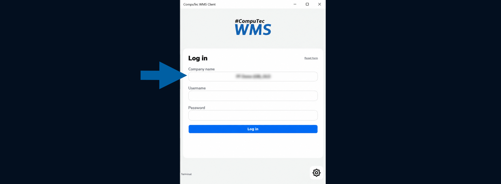

# Start CompuTec WMS Client

**CompuTec WMS Client** provides access to warehouse operations in CompuTec WMS.

This article explains how to start CompuTec WMS Client, log in, and review Pick List notifications.

## Before you start

Make sure **CompuTec WMS Client** has been installed and configured.

:::note[info]
For information about configuring the client, see [CompuTec WMS Client configuration guide](/docs/wms/administrator-guide/installation/wms-client/configuration).
:::

## Start CompuTec WMS Client

1. Start the desktop version of **CompuTec WMS Client** from the Windows program list or run `CompuTec.Client.Desktop.exe` from the CompuTec WMS Client installation folder.

    

2. Select the required **Company name**.

    

3. Enter the username and password configured for the WMS user.

   If a barcode is assigned to the WMS user, you can scan the barcode instead of entering the login credentials. [Read more](/docs/wms/administrator-guide/installation/wms-licensing)

    :::info[note]
    When you start CompuTec WMS Client **for the first time**, configure the connection to CompuTec WMS Server **before logging in**. [Read more](/docs/wms/administrator-guide/installation/wms-server/overview).
    :::

4. Click **Log in**.

After a successful login, the CompuTec WMS Client main menu appears.

## Review Pick List notifications

The **Notification Center** displays informational messages and errors related to Pick Lists. Messages are displayed in the Notification Center instead of interrupting users while they work with Pick Lists.

To review notifications:

1. Go to the main screen of **CompuTec WMS Client**.
2. Click the **Notification Center** icon in the upper-right corner.

    

3. Review the available messages and errors.

:::info[note]

The **Notification Center icon** is available on the main screen of CompuTec WMS Client. It is not displayed when you open a Pick List.

Notifications displayed in the Notification Center are based on entries in the `@CT_WMS_ONOT` table related to Pick Lists.
:::
