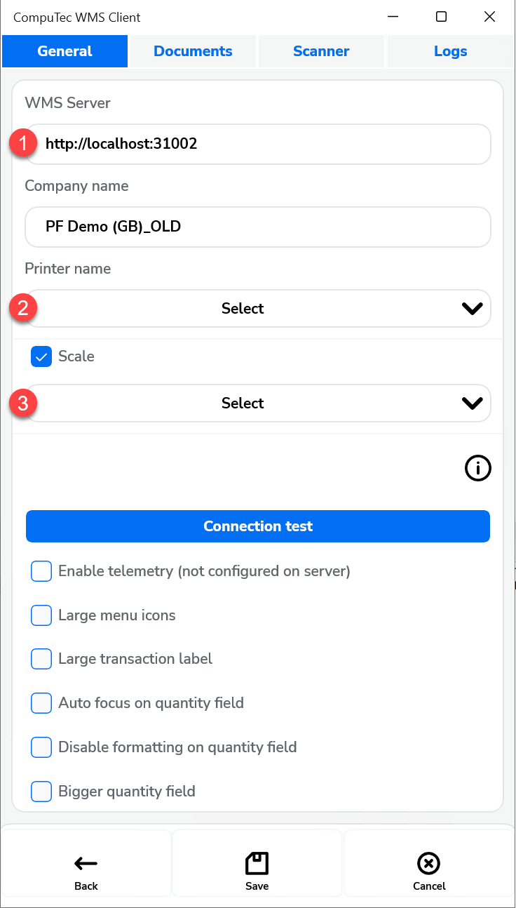
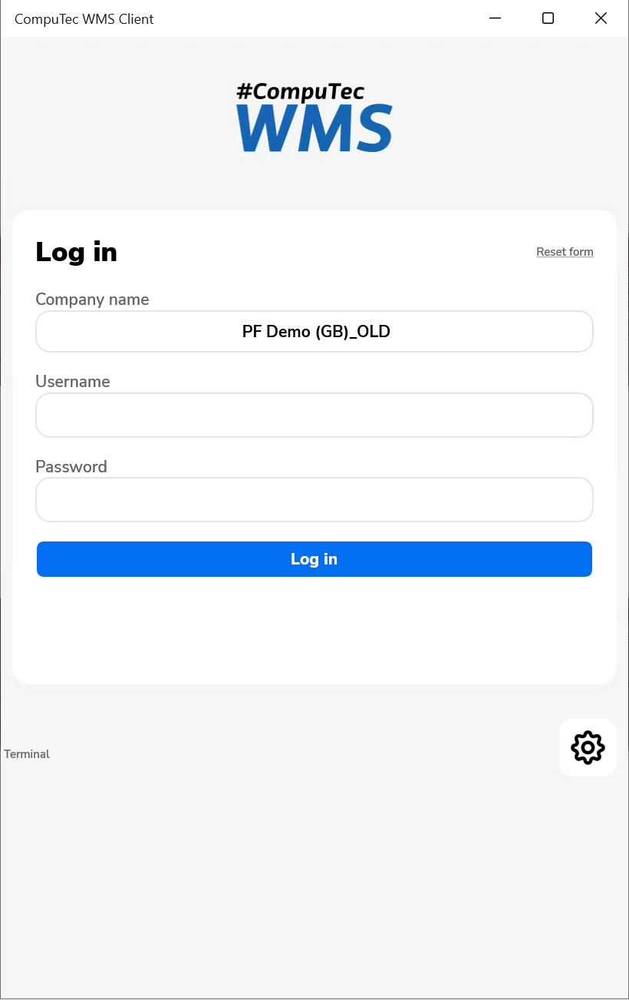

# Starting CompuTec WMS Client

CompuTec WMS Client offers various startup options, including server configuration, logging level, and user interface settings, to customize and optimize warehouse management workflows.

---

## Starting CompuTec WMS Settings

1. To run the desktop version of the CompuTec WMS Client, an installation and configuration of the CompuTec WMS Server is required. For further information, click [here](../administrator-guide/installation/wms-server/overview.md).
2. To start the CompuTec WMS Client desktop version, choose it from a program list or run the CompuTec.Client.Desktop.exe file in the CompuTec WMS Client installation folder.
3. CompuTec WMS splash screen overview
    When running the application for the first time, select the Settings button to set up server addresses.

    

## Options Overview

### Configuration of WMS client-server Connection

 

To ensure seamless communication between the CompuTec WMS Client and Server, follow the steps below:

1. **Server Address & Port**: Ensure that the server address matches the location where the CompuTec WMS Server is installed. The port number must align with the one specified in the server settings. You can verify this in the server configuration.
2. **Printer Setup**: Define the printer that will handle CompuTec Labels whenever WMS sends a new request. The printer's IP address can be configured in Custom Configuration under the Common tab. For more details, click [here](../administrator-guide/custom-configuration/custom-configuration-functions/common.md).
3. **Scale Integration**: If the CompuTec WMS is intended for use with a scale, enable the Scale checkbox to activate this functionality. Please refer to [weight scale](../user-guide/weight-scales/overview.md) for more information.

### Info icon

You can check the following information by clicking the 'i' icon:

    

- Server Name
- Company Name
- Database Name
- Server Version
- Client Version (tap twice to [overwrite](../administrator-guide/installation/wms-client/computec-wms-android-version.md#overwriting-a-client-version))
- Terminal ID

### Other Options

Other options include:

- **Enable Telemetry(not configured on server)**: Activate the feature to collect performance and usage data.
- **Large Menu Icons**: Increase icon size in the menu, with a layout change to two columns instead of three.
- **Auto-Focus on Quantity Field**: On the Quantity screen, the focus will automatically move to the - Quantity field, simplifying the entry process.
- **Disable Formatting on Quantity Field**: Remove decimal places and separators from the Quantity field for a cleaner input.

{/*
Show buttons focus – highlight the buttons focused on

Use global settings –

Full screen – full-screen version of the main menu form

Full screen for login panel – full screen mode for the login panel (even if the screenshot mode is set for the application, the log-in panel has a fixed size, which may lead to the display of an unconventionally small log-in panel on some devices)
*/}

## Documents tab

Checking a specific checkbox displays the Warehouse Selection form of a particular transaction. If you want to use only one default warehouse, uncheck a checkbox for a required transaction and type in a required warehouse. Click [here](../administrator-guide/client-settings-warehouses/overview.md) to find out more.

## Saving Settings and logging in

Click Save or Cancel on the General tab to save or discard changes. It leads back to the log in form.

:::warning
Note that opening the Settings form and clicking Save (even without changing anything) is required to perform after the first installation of the application. This action creates the necessary configuration file to work with the application.
:::

1. After saving, the log-in window appears.

    
2. Type in a terminal username and password or log in by scanning the Employee Badge.
3. Click [here](../administrator-guide/installation/wms-licensing.md) to find out how to create a terminal user. Click a green icon or press Enter. If a terminal user has a barcode assigned, scanning the code logs in the user.

    
4. In WMS Settings, right-click on the database and select User Settings. Then, check the box next to the user(s) who will have access to this database.

    

5. The main menu window appears.
The desktop version of CompuTec WMS Client is ready to work with.

---
