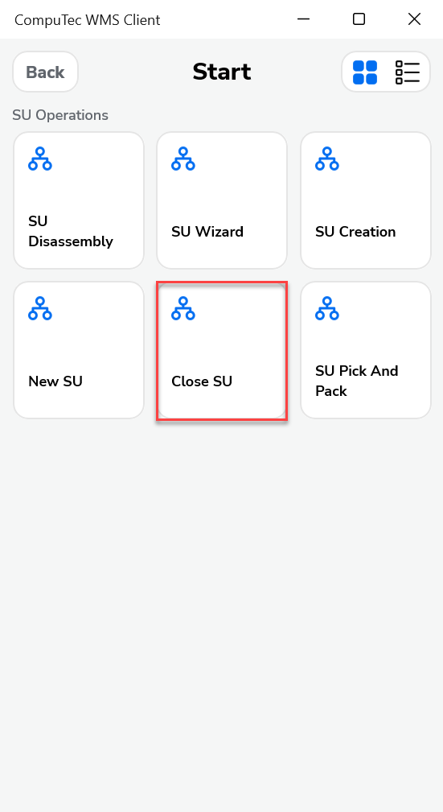
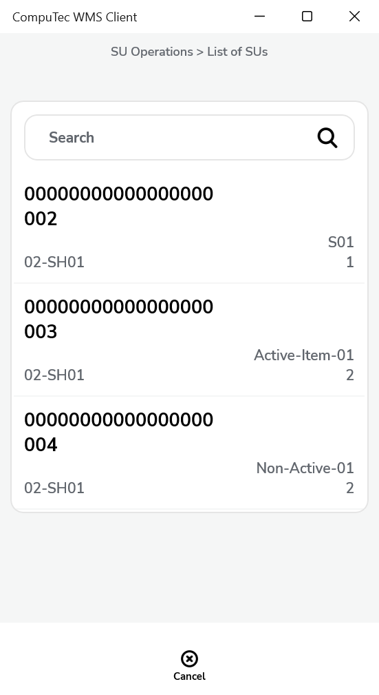
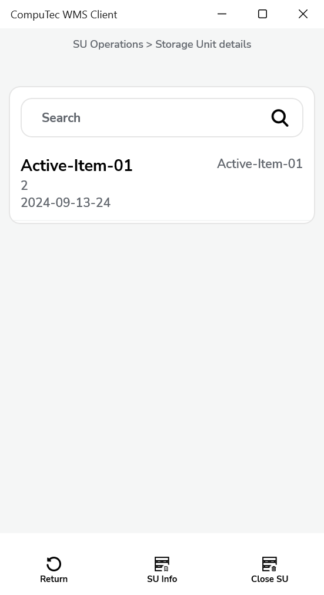
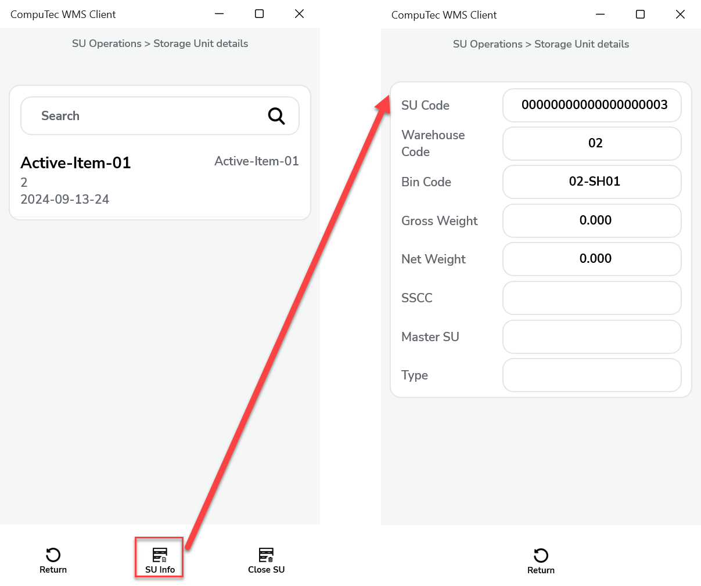
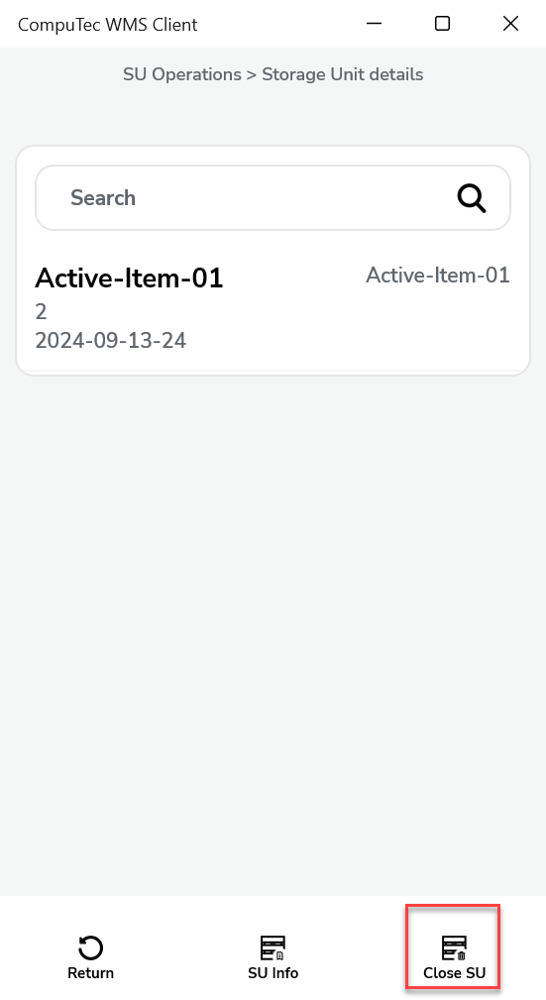
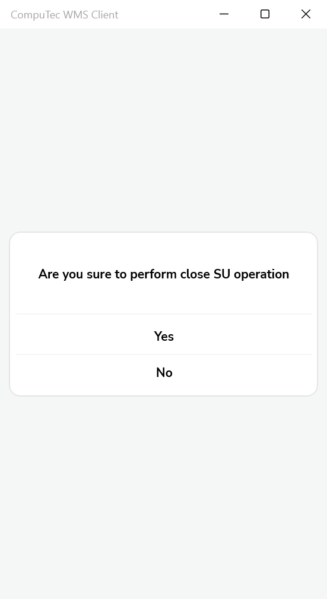

# Close SU

In warehouse operations, there are scenarios where a Storage Unit (SU) is no longer needed for active use—perhaps because its contents have been moved, consumed, or made obsolete. The Close SU function allows you to permanently deactivate such SUs.

:::caution
Once an SU is closed, it cannot be reopened or used again. Closed SUs are removed from transaction lists and are no longer available for operations.
:::

---

## Steps to close a Storage Unit

1. Begin by navigating to the SU options menu. Click on the "Close SU" option:

    

2. From the list of available SUs, choose the one you want to close:

    

3. After selecting an SU, you’ll be directed to the Storage Unit Details screen:

    

    Item rows display the following information: Item name and code, Quantity, and Unit of Measurement.

4. You can check specific Storage Unit details by clicking the icon:

    

5. To proceed with closing the Storage Unit, click the Close SU icon:

    

    A confirmation pop-up will appear. Confirm your action:

    

    Once confirmed, the SU will be marked as closed and removed from active operations.

---
