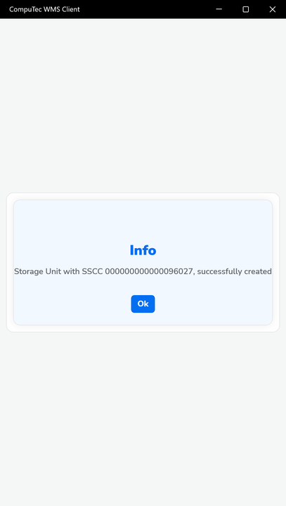

# New SU

The New SU function in CompuTec WMS enables users to manually create a **single Storage Unit (SU)** with a customized set of items and quantities. This method is particularly useful when a unique combination of items needs to be grouped into one SU, such as preparing a specific pallet or container for internal transfers, shipments, or tracking.

Unlike SU Wizard or SU Creator, this feature focuses on building just one SU at a time, offering flexibility in content selection and ease of use.

---

## Steps to Create a New Storage Unit

1. Select **SU Operations** from the Main Menu.

    

2. Select **New SU**.

    

3. Choose a Warehouse in which a Storage Unit will be created.

    

4. Document Details form will be opened. You can add Items that must be included in the created Storage Unit. Click the '+' icon to add Items.

    

5. The Item Selection form will be opened. Choose an Item required to be included in the created Storage Unit.

    

6. Set the quantity for the chosen Item.

     

7. Similarly, you can add another item and its quantity.

8. Click the 'Save' icon after choosing Items required for SU and its quantity:

    

9. A **new SU** is created.

    

---
