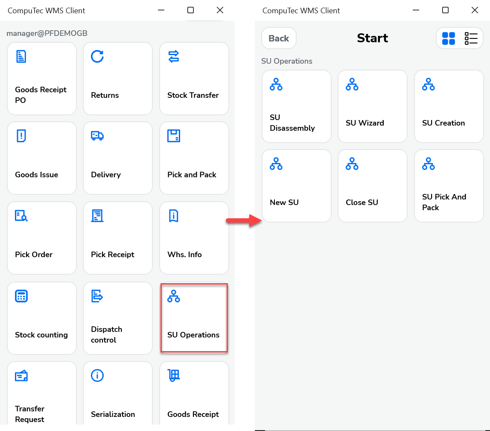

# Overview

Storage Units (SUs) are an essential feature in warehouse operations, providing a streamlined way to group multiple items for efficient handling, tracking, and documentation. In the context of CompuTec WMS integrated with SAP Business One, Storage Units help optimize logistics by enabling users to manage collections of items - such as those placed on a pallet - as a single manageable entity. This not only simplifies warehouse processes but also ensures consistency and accuracy across inventory transactions.

:::warning
    **Known Limitation**

    Currently, there is no Storage Unit element in SAP Business One after installing CompuTec WMS. For a workaround, click [here](./storage-unit-in-sap-business-one-menu-error.md).
:::

:::warning
    Goods packed into Storage Units using CompuTec WMS should not be moved directly within SAP Business One. Doing so may cause data inconsistencies between Storage Unit contents and SAP stock reports.
:::

## What is a Storage Unit?

A Storage Unit (SU) is a group of items (with their quantities) that can be treated as a single entity during document processing. For example, adding an SU to a document will automatically include all items contained within it.

Physically, an SU often represents a pallet or other logistics container used to store and transport items.

### Key Features

- **SU Creation**: You can create Storage Units using CompuTec WMS.
- **SU Browsing**: SUs can be viewed both in CompuTec WMS and SAP Business One.
- **Document Integration**: SUs can be added directly to warehouse and inventory documents.
- **Transaction Support**: SUs are supported across all CompuTec WMS transaction types.

Created SUs can be browsed in SAP Business One. Click [here](../../administrator-guide/installation/sap-business-one-settings/storage-unit.md) to find out more.

Click the 'SU Operations' option in the main menu to go to related options:

## Best Practice – Handling SUs Returned to the Warehouse After Production Consumption

When creating an SU, you may replace the default SSCC number by entering or scanning a different one. As SSCC codes can be reused, an existing SSCC can also be scanned during SU creation.

For returned SUs, it is recommended to:

- Verify the physical content and quantity before reassigning an SSCC.
- Reuse the original SSCC only if the SU content remains unchanged; otherwise, assign a new SSCC to ensure traceability.
- Update system records promptly to maintain accurate stock and audit compliance.

---
