# Storage Unit Import with Powershell

Importing Storage Units (SUs) into CompuTec WMS using PowerShell streamlines bulk data entry and ensures efficient warehouse setup. This guide walks you through the complete process - from preparing your CSV files to executing the import script. Whether you're setting up your WMS for the first time or updating existing records, this tutorial helps you avoid common pitfalls and get the job done right.

---

## How to use the Import Script

Follow these steps to set up and run the Storage Unit import using PowerShell:

1. Download the files from [here](https://github.com/CompuTec/processforce-powershell/tree/main/ImportSU).
2. Copy the net45 directory to C:\
3. Run Powershell ISE (x64) or Powershell (version 7 only) as Administrator:

    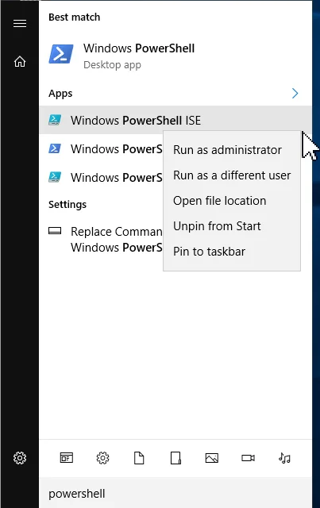

4. Open the ImportSU file in Notepad, copy its content and paste it to the **Windows Powershell ISE**:

    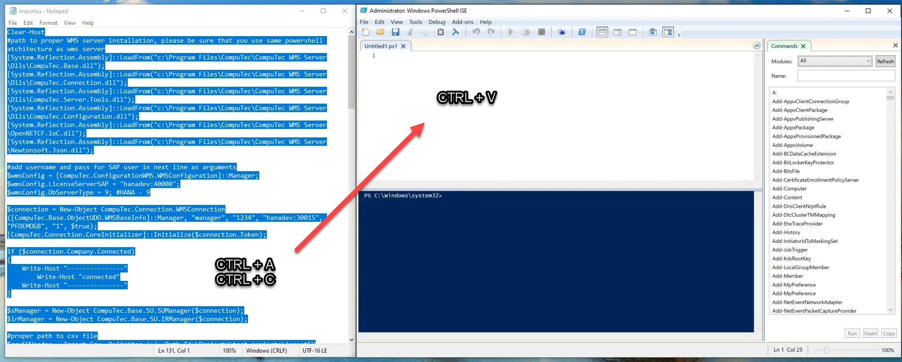

5. Enter correct credentials (login and password from CompuTec WMS):

    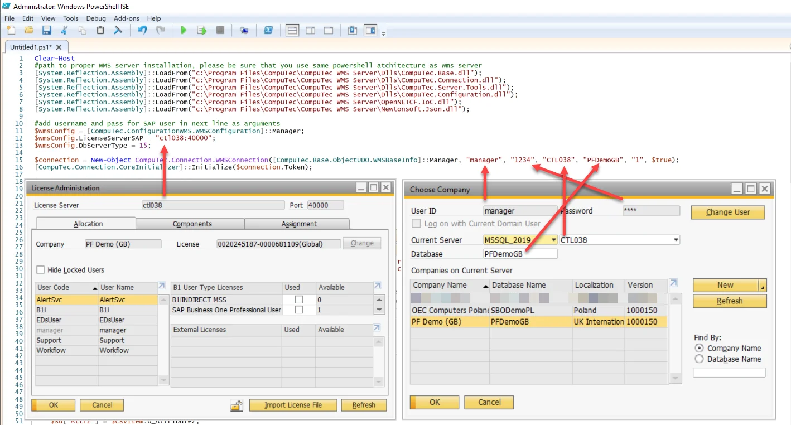

6. Choose the correct database type using one of the following options:

    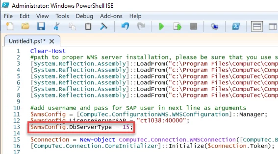

    dst_MSSQL = 1,

    dst_DB_2 = 2,

    dst_SYBASE = 3,

    dst_MSSQL2005 = 4,

    dst_MAXDB = 5,

    dst_MSSQL2008 = 6,

    dst_MSSQL2012 = 7,

    dst_MSSQL2014 = 8,

    dst_HANADB = 9,

    dst_MSSQL2016 = 10,

    dst_MSSQL2017 = 11,

    dst_MSSQL2019 = 15

7. Enter the correct path to your prepared .csv files:

    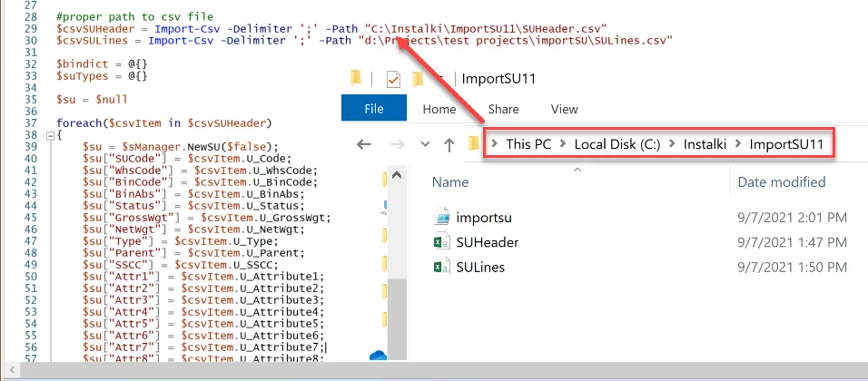

8. Copy the BusinessObjects folder from CompuTec WMS to C:\Windows\System32\WindowsPowerShell\v1.0:

    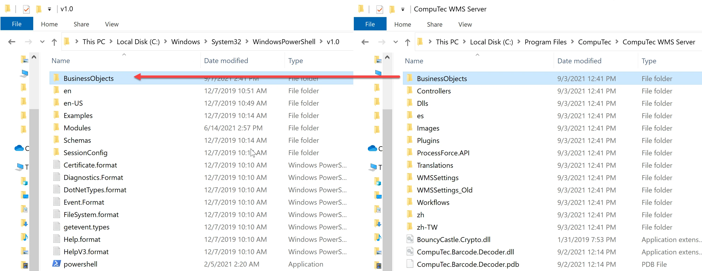

9. Run the script to begin the import process.

## CSV Files Preparation

1. Download the CSV Files from [here](https://github.com/CompuTec/processforce-powershell/tree/main/ImportSU).
2. Open Microsoft Excel.
3. Go to Data tab and open From text/CS:

    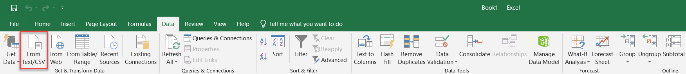
4. Open SUHeader.csv / SULines.csv.
5. In the data type detection menu, select Do not detect data types. Then load the file:

    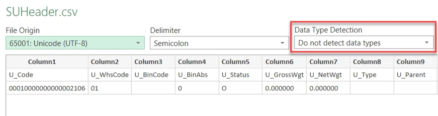

    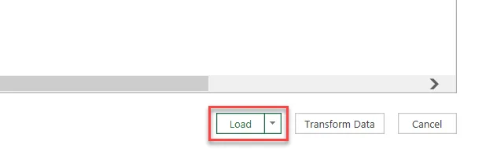
6. Right-click on the following columns: U_Code, U_WhsCode, U_BinCode, U_SSCC (U_Parent as well, if you create SU in SU) and change the type from General to Text:

    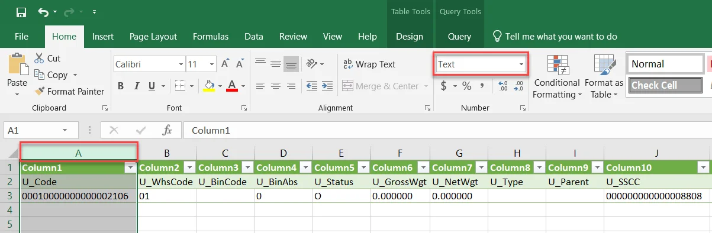

7. Enter relevant data: new, different U_Code and U_SSCC, correct warehouse and bin codes. Check the U_BinAbs (AbsEntry from OBIN)

    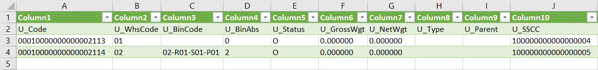

    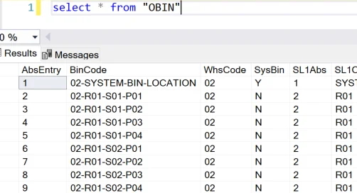
8. Enter the proper data for the following SULines: ItemCode, Quantity, Manage Type, Item Type and DistNumber. Remember, that the Code must be the same as U_Code from SUHeader.

    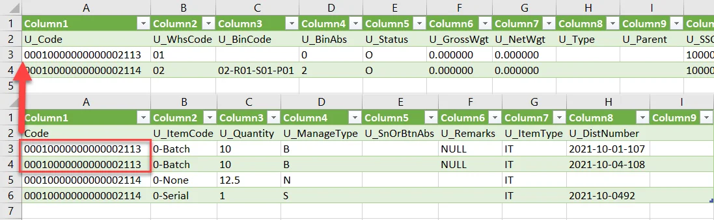

9. Save the files as CSV UTF-8 (comma delimited) format. Adjust the delimiter (; or ,) based on your region and configure it accordingly in the script:

    

10. Open the saved files in Notepad and delete the first row (headers) before import:

    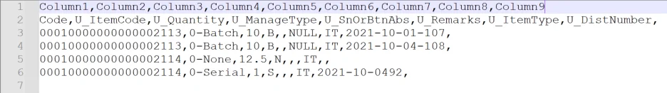

---
