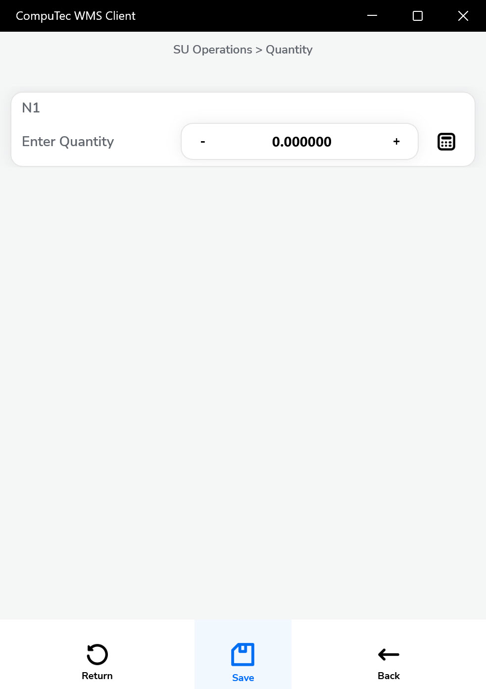
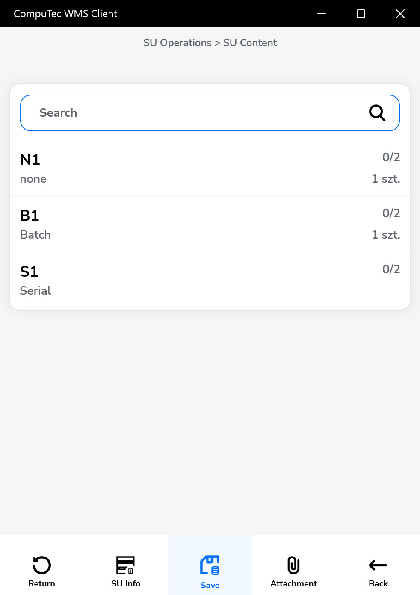

# SU Creation

The SU Creation function in CompuTec WMS enables users to manually create multiple Storage Units (SUs), each with a defined set of items and quantities. Unlike the SU Wizard, which generates multiple SUs with identical content, SU Creator offers more flexibility - allowing users to review and set item-specific details such as batches and serial numbers for each SU.

This option is ideal when the same item set is packaged repeatedly but requires batch-level or serial-level tracking for each unit.

---

## Steps to Create Storage Units Using SU Creator

1. Choose "SU Operations" from the Main Menu. Choose "SU Creation".

    

2. Choose the warehouse where the Storage Units will be created.

    

3. Select SU content. You can add Items that must be included in the created Storage Unit. Click the '+' icon to add Items.

    

4. Choose the item you want to include in the Storage Unit from the list.

    

5. Set the Quantity for the chosen Item and click the "Save" icon.

    

6. Click the "Forward" icon after choosing Items required for SU and its quantity.

    

7. Define how many SUs with a defined set of Items will be created and click the "Forward" icon.

    

8. A list of creating SUs will be displayed. Click a specific SU row to display its content.

    

9. Click a row of specific Items to set its details (Batch, Serial).

    

10. If items are **batch-managed** or **serial-managed**, assign the appropriate values.

    

11. Define the quantity for each batch or serial. Items can be pulled from different batches.

    

12. Click the "Save" arrow after setting details for every Item.

    

13. The Save icon saves the defined Storage Units and leads back to the SU Operations form. New Storage Units are created and can be used in other transactions.

---
