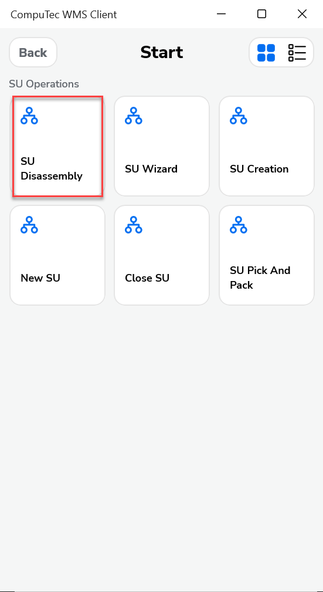
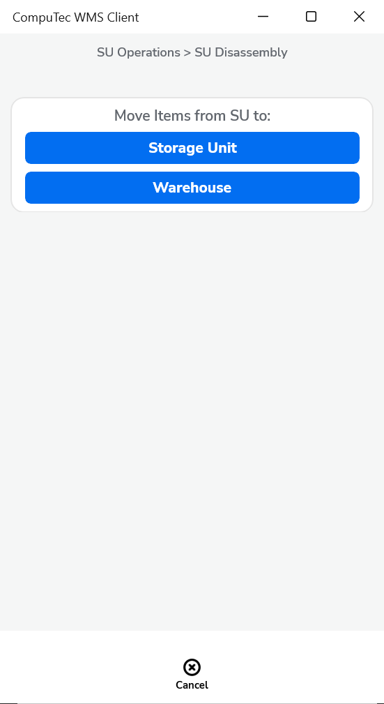
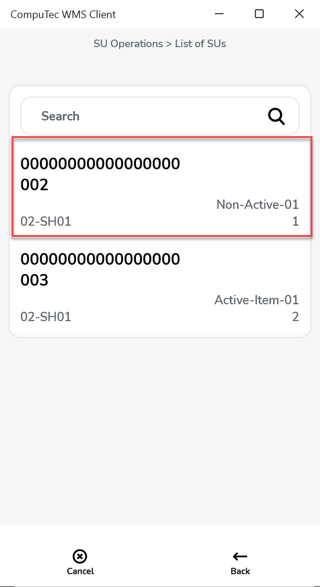
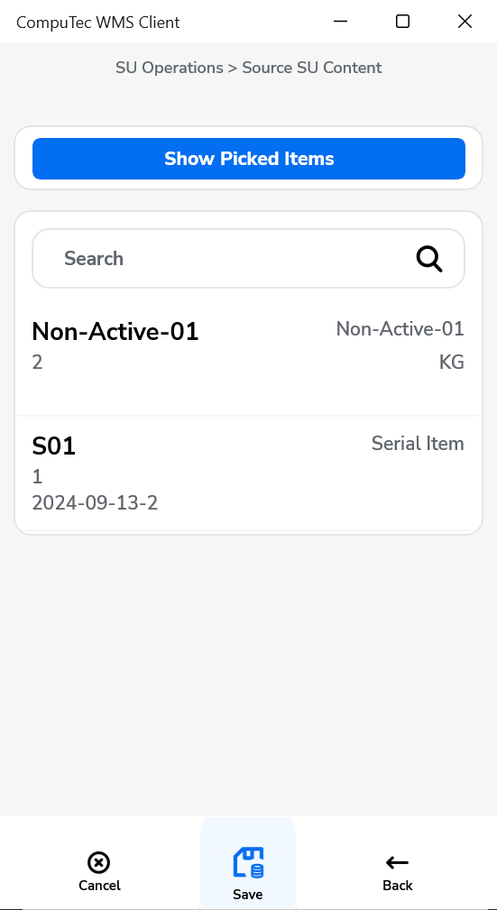
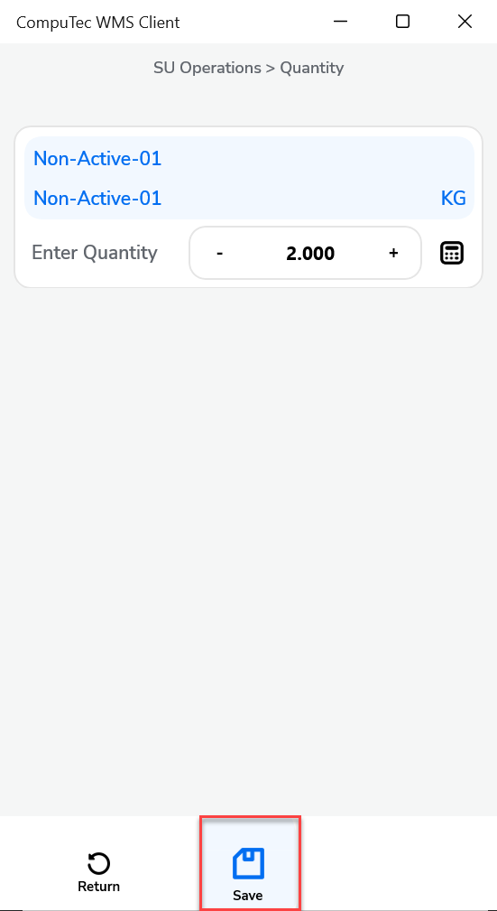
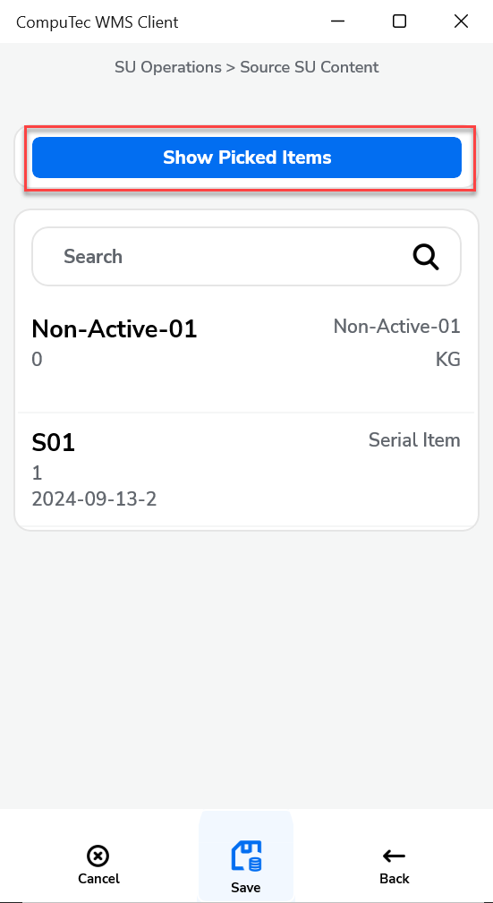
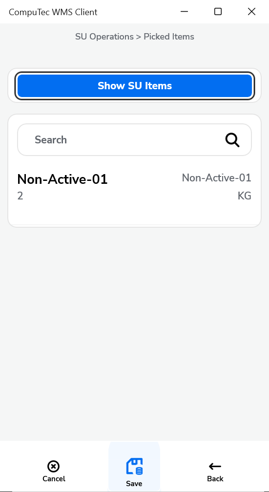
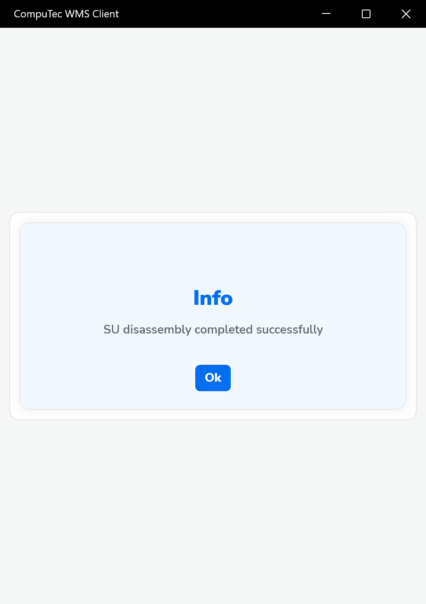

# SU Disassembly

Storage Unit (SU) Disassembly is a feature in CompuTec WMS that allows users to break down an existing Storage Unit and transfer its contents - either fully or partially into a warehouse or another Storage Unit. This is particularly useful when you need to reorganize inventory, repack items or make specific items available for new operations.

This guide walks you through the step-by-step process of disassembling a Storage Unit within the CompuTec WMS system.

---

## Steps to Disassemble a Storage Unit

1. From the main menu, navigate to and select the **SU Disassembly** function:

    

2. Choose where the disassembled items should go:

    1. **Storage Unit**: A new Storage Unit will be created with picked Items in it,
    2. **Warehouse**: Items will be moved to the **warehouse** of the source SU, without being assigned to any SU.

        Click the desired option:

        

3. Select the Source Storage Unit. Click the row of the SU you want to disassemble:

    

    >Tip: You can also scan a barcode with a **Storage Unit** or **SSCC** prefix to select the SU. Scanning a code **without a prefix** will be interpreted as a standard SU code.

4. Select Items to Move. Click on an item row to set the quantity to move:

    

    You can use barcodes here too:  
    - With an **Item**, **Batch**, or **Serial Number** prefix  
    - Without a prefix (interpreted as an Item code)  
    - If multiple batches exist for the same item, you’ll be prompted to select the appropriate batch.

5. Set the required Quantity. Use the `+` or `-` buttons or type in the quantity manually, then click the **Save** icon.

    

    >Note: You don’t have to move all items—you can disassemble only part of the SU’s contents.

6. Click the icon to view the list of already picked items:

    

7. The list of Picked items will be displayed:

    

    Click "Show SU Items" to return to the original SU content view.

8. Click the "Save" icon in the Picked or Source SU Content form to save the changes.

9. Info message appears: "SU disassembly completed successfully".

    

---
