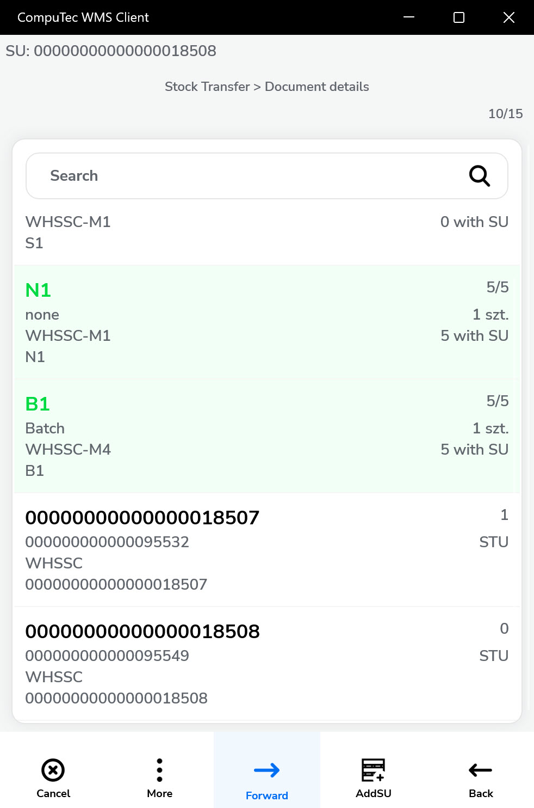

# SU in Stock Transfer

Stock transfers involving Storage Units (SUs) require a clear understanding of how to manage both new and existing SUs within the warehouse workflow. This guide walks you through handling SUs during stock transfers - whether you're creating new ones, assigning items to them, or using existing SUs to move goods between warehouse locations. The process is explained step-by-step with relevant screenshots for ease of use.

---

## Managing a New Storage Unit (SU)

1. Set the Storage Unit details. You can choose the Destination Warehouse now (the Arrow Down) or do it during the Items collection or in the Put Away Items screen:

    

    You can also scan the SSCC number to set a new number instead of the generic one.
2. The top line holds information on an SU to which Items are being added. Click it to leave the adding SU mode. When the bar is empty, Items are added without an SU assigned.

    

3. You can add Items by scanning barcodes or adding them manually:

    

4. Clicking an item while in SU adding mode opens a screen where you can specify the Quantity, Batch, or Bin Locations - depending on the item type, warehouse setup, and workflow configuration.

    

5. Clicking on SU details opens its detailed view, where you can review the picked items. From this screen, you can navigate to the Storage Unit Details screen (B) to select a Destination Warehouse or exit the SU adding mode (A).

    

6. You can add another Storage Unit (SU) along with its items. To return to a previous SU, either scan its SSCC or SU Code, or navigate to it manually and click the magnifying glass icon.

    
    

7. When you exit the edit mode of a Storage Unit (SU) and open its details in the Line Details screen, you can view the selected batches, quantities, and whether the items are stored in another SU or individually (loose). You can delete items that are either not assigned to any SU or are part of newly created SUs, but items within pre-existing SUs cannot be deleted.

    

8. You can choose a Destination Warehouse after setting up the document details. You can skip this step by clicking the Right Arrow (which leads directly to the Put Away Items screen).

    
    

9. Using the Put Away Items screen, choose a location for each of the SUs. Delete selecting all of the SUs (A), place all of the SUs in the chosen location (B), and go to the document saving (C).

    

    

10. Once the location is selected, it is marked on its line. After choosing a location for all SUs, proceed to the document summary via the Right Arrow icon.

    

11. Final review and add remarks if needed.

    

## Existing SU

1. Choose an existing SU. There are two ways to ways to do it:

    1. In the Document Details screen, scan an SU or SSCC code. This adds the entire SU and its contents (you can still modify the selection afterward).

        

    2. Scanning an SU or SSCC Code or choosing an SU manually in the List of SUs screen:

        

        Choosing this option opens a List of SUs in the current Warehouse (if there are Bin locations in the Warehouse, a list of Bin Locations is opened first):

        

        

2. Choosing an existing SU leads to the Storage Unit details screen. Here, you can choose to receive all the Items or just some of them (A), with a pallet or other collective packaging (B) or without it (C):

    

    Android version:

    

3. In the following example screenshot, you can see that the Item in the first line has not been picked at all, the second one has been picked partially, and the third has been picked fully. The child SU (the fourth row) has not been picked at all:

    

4. You can choose the child SU and choose Items, quantities, Batches, and if we are picking it with (A) or without (B) the collective packaging:

    

    1. Here you can see an example where the child SU has been chosen with content and collective packaging (the child SU stays in the parent SU):

        

    2. Here you can see an example where the child SU has been chosen with content but without the collective packaging (the child SU content goes to the parent SU):

        

5. The chosen lines can be transferred along with the parent SU (A) - then, Active-Item-01 will be left in the source Warehouse, and the rest will be transferred. Or transfer alone, Active-Item-01 will stay in the Parent pallet (B).

    

6. Choose the required Items and SUs and go to the document summary:

    

7. Now, choose a Destination: Warehouse, Warehouse, and Bin, or skip this step.

    

    

    You can set the automatic skip of this step in Custom Configuration:

    

8. In the Put Away screen, you can: put each Item in a specific location by clicking its line, delete the location selection (A), put all the Items in the previously chosen location (B), and go to the Document Details (C):

    

9. Optionally, add remarks and save the document.

    

---
