# SU Pick & Pack

This guide walks you through the SU (Storage Unit) Pick & Pack process in your warehouse operations using two workflows:

- From Sales Order
- From Inventory Transfer

Each method allows warehouse operators to efficiently assemble and pack items into Storage Units (SUs) for dispatch or movement, while tracking batches and quantities at every step. Let’s go through both processes in detail.

---

## From Sales Order

Begin the Pick & Pack process directly from a Sales Order.

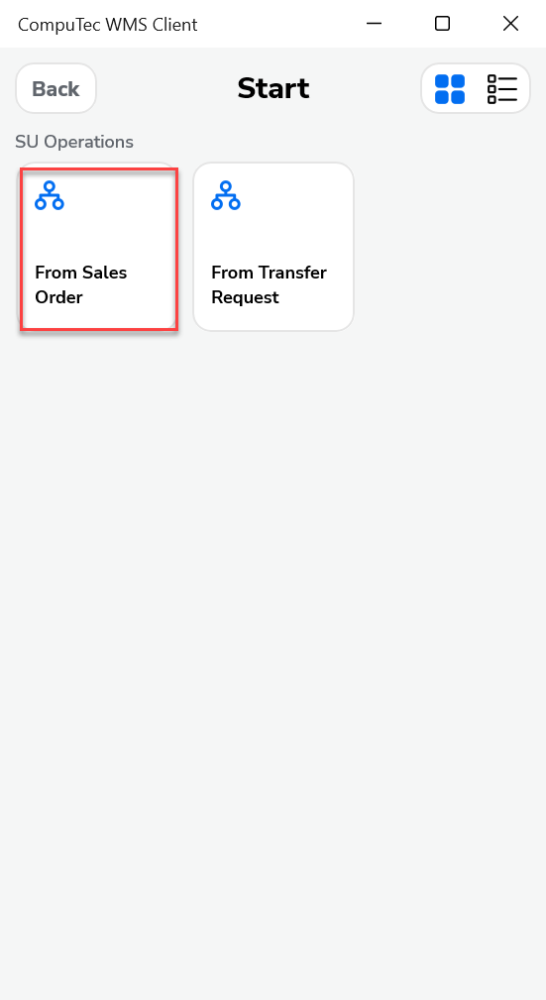

1. Choose the From Sales Order option. The system will prompt for warehouse selection - you can either pick a warehouse or skip this step. Next, the Customer Selection screen appears.

    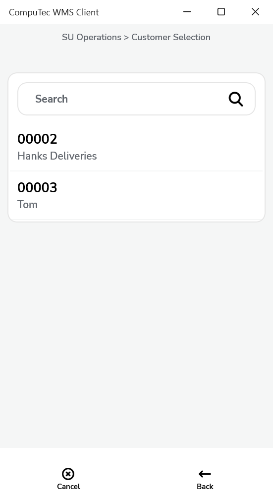

2. The list of sales orders for the selected customer is displayed. Select one or more orders, then click forward.

    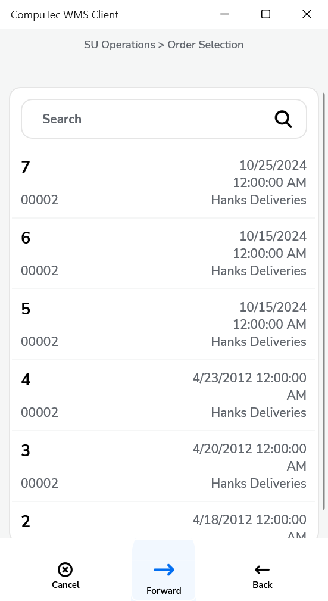

3. The Document Details form will appear.

    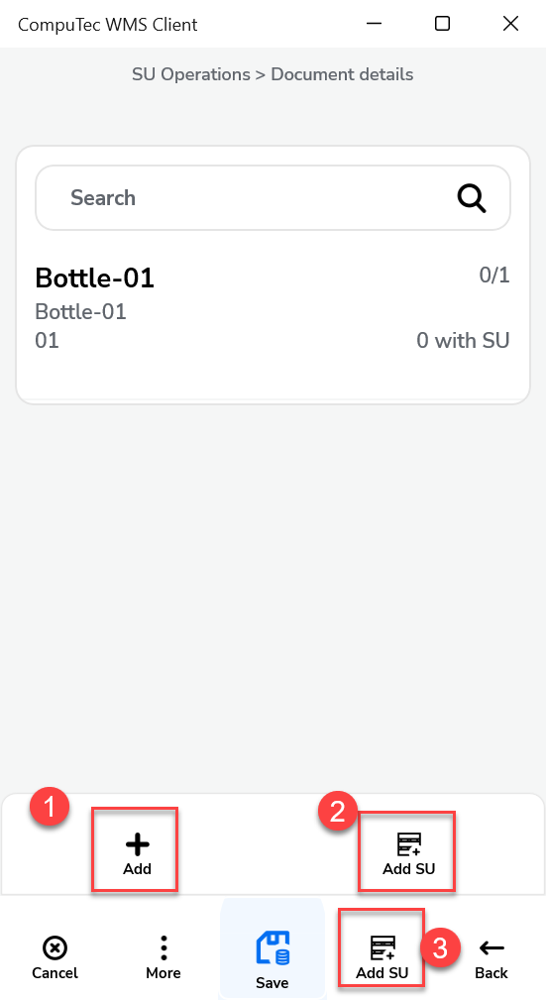

4. Here you can:

    1) add a new Item
    2) add a new SU
    3) assemble an SU from the Items on the list.

    Alternatively, manually enter item quantities and select Batch/Serial Numbers. Selecting the assemble option opens the Items Document form:

    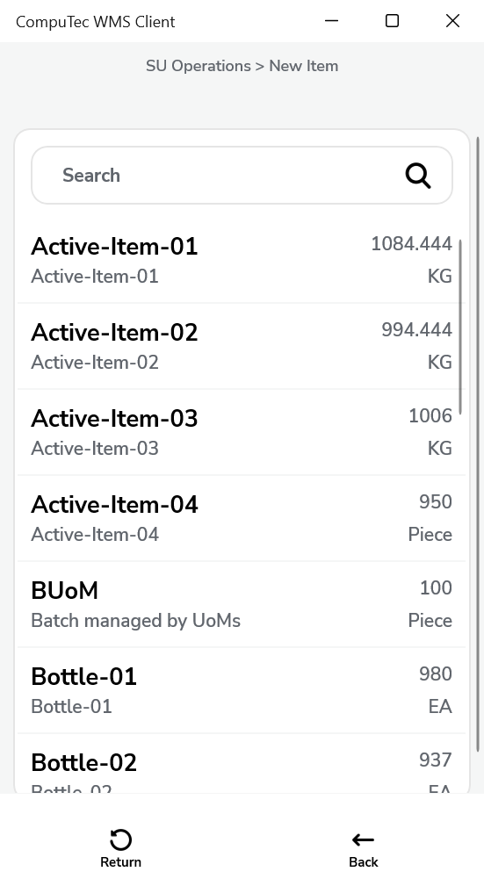

5. Clicking any of the row will lead to the list of available Batches with quantities.

    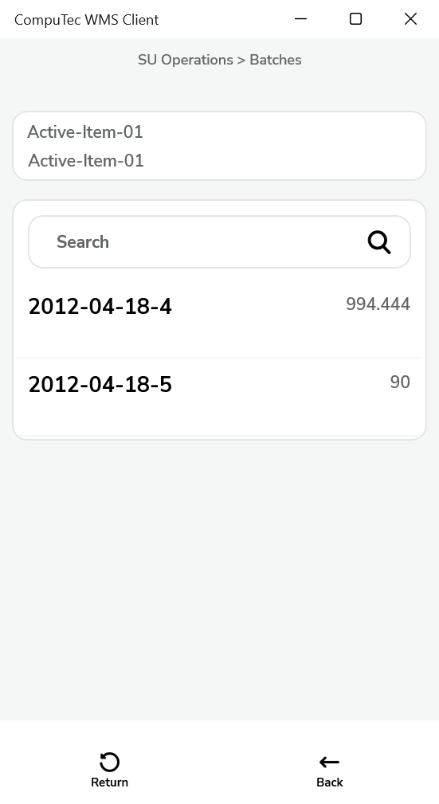

6. The Item row turns green After choosing a Batch and setting the whole quantity.

    If the whole quantity is set, the row stays grey, and in the upper right corner, there is an indication of the picked/total quantity. Click the save button after selecting the whole quantity.

        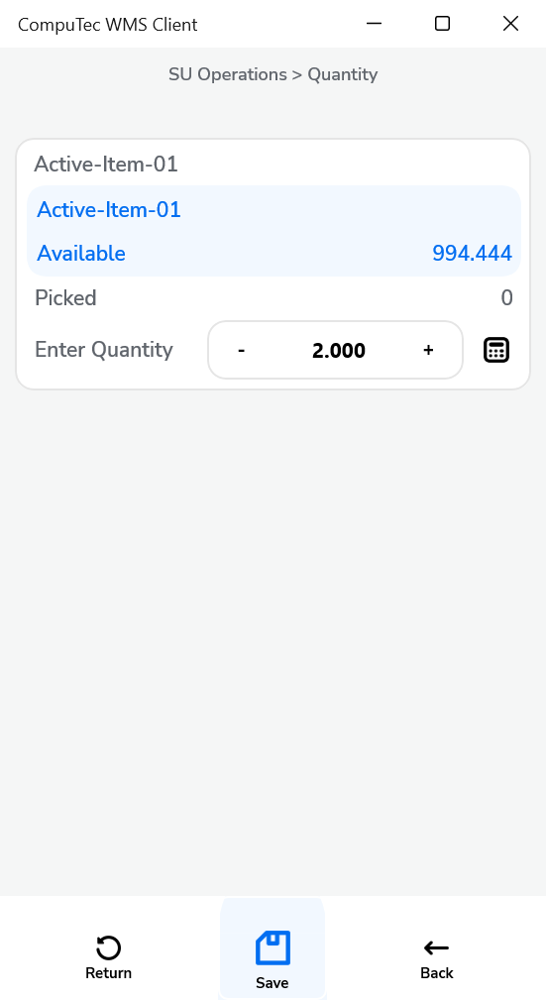

7. Saving Batch and quantity for the SU leads to the Document Details form. You can see the completed Items (marked with green color, with a note that the whole quantities are on the SU) and the added SU:

    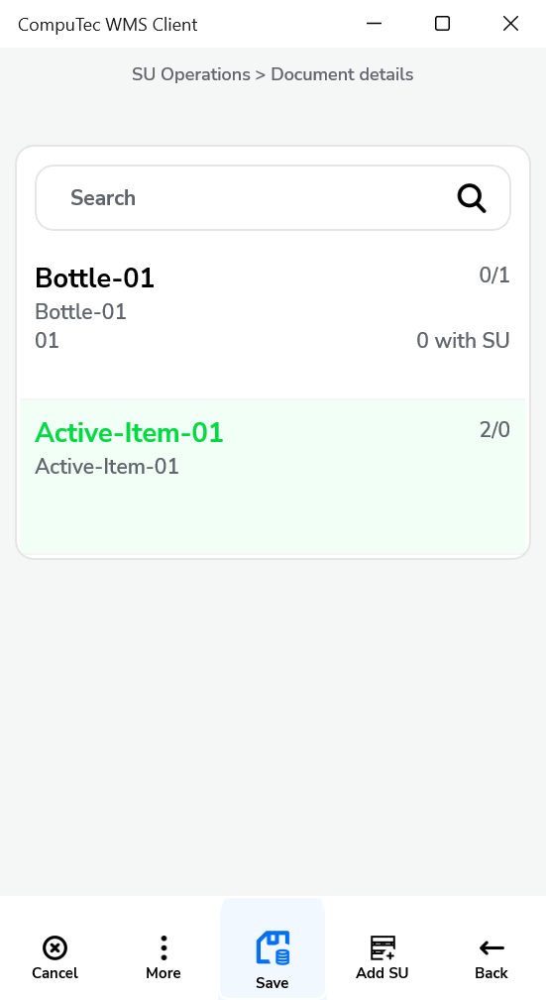

8. Click the save icon. A system message about successful save will be displayed:

    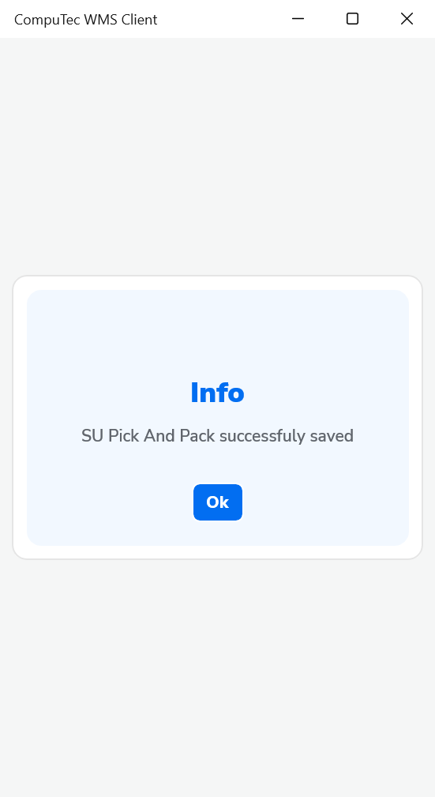

## From Inventory Transfer

SU Pick and pack from Inventory Transfer

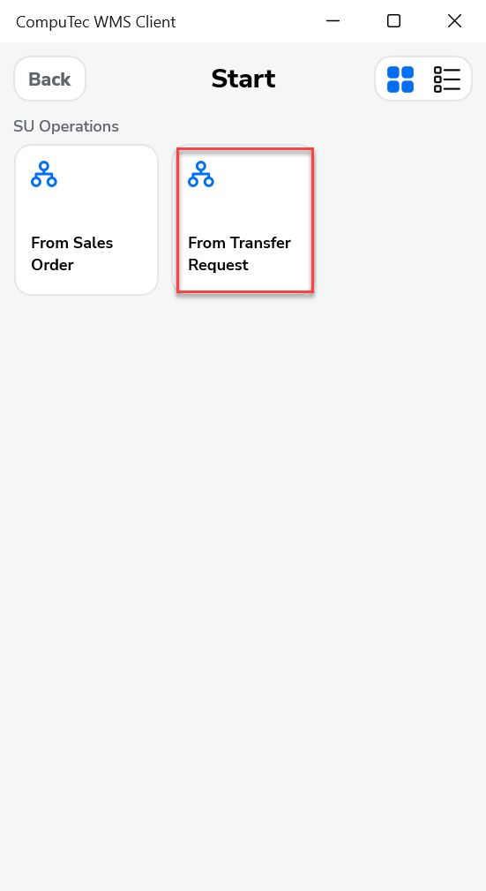

After selecting **From Inventory Transfer**, the Warehouse selection screen opens. You can skip this screen, but you will ask for it when adding items.

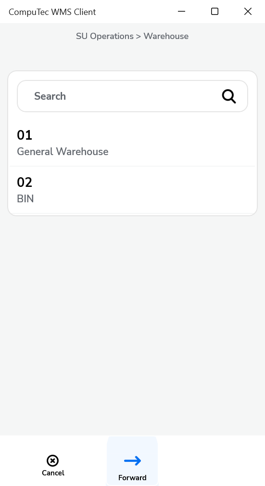

The list of Inventory Transfers for this warehouse opens - select one of the documents.

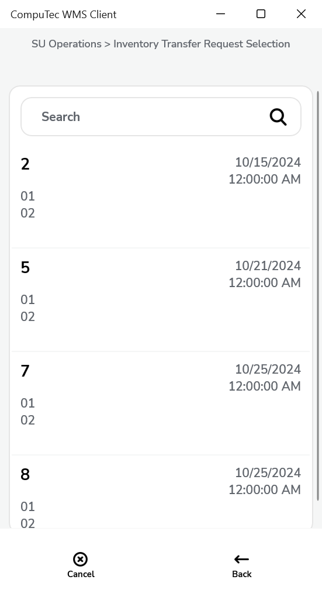

Document Details screen opens - selecting one of the listed items leads to the Storage Info screen.

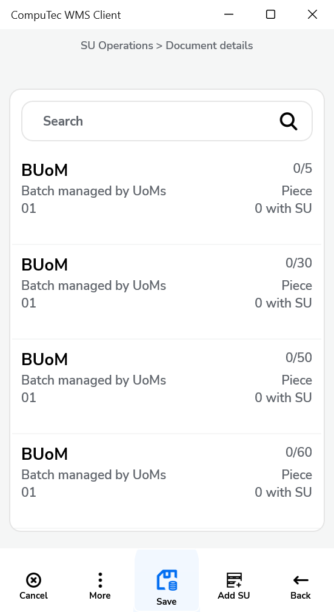

When you select an item managed by none, the Quantity screen opens. You can enter the required quantity of this item.

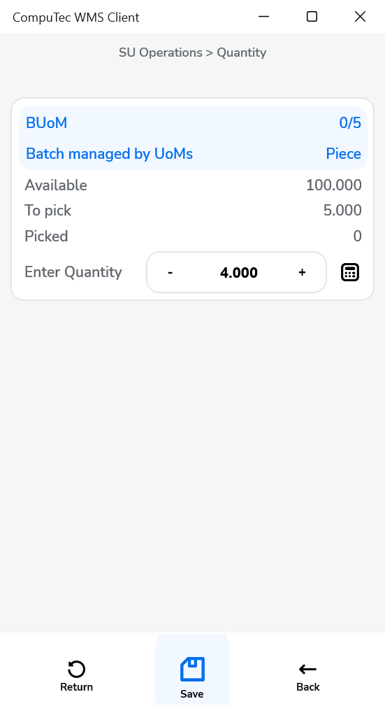

After entering the required quantity and pressing the right arrow button, we return to the Document Details. Non-Active-01 is marked green because all quantity was selected.

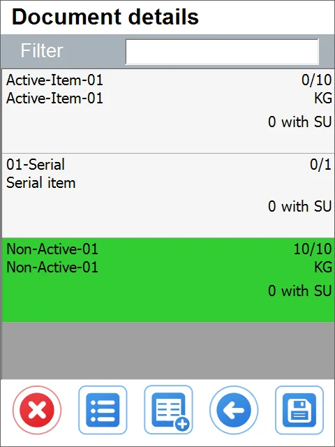

We can add:

1. the item not listed

2. SU not listed

3. SU details.

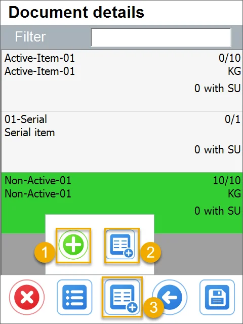

---
