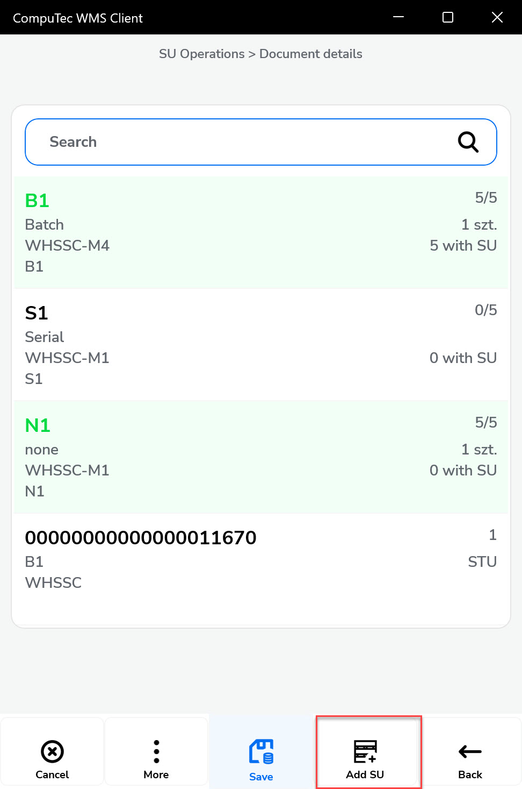

# SU Pick & Pack

This guide walks you through the SU (Storage Unit) Pick & Pack process in your warehouse operations using two workflows:

- From Sales Order
- From Transfer Request

Each method allows warehouse operators to efficiently assemble and pack items into Storage Units (SUs) for dispatch or movement, while tracking batches and quantities at every step. Let’s go through both processes in detail.

:::info
The process remains the same for both Sales Orders and Transfer Requests.
:::

---

## From Transfer Request

---
