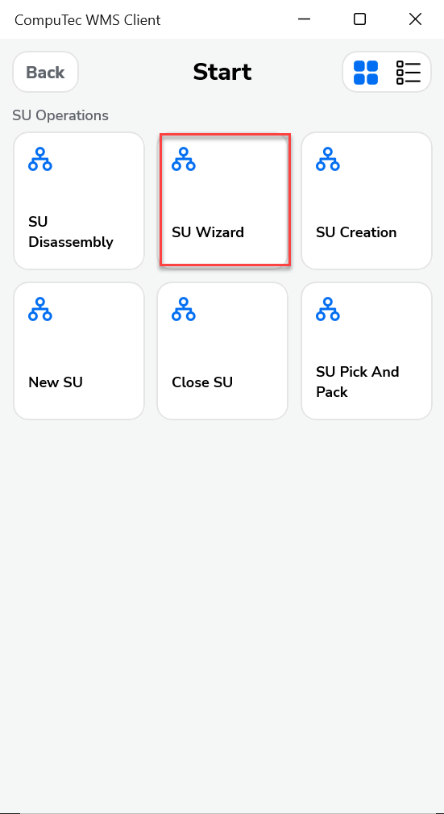
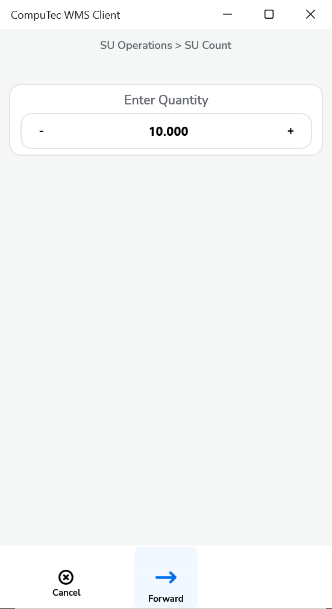
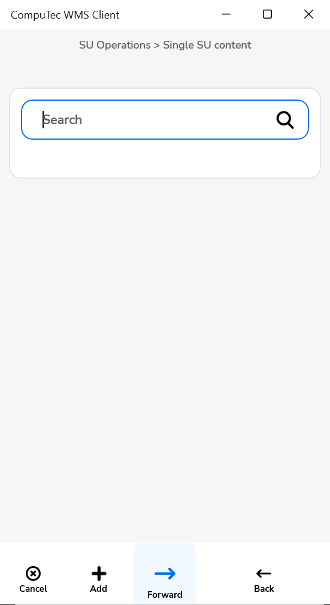
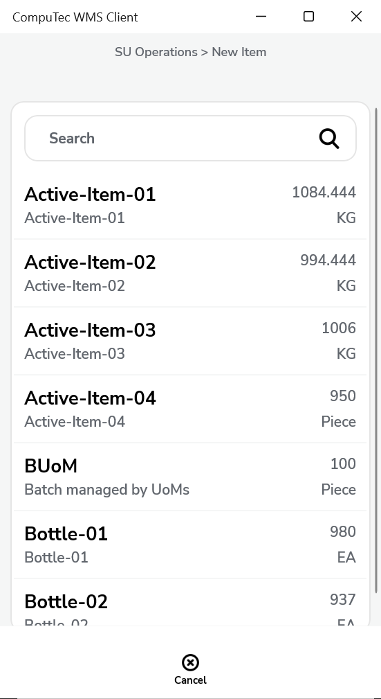
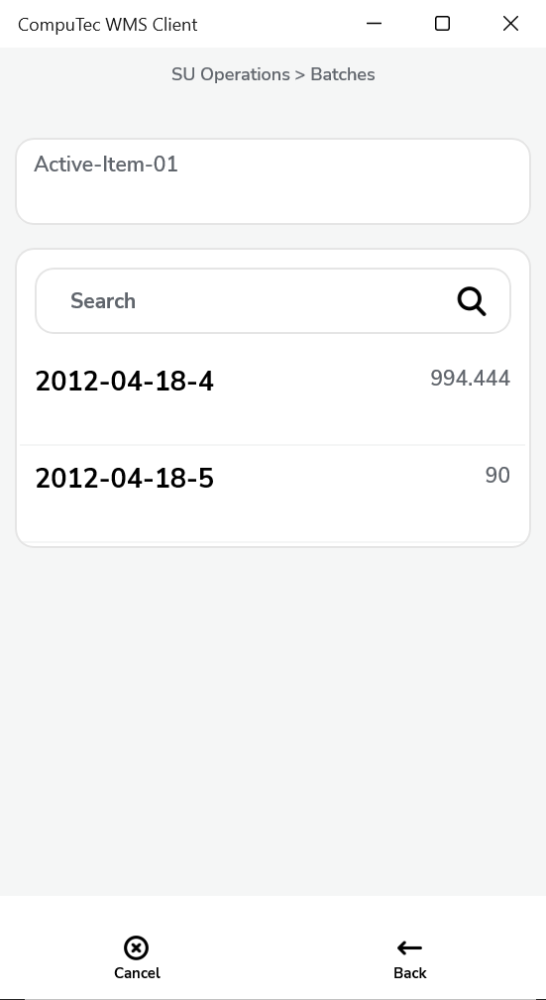
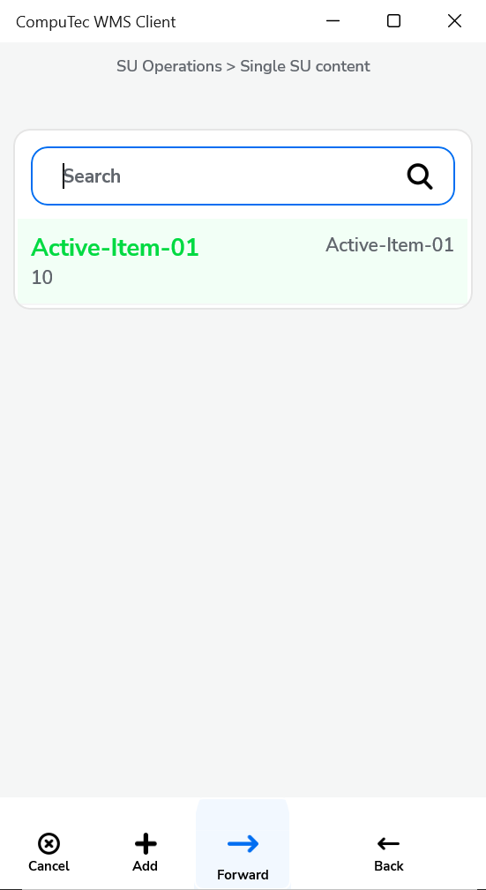
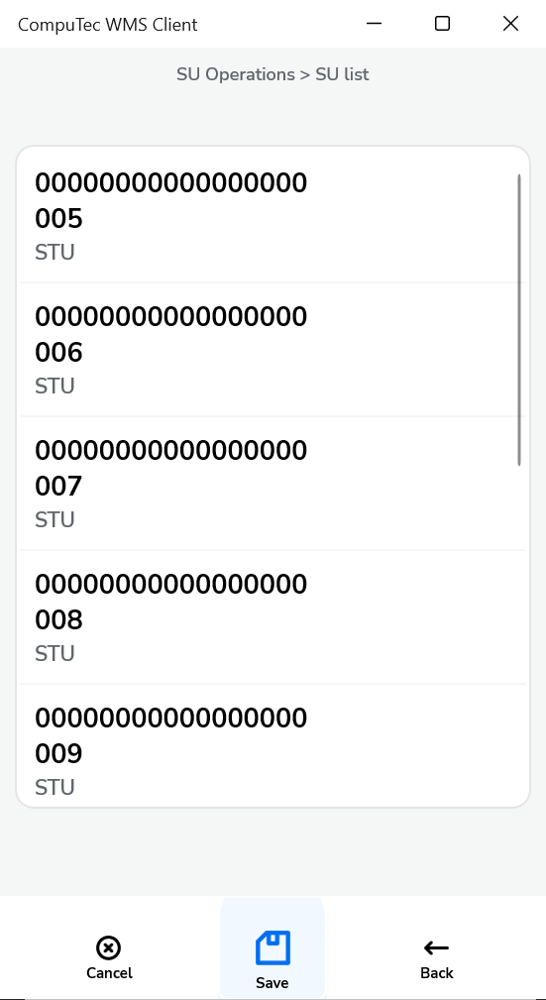

# SU Wizard

The **SU Wizard** in CompuTec WMS provides a convenient way to create multiple **Storage Units (SUs)** with identical item content and quantities. This function is especially useful for repetitive packaging, batch production, or organizing items into pallets or containers with uniform structure. Instead of creating each SU manually, the wizard streamlines the process, saving time and reducing the chance of manual entry errors.

Follow the steps below to create multiple SUs quickly using the SU Wizard.

---

1. Select "SU Operations" from the main menu.

    

2. Click on the "SU Wizard "option:

    

3. Choose the warehouse where the Storage Units will be created.  
    > If the warehouse uses bin locations, you’ll be able to assign bins in the next step.

    

4. Enter how many identical Storage Units you want to create and click the Right Arrow icon to proceed.

    

5. Set up a single SU content by adding Items using the '+' icon.

    

    

6. If the chosen Item is managed by Batch, choose it from the list in the next step.

    

7. Enter the quantity for the selected item and click the "Save" icon.

    

8. Click the "Right Arrow" icon after choosing the required items and quantities.

    

9. A list of created SUs is displayed.

    

10. Click the "Save" icon to complete the process. Click the "Left Arrow" to return to a previous step and make changes if needed.

---
