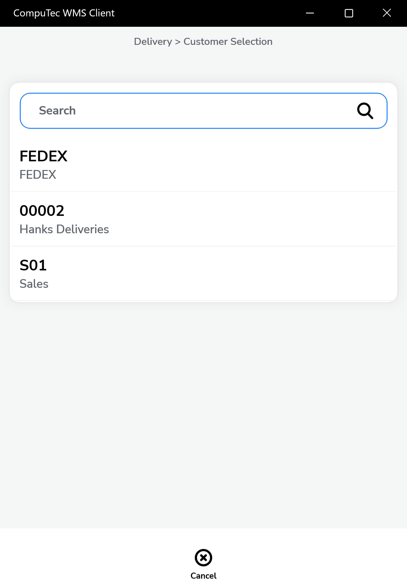
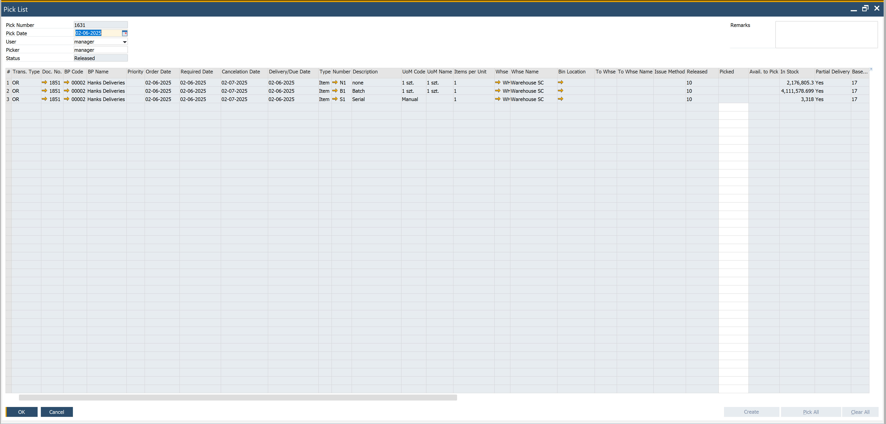
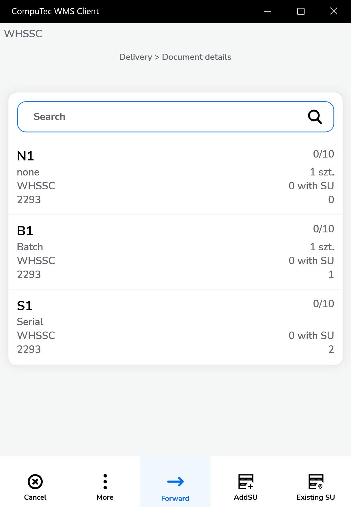
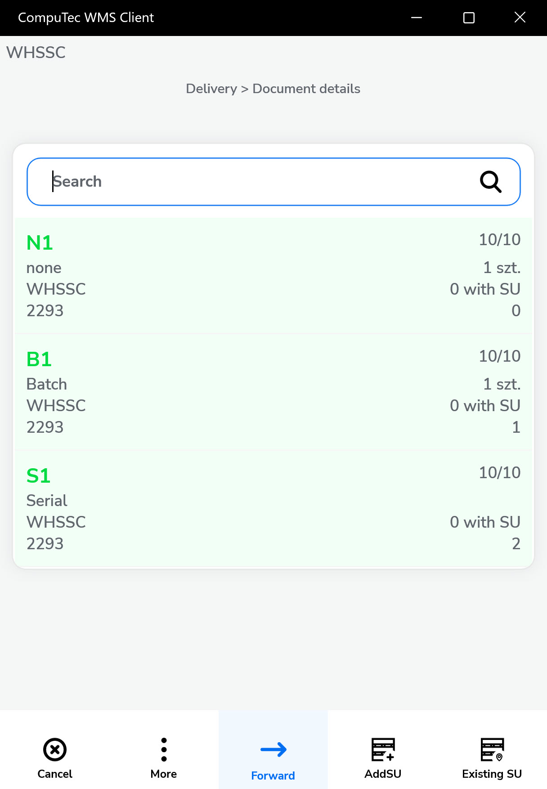
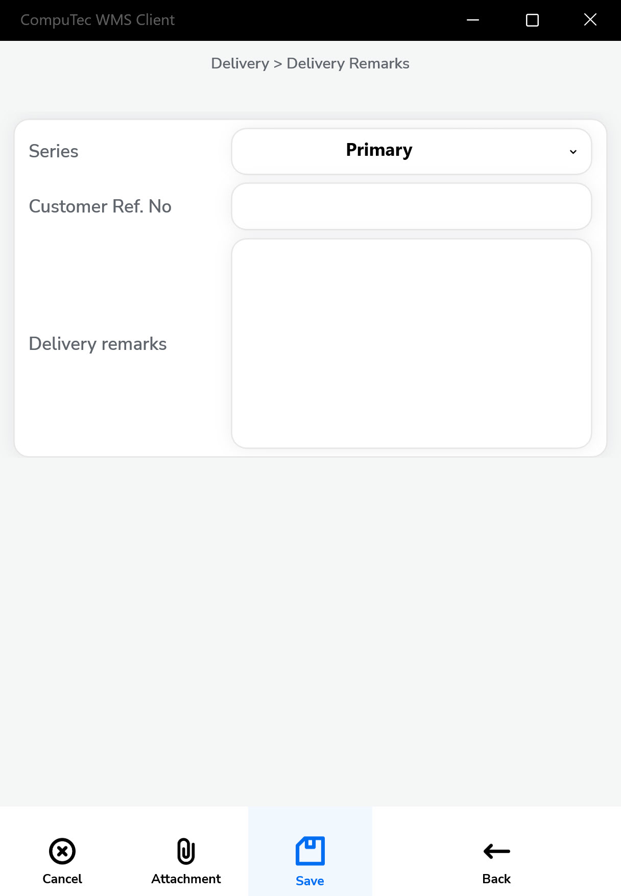

# Customer-Date Workflow

**Customer-Date workflow** allows one to choose Customer first and then a specific date on completing the information on a document. This way, we can easily browse through documents for this Customer any day. This workflow is practical when we want instant access to information on which dates documents are planned for a specific Customer.

The following description applies to the Customer-Date workflow. Click [Default Workflow](default-workflow.md) to check how to choose a workflow for the Delivery document.

---

## From Pick List

1. Click "From Pick List".
2. Select a **Customer** from the available list. (Note: Some customers may not yet have any generated documents.)

    

3. If the selected Customer has existing Pick Lists, they will be displayed.

    

4. Choose the required document. The **Document Details** screen will appear, allowing you to set quantities for each item.

    

5. On the Document Details screen, you can:
    - Adjust quantities
    - Add new Items or Storage Units (SUs)
    - Confirm existing item selections

        

6. Once quantities are confirmed, click "Next" to move to the Remarks screen.

    

Click the "Save" icon to save and complete the document.

---
