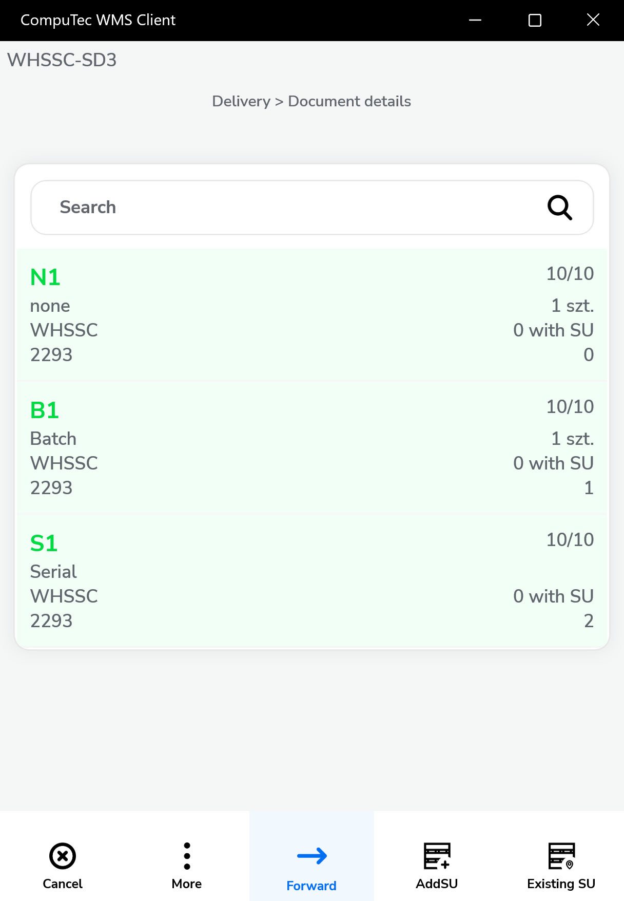

# Date-Customer Workflow

The **Date-Customer Workflow** enables you to select a date first, followed by choosing the corresponding Customer. This approach allows for quick and easy navigation through documents associated with a specific date for any given Customer. It is particularly useful when you need immediate access to documents where Customers have scheduled activities for a certain date.

For instructions on setting up a workflow for Delivery documents, click [here](default-workflow.md).

---

## From Pick List

1. Click "From Pick List".
2. A list of Pick Lists with assigned dates is displayed. Select the relevant Pick List.

    

3. The Customer Selection screen appears, showing only those Customers who have a Pick List generated for the selected date.

    

4. Choose the desired Customer to open the Document Details screen.

    

5. In the Document Details screen:

    - Add additional Items or Storage Units (SUs)
    - Confirm quantities
    - Select appropriate Batches and Serial Numbers

    

6. Click Next to proceed to the Remarks screen.

    

7. Click the "Save" icon to save the document.

---
