# Default Workflow

Managing deliveries efficiently is essential to streamlined warehouse operations. This guide walks you through the default Delivery workflow in the system, ensuring every step is covered - from selecting a customer to posting the final delivery document in SAP Business One.

Click [here](../../../administrator-guide/custom-configuration/custom-configuration-functions/delivery.md) to check how to set a workflow for the Delivery document.

:::note
    Some forms' order and availability during a document's creation may vary depending on individual settings. Click [here](../../../administrator-guide/custom-configuration/overview.md) to find out more on custom configuration.
:::

1. Click "Delivery" from the main menu to initiate a new Delivery document.

    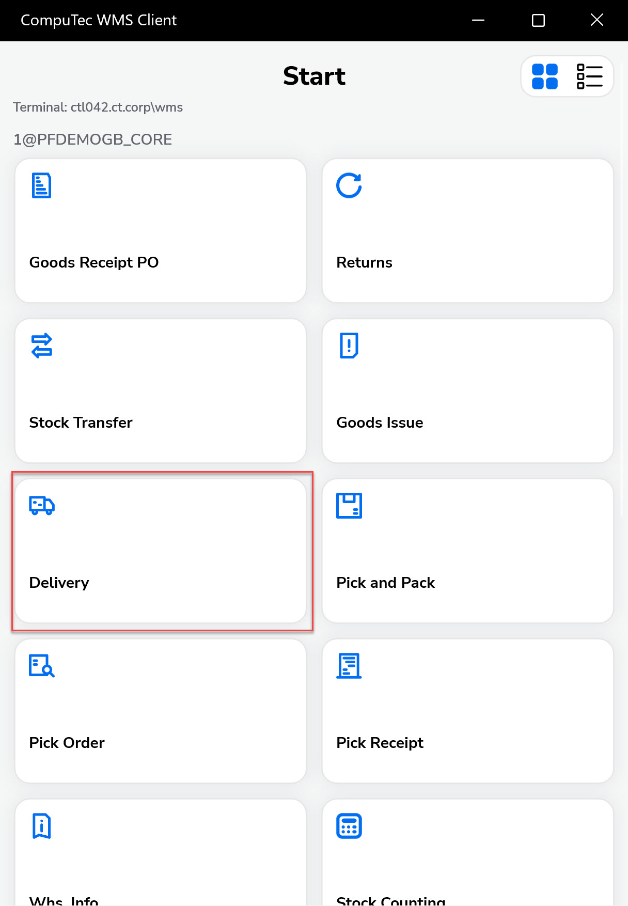 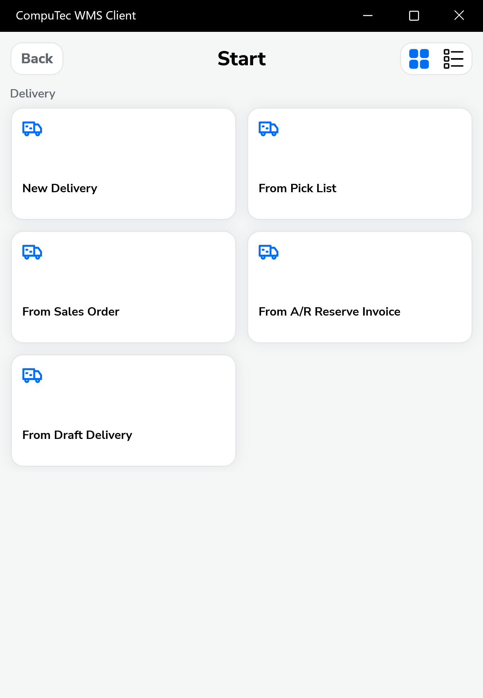

    :::info
    It is possible to [set up a default Warehouse](../../starting.md#documents-tab). In this case, the Warehouse Selection screen is skipped, and the Warehouse set as default is chosen automatically.
    :::

2. The Customer Selection window will appear.

    Clicking a row of a Customer picks it and leads to another window.

    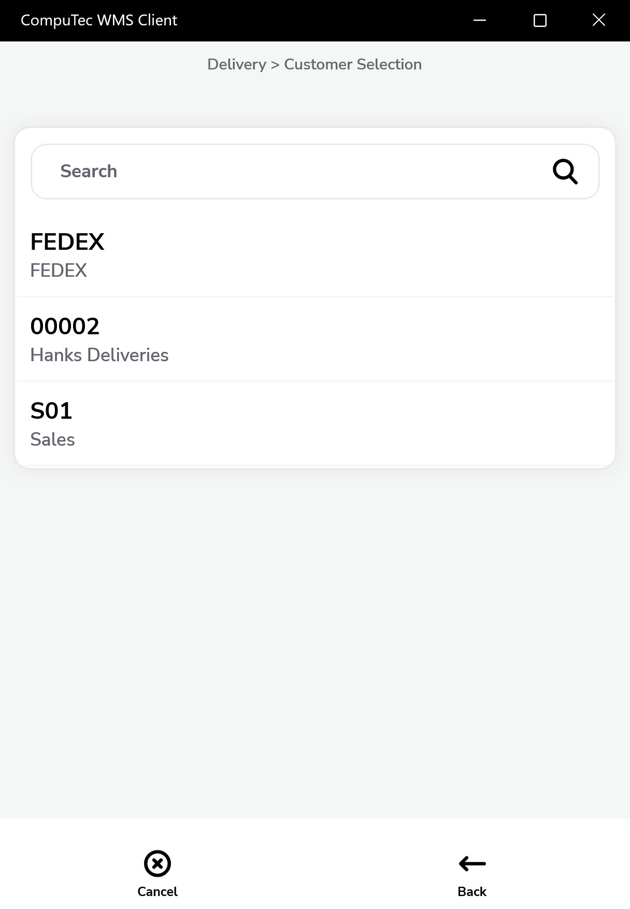

3. You will now see a list of active Pick Lists (excluding those with status “Closed”) for the selected warehouse. You can filter these by scanning an item code.

    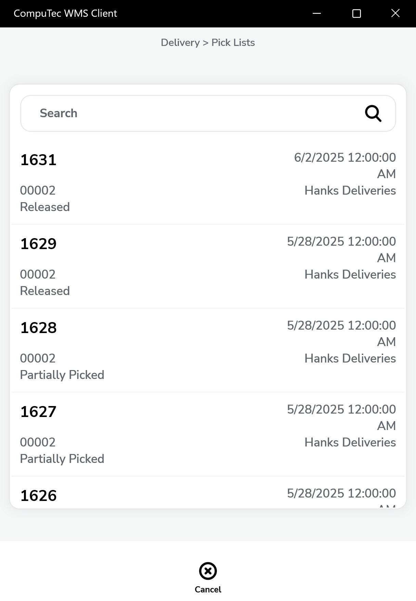

4. The Document Details window will appear. Select items from the Pick List by clicking a row or scanning the item code to set quantities.

    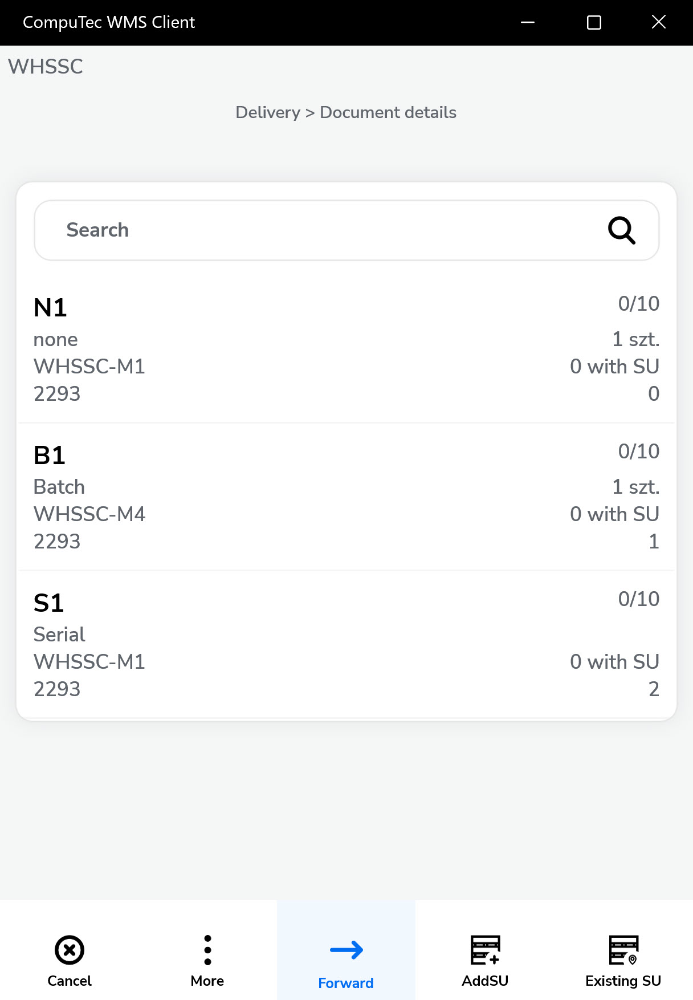

5. A "From Bin form" will appear if Bin Locations manage a Warehouse. Click a required Bin row or scan its code.

    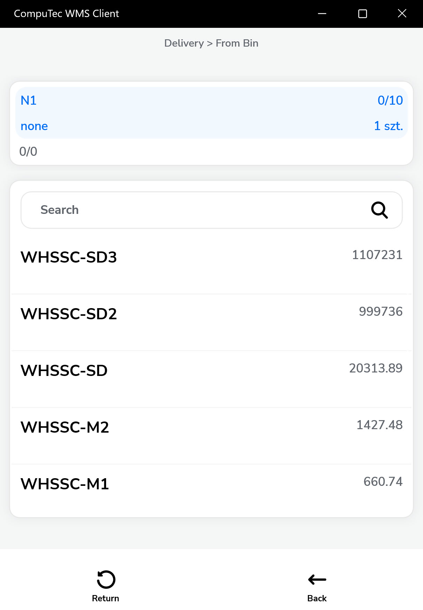

6. Adjust the quantity manually, by scanning, or using the '+' and '-' buttons. Confirm with the right arrow icon. Click the "Save" icon after choosing the correct quantity to return to the Document Details window.

    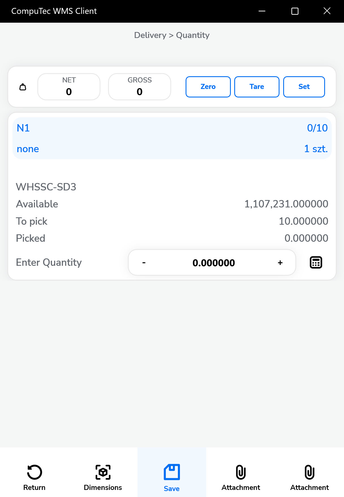

7. If serial numbers manage an item, the Serial Number window appears after clicking an item row. Clicking a Serial number row picks it and adds it to the Document Details window. This step should be repeated until obtaining the desired quantity.

    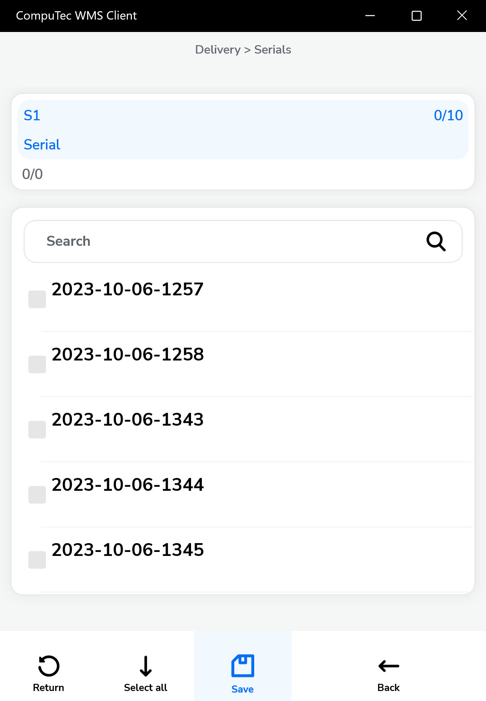

8. For items managed by Batches, the batch selection screen appears after clicking an item in the Document Details window. The Quantity window appears after clicking the desired batch (see no. 6 of this guide).

    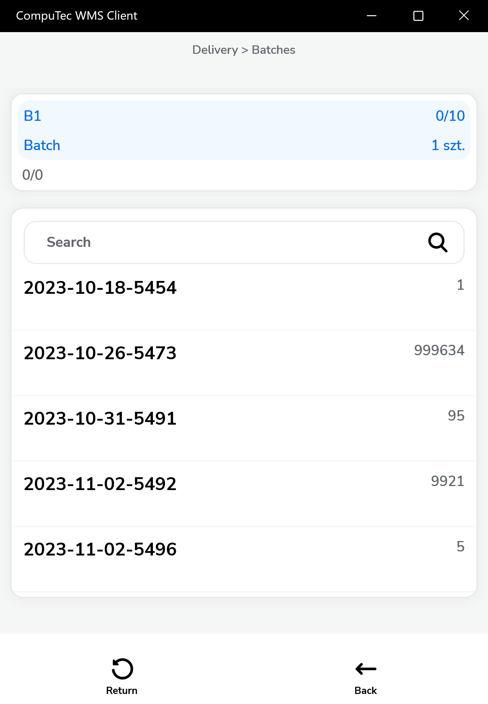

9. Click the menu icon → '+' to manually add items not on the Pick List. Then follow the process from step 4 onward for the new item.

    >Note: If a source Warehouse was not picked in no 2 of this guide, it is available now.

    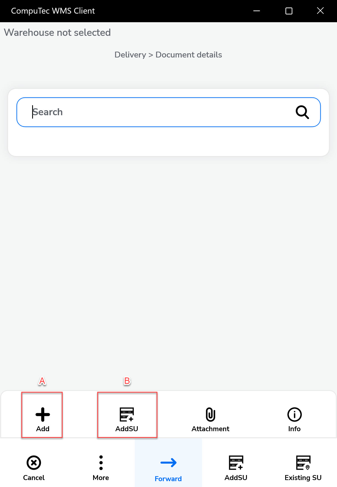

    Click the menu icon and then add the storage unit icon (B) to add a new storage unit to the document:

    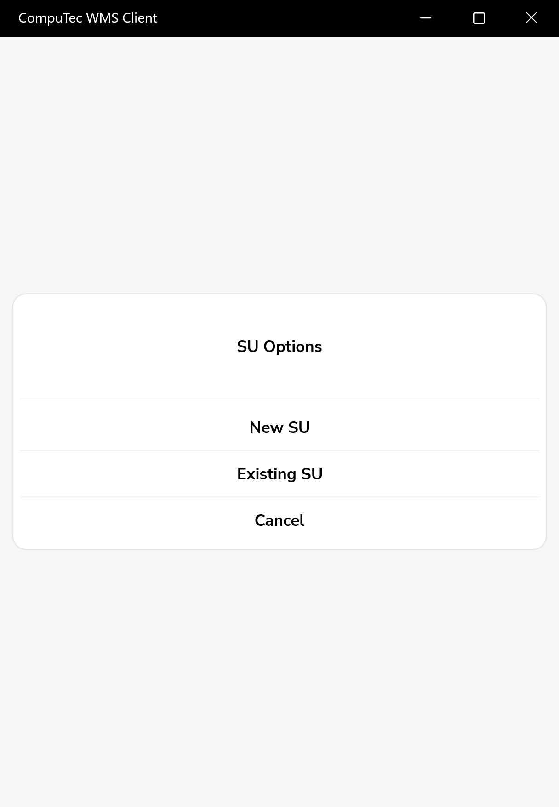

    Storage Unit form will be displayed; click the SU row to add it to the document:

    Click the highlighted icon to see information on a Storage Unit added to the document.

    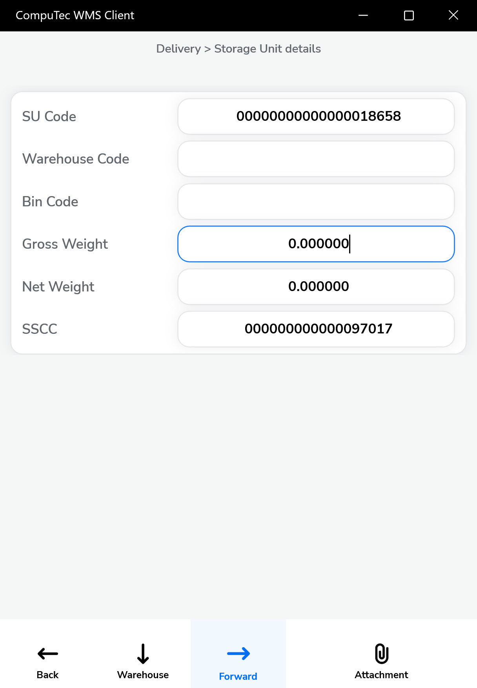

10. Click the "Forward" icon after setting document details.

    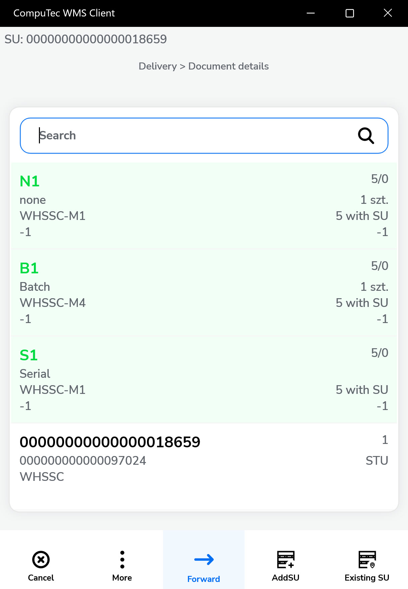

11. The Remarks window will appear. Filling in a reference number field and a remarks field is optional. You can choose a document series (if it is set in a database).

    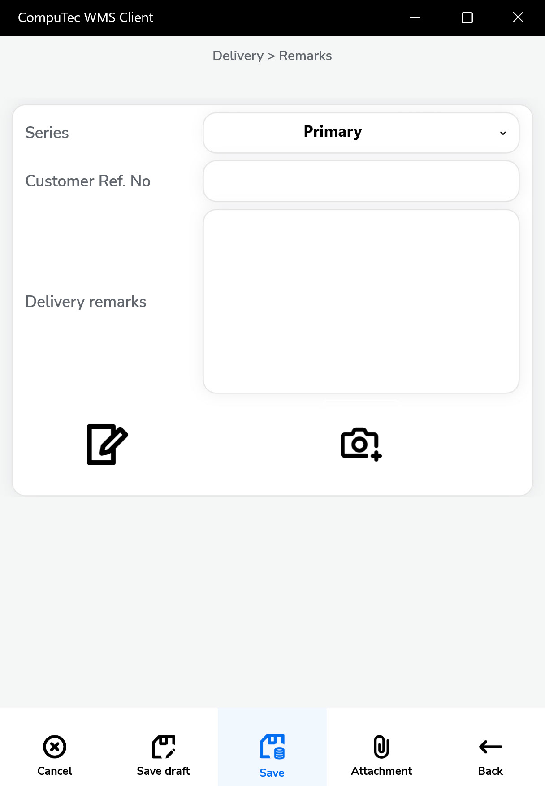

12. You can save the document as a draft.
13. Click the "Save" icon to generate a delivery document.

14. A confirmation message will appear. Click OK to complete the process.

    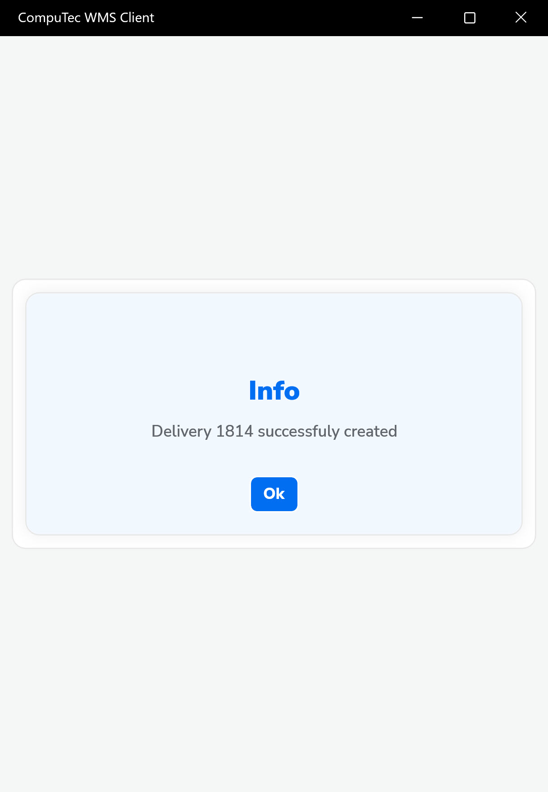

15. Your delivery document is now posted and available in SAP Business One.

---
