# Delivery from Base Document

You can add a delivery based on another document.
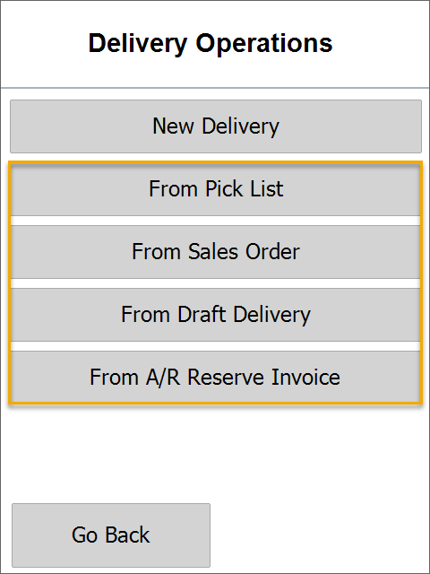

---

## Steps to Create a Document

### Choosing a Base Document

#### From Pick List

Select a Pick List:
    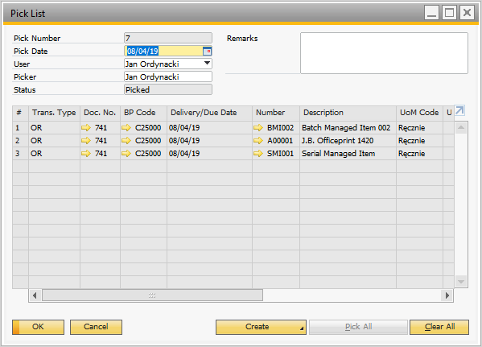
    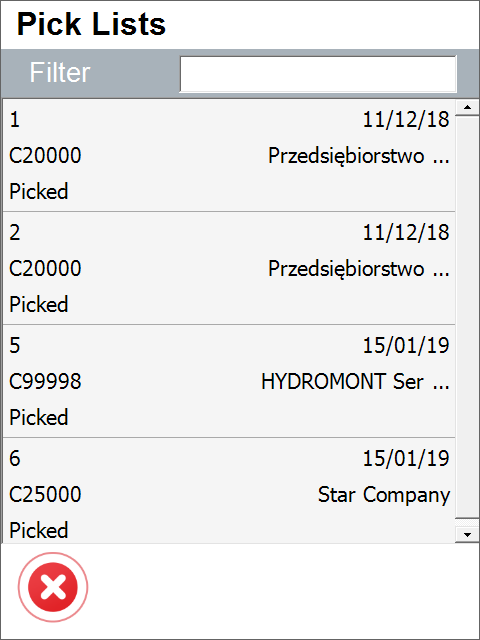

#### From Sales Order

Select one or more Orders of the same Customer:
    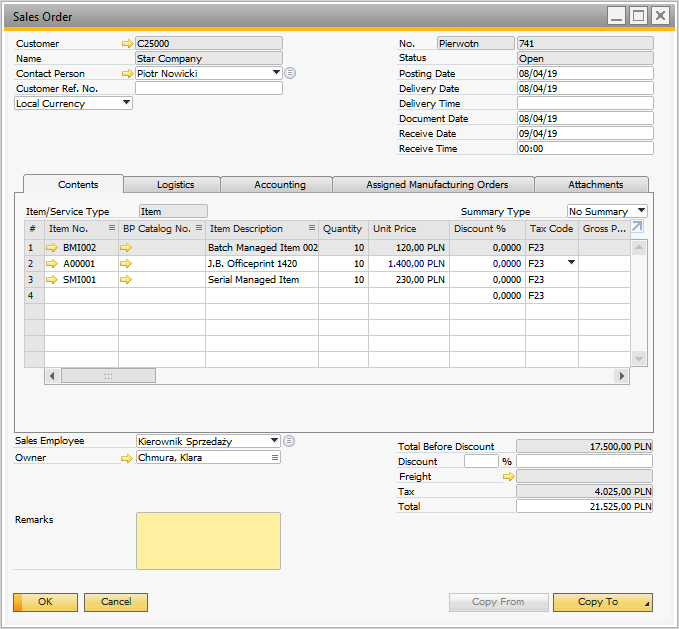
    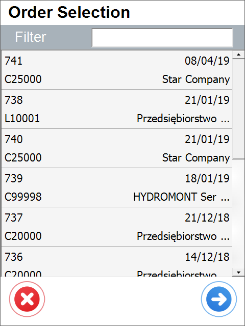

#### From Draft Delivery

    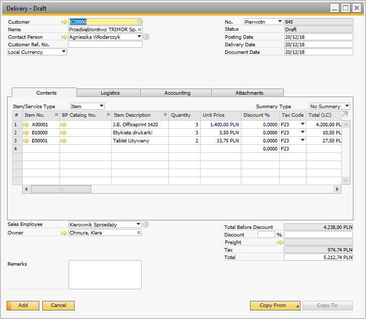
    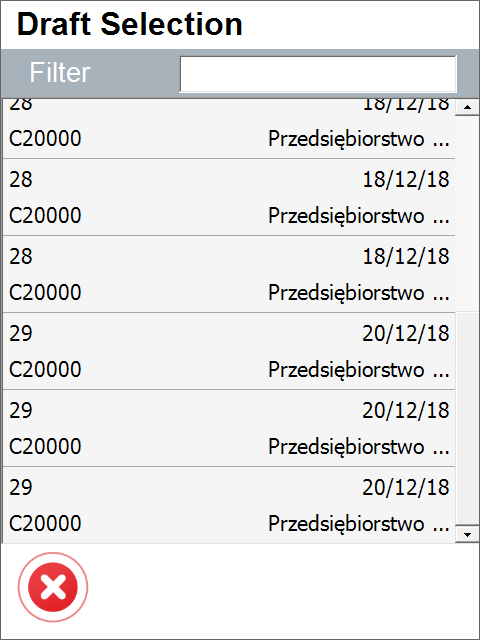

#### From A/R Reserve Invoice

    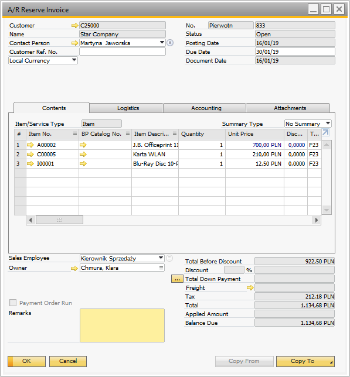
    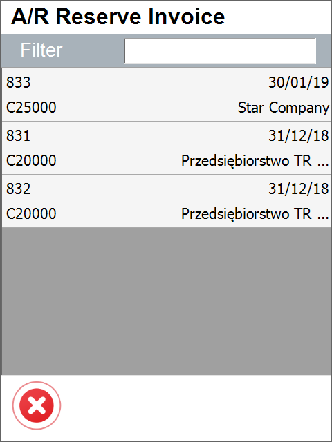

### Setting the Quantity of an Already-added Item

Document Details screen opens. You can select and confirm the quantity of the already added item.
    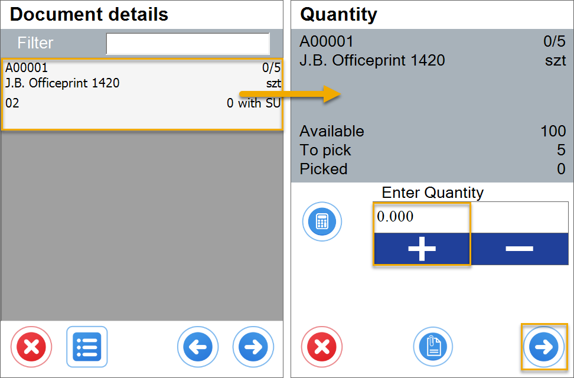

### Confirming the Quantity of Batch Managed Item

    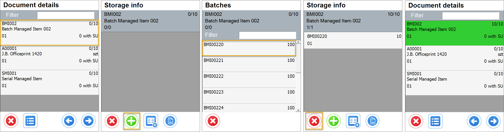

### Confirming the Quantity of the Item Managed by Serial Numbers

    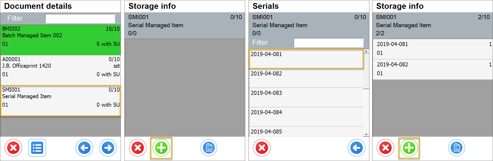

### Adding an Item that is not Listed

    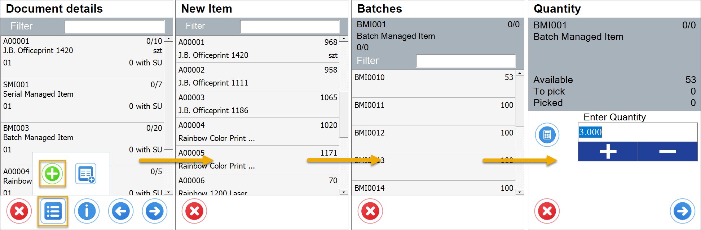

### Adding a Storage Unit

    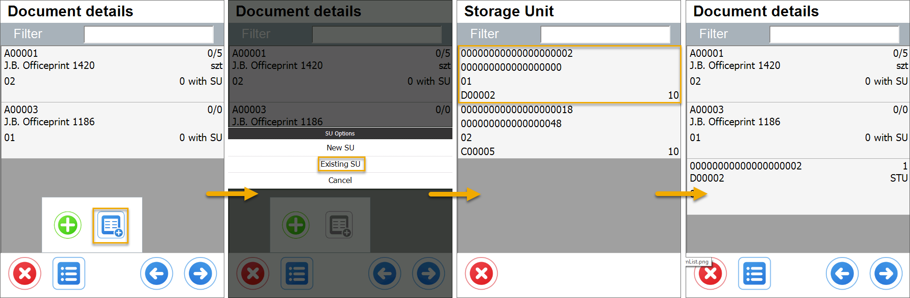

The items and their quantities are successfully added to the document:
    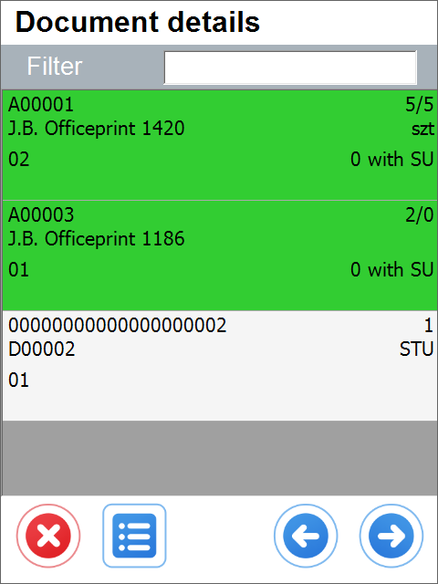

### Remarks Screen

    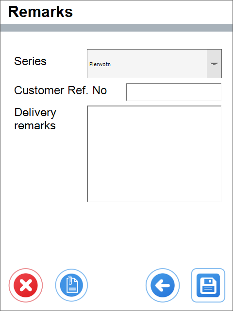

### Delivery is Successfully Saved

    

### Delivery is Posted in SAP Business One

    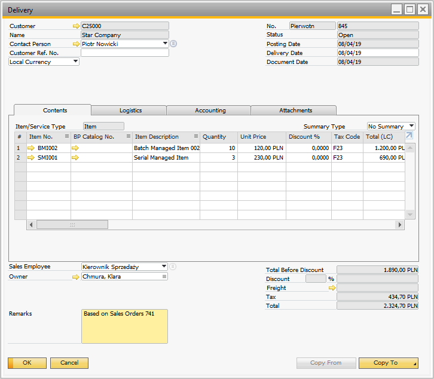
