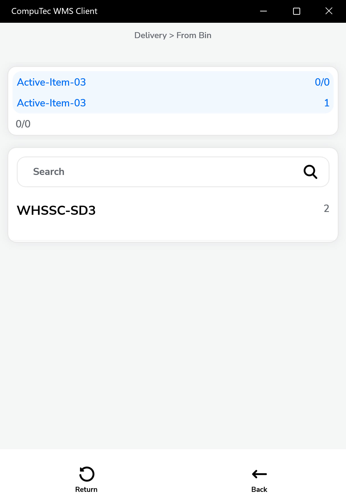
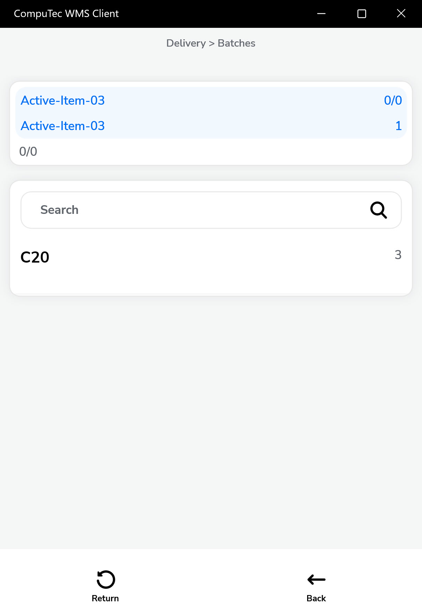

# Delivery from Base Document

n SAP Business One, deliveries can be efficiently created by referencing existing base documents. This not only ensures consistency but also helps in streamlining the dispatch process by pulling in relevant data automatically. This guide walks you through the detailed process of creating a delivery document based on various source documents and managing item details effectively.

---

You can add a delivery based on another document.

---

## Steps to Create a Document

### Choosing a Base Document

You can initiate a delivery based on several types of base documents. This ensures that items, quantities, and customer details are accurately carried over without manual entry.

**a. From Pick List**

- Navigate to the Pick List screen.
- Select the relevant pick list generated from a Sales Order or Production Order.
- Once selected, the system fetches all relevant item details to proceed with delivery.

     

**b. From Sales Order**

- Choose one or more Sales Orders belonging to the same customer.
- This is useful when consolidating multiple orders into a single delivery.
- Ensure that only items available in inventory are confirmed for delivery.

     

**From Draft Delivery**

Select the relevant draft, review the items and quantities, and proceed to post the delivery.

     

**d. From A/R Reserve Invoice**

- Deliveries can also be created based on A/R Reserve Invoices.
- Select the invoice and proceed with confirming the items and quantities for dispatch.

     

### Setting the Quantity of an Already-added Item

Once a base document is selected, the system opens the Document Details screen. Here:

- You can adjust the delivery quantity if it differs from the ordered quantity.
- This step allows for partial deliveries if needed.

    

### Confirming the Quantity of Batch Managed Item

If the item is batch-managed:

- Navigate to the line item and select the batch numbers.
- Confirm the batch quantity to be delivered from the warehouse bin.

          

### Confirming the Quantity of the Item Managed by Serial Numbers

For items managed by serial numbers:

- You need to select individual serial numbers from the available stock.
- This ensures traceability and control over serialized inventory.

        

### Adding an Item that is not Listed

In certain cases, you may want to add an item not included in the base document:

           

### Adding a Storage Unit

The items and their quantities are successfully added to the document:

      

### Remarks Screen

The Remarks window will appear. Filling in a reference number field and a remarks field is optional.

    

### Delivery is Successfully Saved

Once all items and quantities are verified, save the delivery document.

The system validates the information and confirms a successful save.

    

### Delivery is Posted in SAP Business One

    

---
