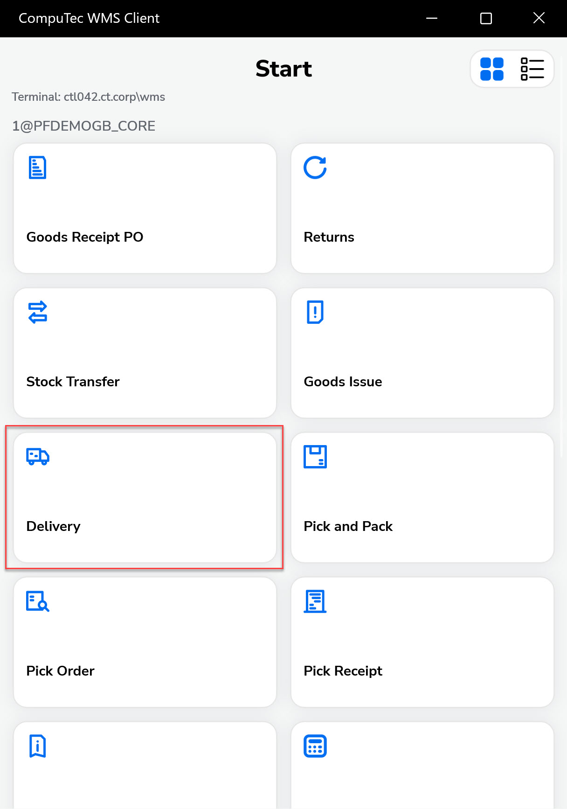

# New Delivery

This guide explains how to create a new Delivery Document in the system. A delivery document is used to record the dispatch of goods to a customer and is often based on a Sales Order or Pick List. Depending on your system’s configuration, some steps or screens may vary.

:::info
Some forms' order and availability during document creation may vary depending on individual settings.
:::

---

1. Press the Delivery in the main menu to create a delivery document.

     

    :::info
        It is possible to [set up a default Warehouse](../../starting.md#documents-tab). In this case, the Warehouse Selection screen is skipped, and the Warehouse set as default is chosen automatically.
    :::

2. The Customer Selection window appears. Click a row to choose a customer and move to the next screen.

    

    The Document Details screen appears.

    

3. After selecting the customer, the Document Details screen opens. Here, you can add items to the delivery using multiple methods.

    

    
A. Add new Item from the Item's list.

    

    Select an item from the list and input its quantity.

       

    Scan the item’s barcode to be taken directly to the quantity screen. Example shown for non-managed item A00001.

    

    Scanning the barcode leads directly to the quantity screen.

    
    

    

    

    
B. Add a new item in new SU

    

    Use this option to create a new SU and add an item into it.

      
    

    

    

    
C. Add a new item in existing SU

    

    Use this option to place an item into an already existing SU.

          
    

    

4. In the Remarks screen, you can:

    - Add comments
    - Change the document series
    - Enter supplier reference numbers
    - Include UDF (User Defined Fields), if required

        

5. Message info about the created delivery no appears.

    

6. The Delivery document is posted in SAP Business One.

    

---
