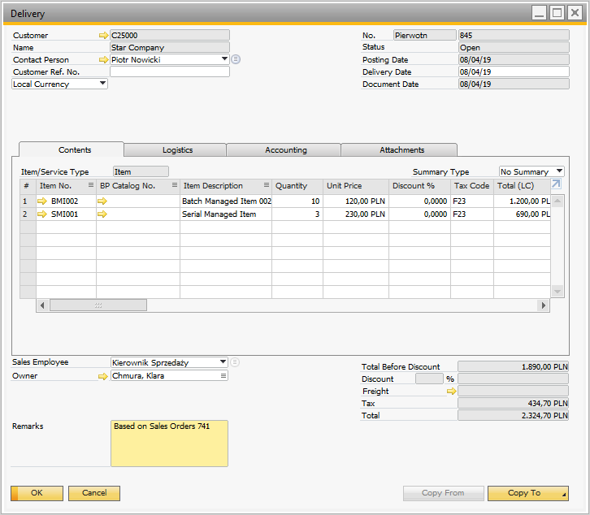

# New Delivery

:::info
Some forms' order and availability during document creation may vary depending on individual settings. Click here to find out more.
:::

- Press the Delivery in the main menu to create a delivery document.

- The Source Warehouse window will appear.
Choose the desired warehouse by clicking its row.

:::caution
Searching through the records is available in every window in which a Filter row is displayed by typing in at least a part of a name, e.g., a part of a Warehouse name, in the Warehouse Selection window.
:::
    

:::caution
This step can be skipped by clicking the right arrow icon. In this case, Source Warehouse can choose from setting Item details.
:::

It is possible to [set up a default Warehouse](../../starting.md#documents-tab). In this case, the Warehouse Selection screen is skipped, and the Warehouse set as default is chosen automatically.

- The Customer Selection window will appear.

Clicking a row of a Customer picks it and leads to another window.

- The Document Details screen appears.

You can add an Item to the list in different ways.

A. Add new Item from the Item's list.

Add an item manually:

Add an item by scanning its barcode:
You can scan an Item's barcode, which leads you directly to the quantity screen.
This is the barcode of non-managed item A00001.

Scanning the barcode leads directly to the quantity screen.

B. Add a SU to the item's list.

You can create a New SU or add an existing SU.

- There are items added in the Document Details screen:

**Remarks screen**

You can add remarks, change document series, or set the supplier ref no on the remarks screen. Add a UDF to the previous screen or save the document.
    

- Message info about the created delivery no appears.

    

- The Delivery document is posted in SAP Business One.

    

---
