# Packing Slip

A Delivery document can be created directly or based on other SAP Business One documents. This guide explains how to create a delivery, customize its view, manage storage units (SUs), and use packing slips to track items.

---

## Prerequisites

Before creating a delivery, ensure that:

- You have access to the relevant base documents (e.g., Sales Order, Pick List).
- Any required custom configurations (extra fields, buttons, or packing slip options) are set up in the system.
- Storage Units (SU) and SSCC codes are enabled if your process requires them.

## Steps to Create a Delivery Document

- **Step 1. Start a Delivery Document**

    A delivery document can be created from the following sources: Sales Order, Pick List, A/R Reserve Invoice, Draft Document

        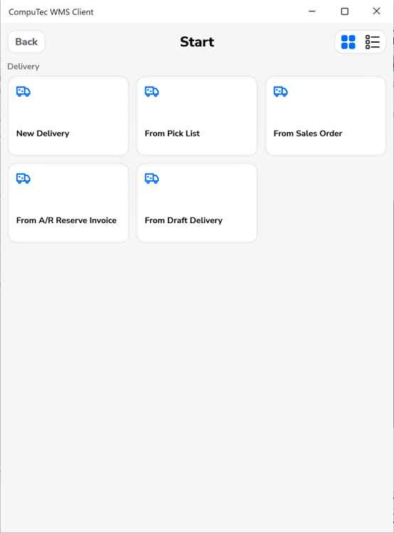

    Alternatively, you can start a new delivery from scratch.

    When you open the Delivery, the Document Details screen displays the item lines from the selected base document.

        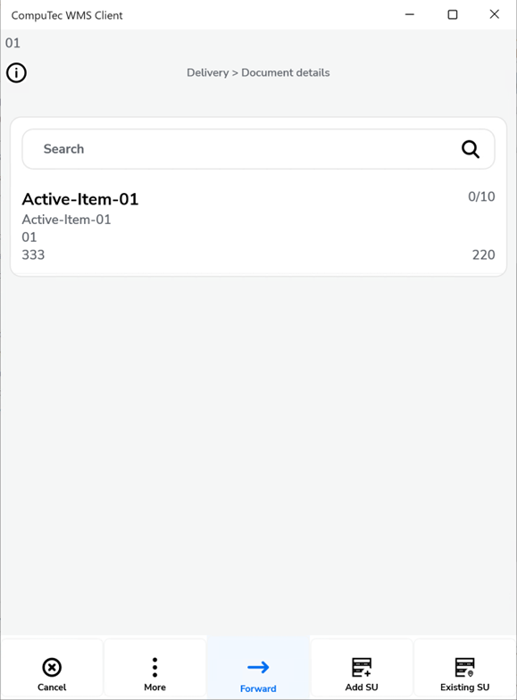

- **Step 2. Customize the Line View**

    You can personalize the Document Details screen to display additional information:

        - Go to Custom Configuration → Manager → Extra SQL fields on Main List Items.

            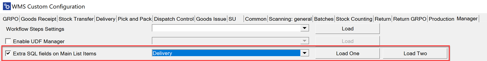

        - Add up to two extra fields to display on each line.

            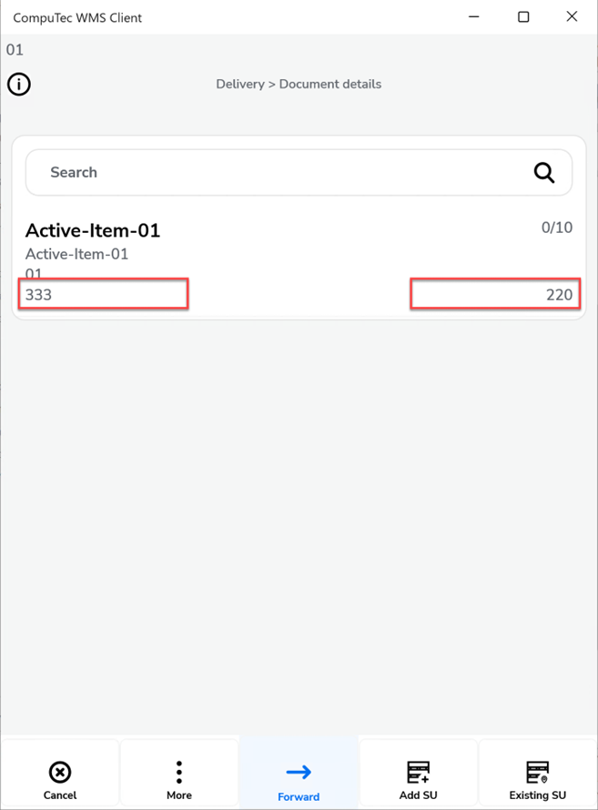

- **Step 3. Configure Available Actions**

    The action buttons at the bottom of the screen can be customized. For example, you can disable the option to add a Storage Unit if it is not needed in your process.

        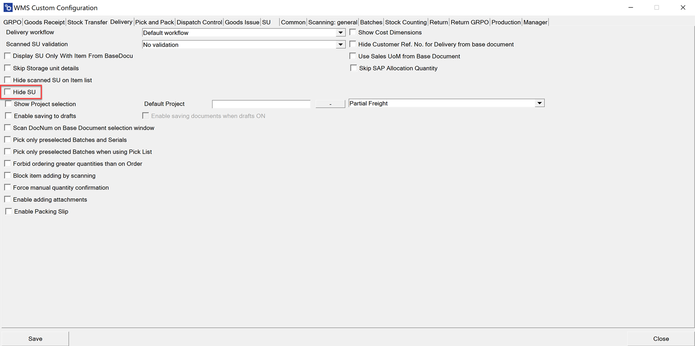

- **Step 4. Manage Storage Units (SU)**

        - When you create an SU, its SU Code is displayed on the top bar.

            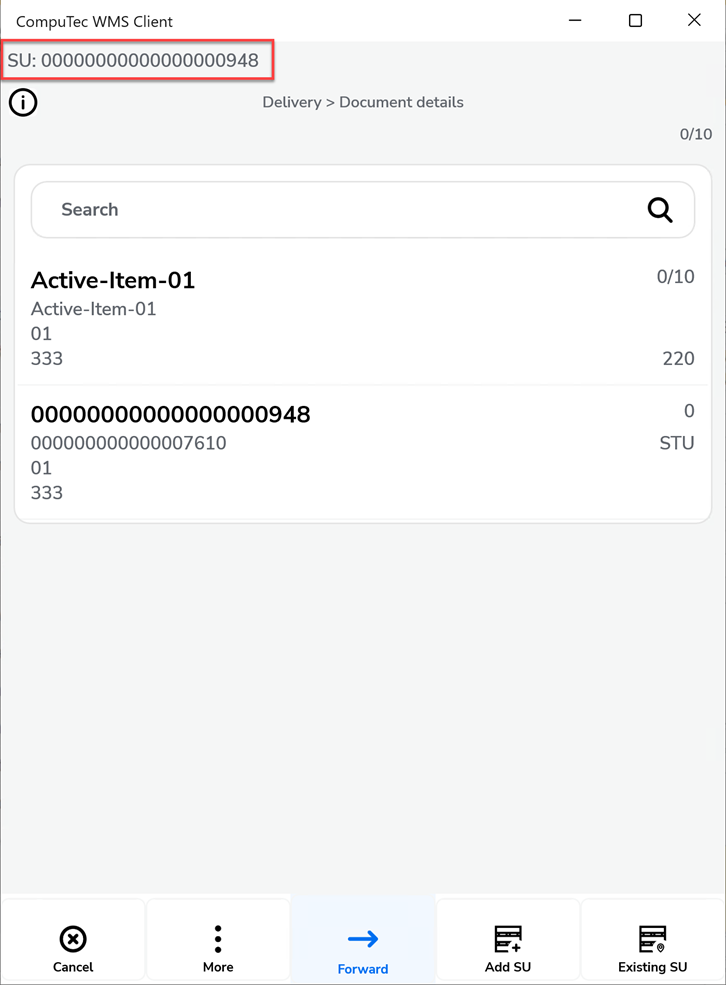

        - After scanning or selecting an item, you can choose the requested or allocated quantity. A list of available batches appears for selection.

            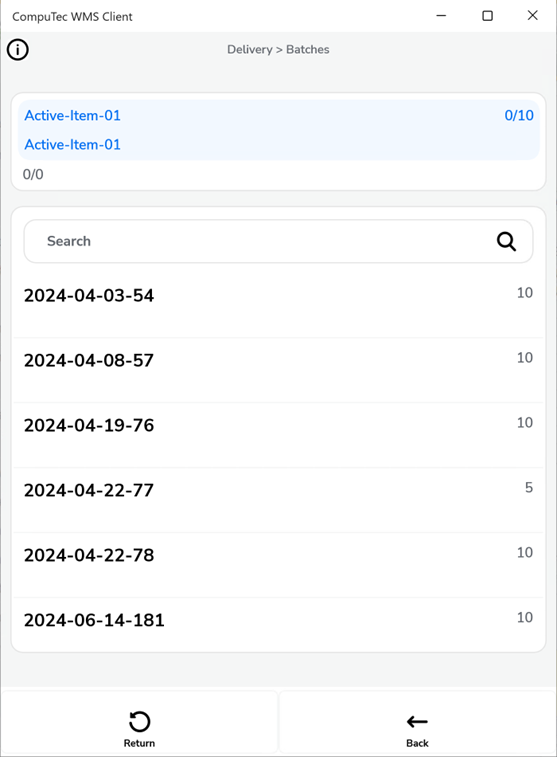

        - You can add a new SU at any point. Its SU Code will appear on the top bar.To switch between Storage Units - Scan the SU Code/SSCC, or tap the top bar to stop adding to the current SU, then select the SU you want to edit.

            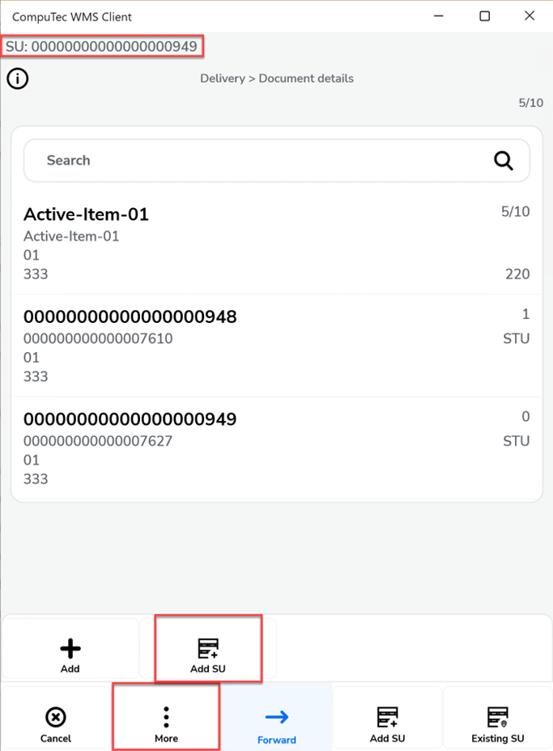 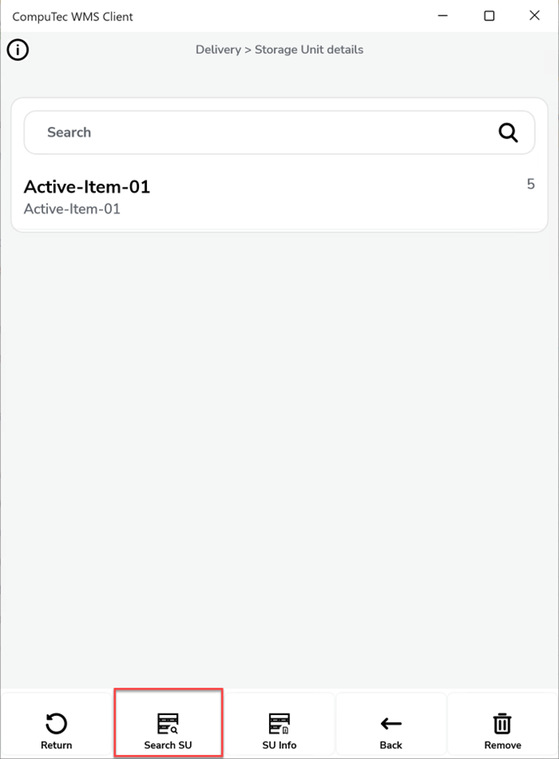

- Step 5. **Enable and Use Packing Slips**

    Packing Slips allow you to track which items are packed into which Storage Unit.

        - Go to Custom Configuration → Delivery tab.

            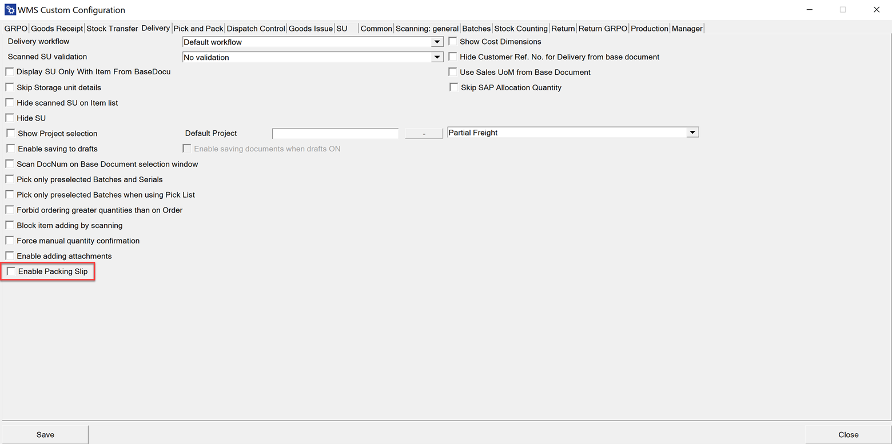

        - Enable the Packing Slip option.

    Once enabled, you can open the Packing Slip directly from the saved Delivery document.

        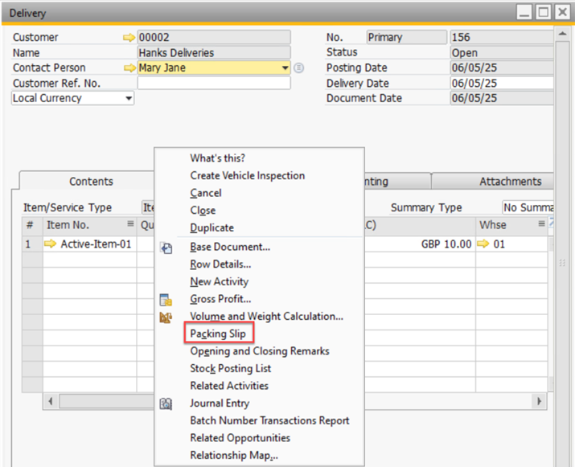

    The Packing Slip displays the mapping between items and their assigned Storage Units.

        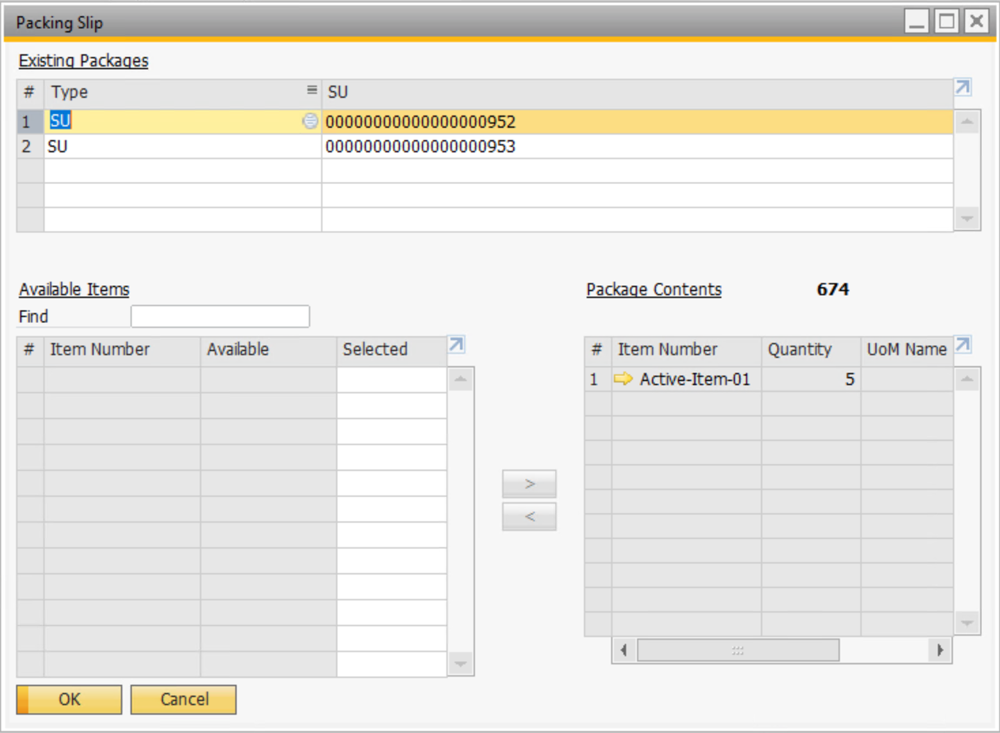

- **Step 6. Finalize the Delivery**

    When the requested quantity is fully entered, the line turns green.

    You can then:

        - Save the document as a Delivery document.
        - Save it as a Draft.
        - Attach additional files (if attachments are enabled in Custom Configuration).

            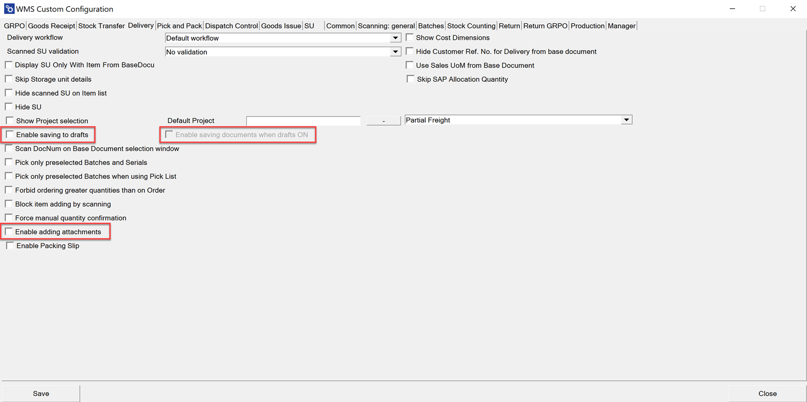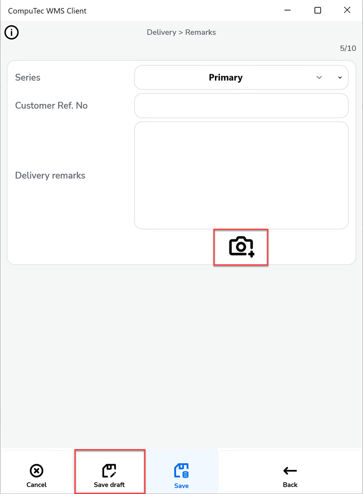

---
