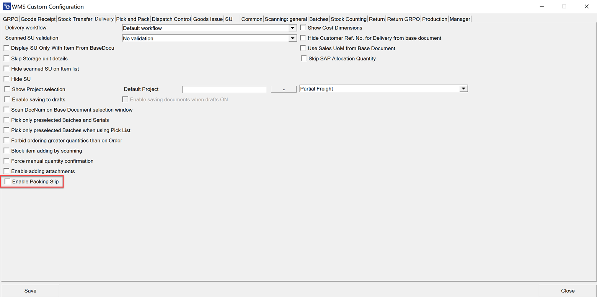
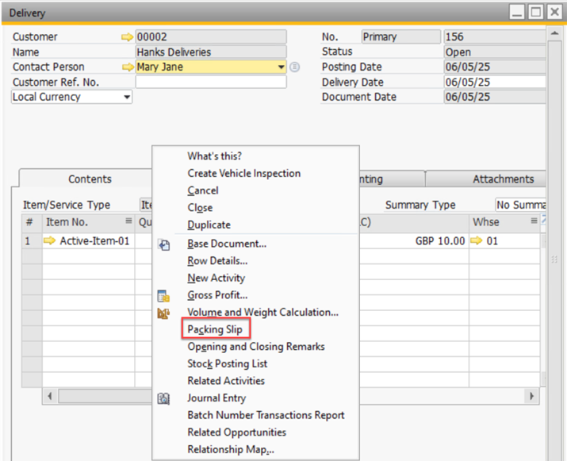
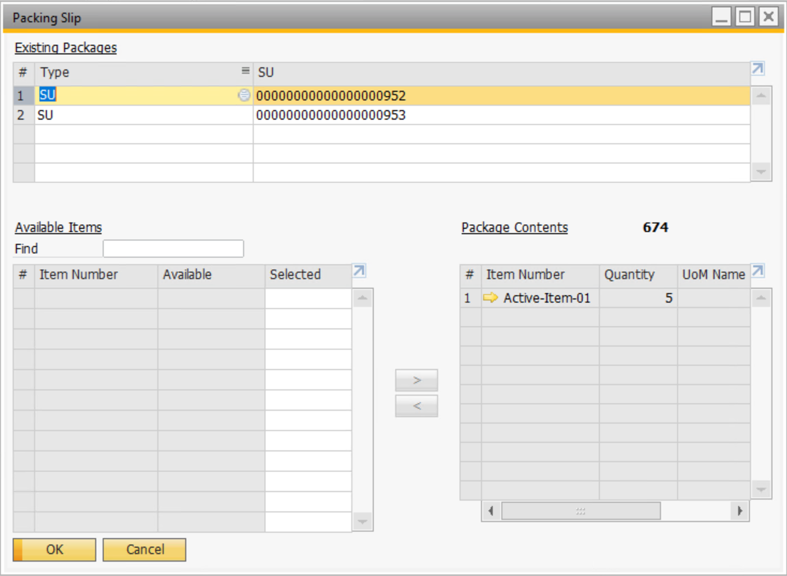
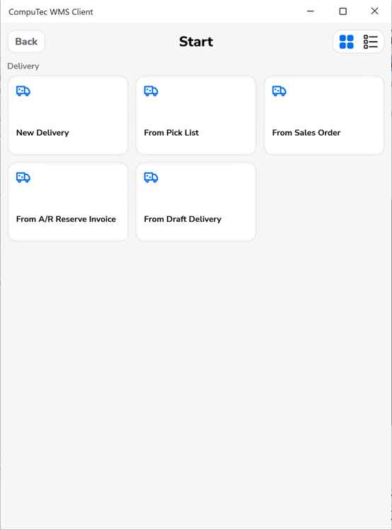
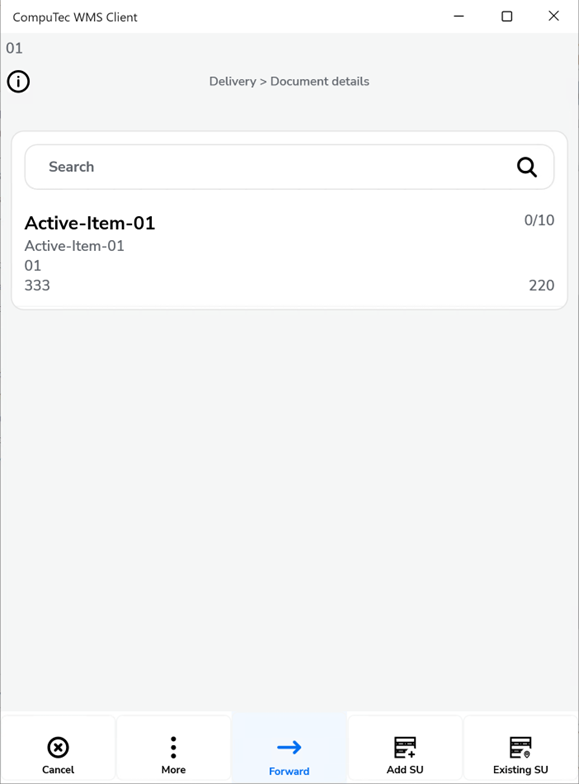
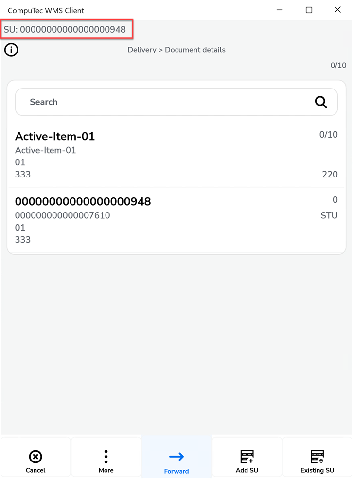
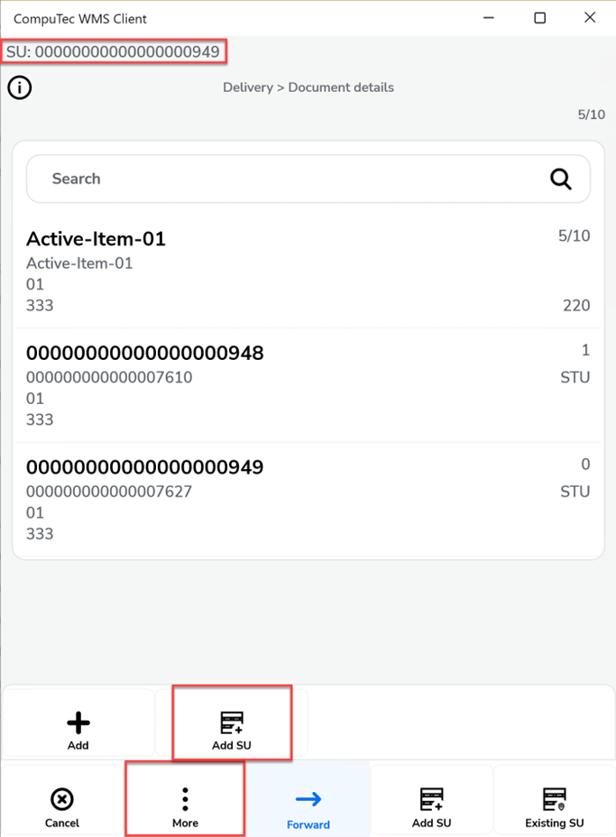
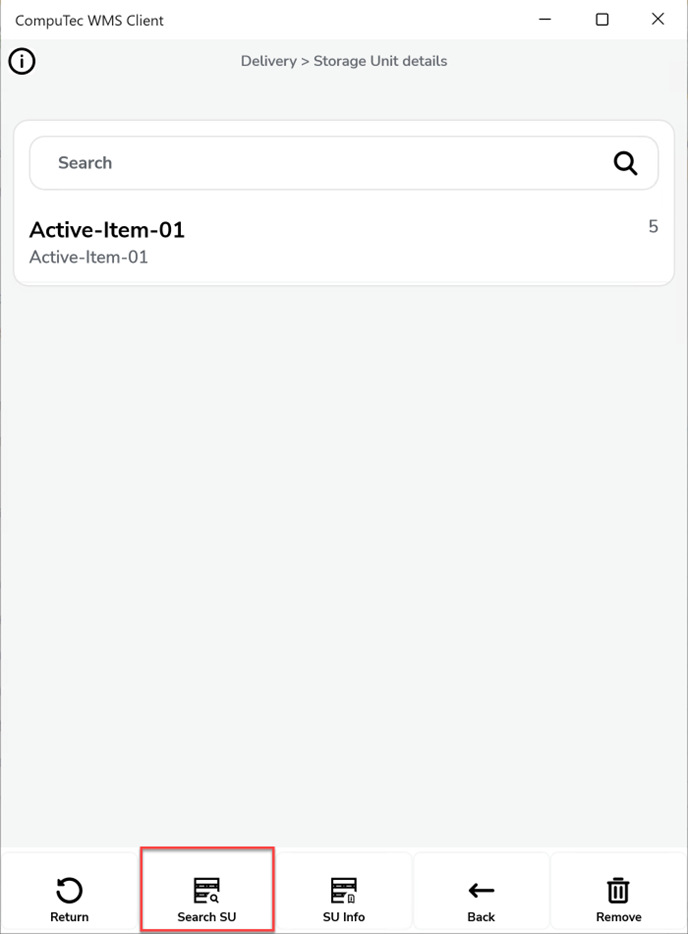
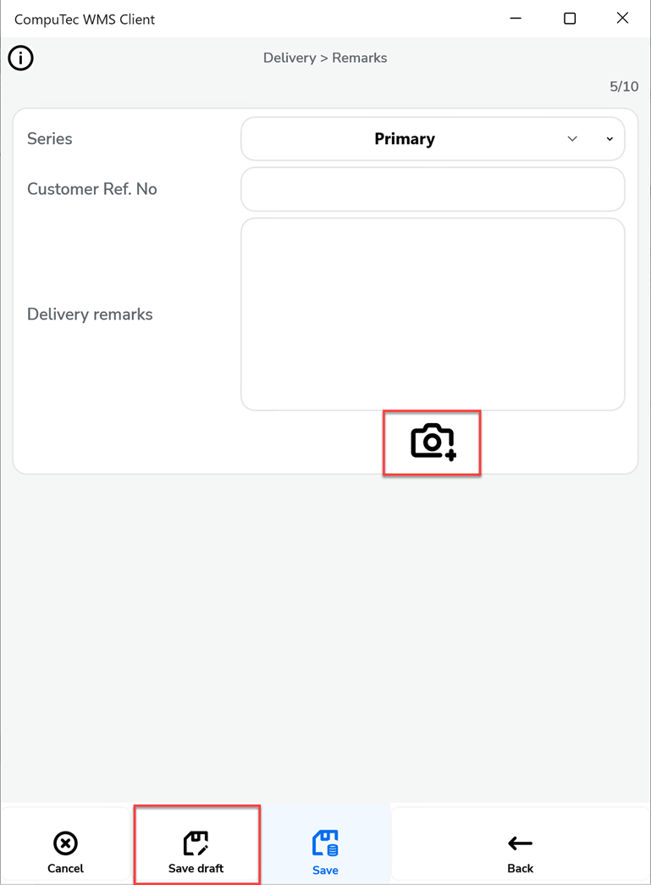

# Packing Slip on Delivery

The Delivery process in SAP Business One allows you to move goods out of the warehouse and record them against customer orders. With CompuTec WMS, you can enhance this process by enabling **Packing Slips** to trace Storage Units (SUs).

---

## Purpose

- Record customer deliveries against base documents.  
- Track which items were packed into which Storage Units (SUs).  
- Provide transparency with **Packing Slips**, ensuring accurate logistics and traceability.

---

## How to Use Packing Slip in Delivery

- **Step 1: Enable Packing Slip**

        - Navigate to: Custom Configuration → Delivery tab

            

        - Enable the "Packing Slip" option.
        - After saving the document, the Packing Slip becomes accessible directly from the Delivery document.

            

        - In the Packing Slip, you can view which items have been packed into each Storage Unit.

            

- **Step 2: Create a Delivery**

        - You can create a Delivery document based on: Pick List, Sales Order, A/R Reserve Invoice, Draft.

            

        - When you open or create a delivery, the **Document Details** screen displays the lines from the SAP base document.

            

**- Step 3: Manage Storage Units (SUs)**

        - Add a new "SU": its SU Code appears on the top bar.  
        - Switch between SUs by:  
        - Scanning the **SU Code/SSCC**, or  
        - Clicking the **top bar** to stop adding, then selecting the SU you want to edit.  

              

- **Step 4: Complete the Delivery**

        - When the requested quantity is fully picked, the line turns "green".  
        - Save the document to finalize the Delivery.

            

---
