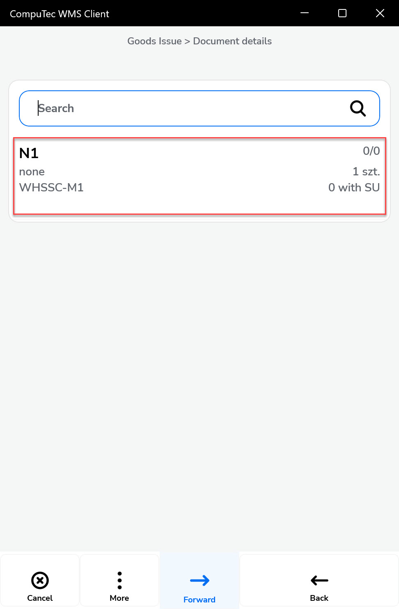

# Goods Issue

The Goods Issue document in SAP Business One records the internal movement of items or materials out of a warehouse. It’s typically used when goods are consumed internally, issued for production, or sent for other non-sales purposes.

Goods Issue documents the company's internal issue of Items or materials.

:::info
    The order and availability of forms during document creation may vary depending on your system's settings. Click [here](../../administrator-guide/custom-configuration/overview.md) to find out more about custom configuration.
:::

---

## Step-by-Step Process to Create a Goods Issue Document

- From the main menu, select Goods Issue to begin the process.

    

- You’ll now be prompted to choose the Source Warehouse.

        - If a [default warehouse](../starting.md#documents-tab) is already set in your system, this step may be skipped.
        - You can also scan a warehouse code (with or without a prefix) to make a selection.

            

- Click the menu icon, then the plus icon (+) to begin adding items.

    

    You can:

        - Scan an Item or Storage Unit (SU) code, with or without a prefix.
        - Manually select items from the list shown.

    

    
Click here to expand

    

    Scanning an Item code of an Item that is not on the list adds the Item to the list.
    Scanning a code without a prefix leads to interpreting it as an Item code and works as described above.

    If a code without a prefix is scanned and an Item with this code is not found, the application attempts to validate the code as an SU code.

    

    You can scan an Item or SU code in this form, with or without a prefix. Scanning an Item code of an Item that is on the list leads to the quantity.

    
    

    

- The list of available Items will be displayed. Click a desired Item to add it to the document.

     

- Then, click on the item row to set its details.

    

- If the Item is managed by serial numbers, a form for choosing it will be displayed.

     

- If the Item is managed by Batches, a form for choosing it will be displayed. Click a desired batch from the list.

     

- A form for setting quantity will be displayed. Type in a desired value or set it using the plus and minus buttons and click the "Save" icon.

    

- Click "More" and then the Storage Unit icon to add a Storage Unit.

    

- The form for choosing Storage Units will be displayed. Click a desired Storage Unit to add it to the document. Set the desired quantity.

        

- Click the "Forward" icon after setting all the details.

    

- Set the series (if it is preset and required), add Remarks (if needed), and click the "Save" icon.

    

- A confirmation message with the document number will appear.

    

- The Goods Issue document is now saved and available in the SAP Business One system.

    

---
