# Based on Existing Document

Goods Receipt PO (GRPO) can be created directly based on an existing base document such as a Purchase Order or an A/P Reserve Invoice. This approach helps reduce data entry errors, ensures consistency, and speeds up the receiving process. Below is a step-by-step guide on how to create a GRPO based on an existing document.

---

## Step-by-Step Process

1. Navigate to the main menu and choose the relevant base document type.

    >Note: When basing your GRPO on an A/P Reserve Invoice, ensure the quantities match the base document exactly.

    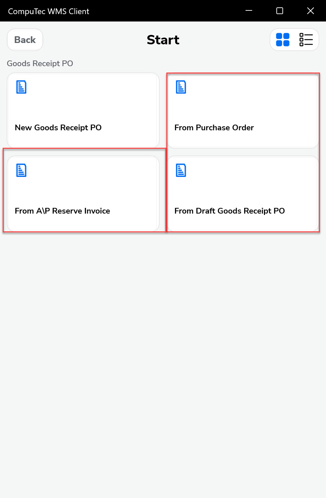

    >Note: UDFs (User Defined Fields) at the header level now display default values for Warehouse and Bin Location for easier processing.

2. Choose a document number by clicking its line. You can also scan a barcode or filter using the filter field.

    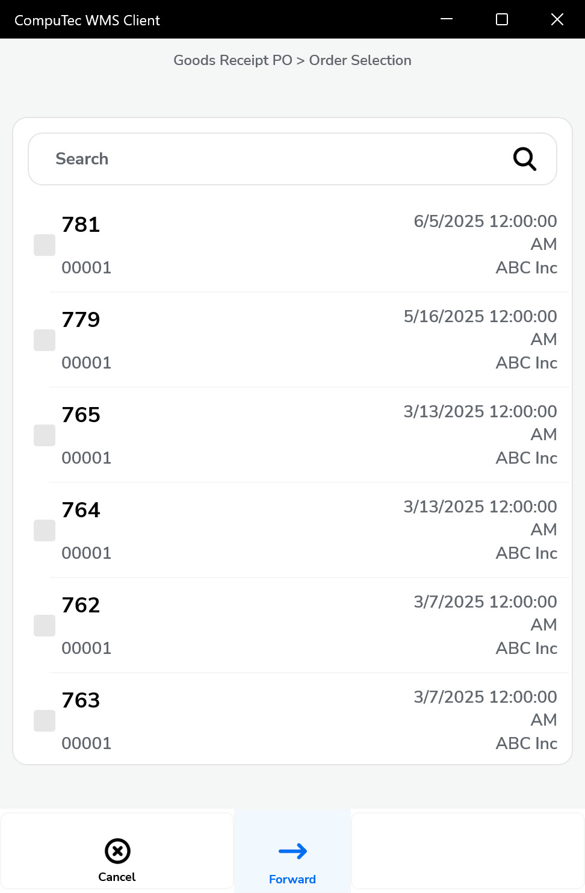

3. There are additional elements in the Document Details screen:

    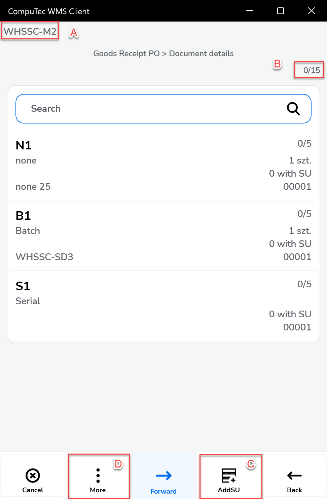

    1. **Warehouse**: Automatically selected if all items are received into the same warehouse. Otherwise, select it manually for each item or Storage Unit (SU).
    2. **Picked/Overall Quantity**: Displays progress.
    3. **New SU Button**: Creates a new Storage Unit. If "Hide SU" is enabled and Bin Locations are disabled, SU details won’t be shown.
    4. **Tooltip**: A tooltip lets you add a new item or open the SU menu.

    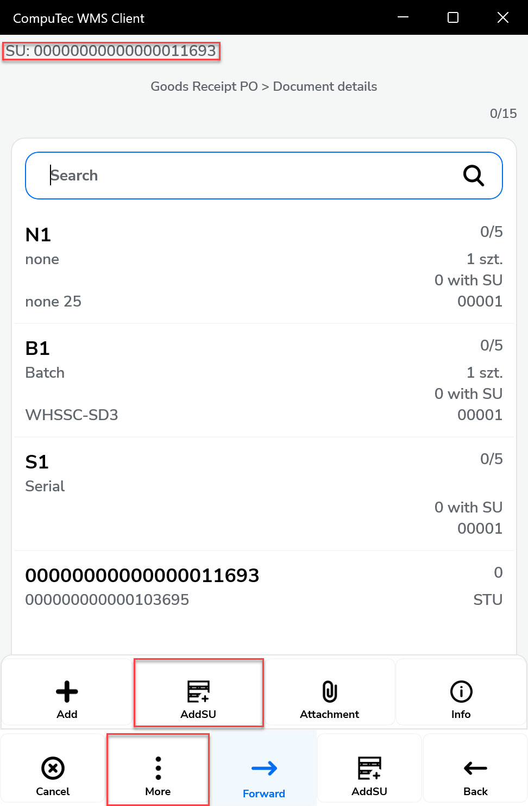

4. You can add Items to already existing SU and also to those with Created status (CR).

    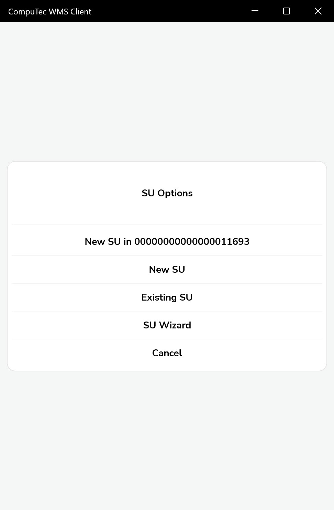

5. If you’re in SU adding mode and scan an item barcode, all items are added to the SU displayed at the top.

    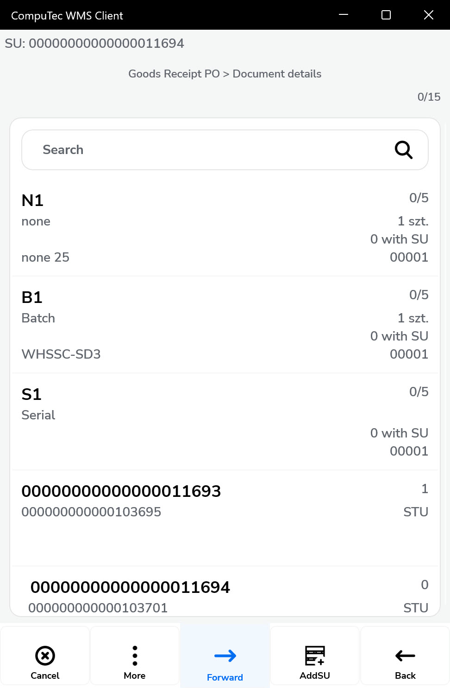

6. To leave the SU, click the top bar with its number or scan a barcode of another existing (only on this document) SU.
7. You can also click the SU line on a list to see its details.

    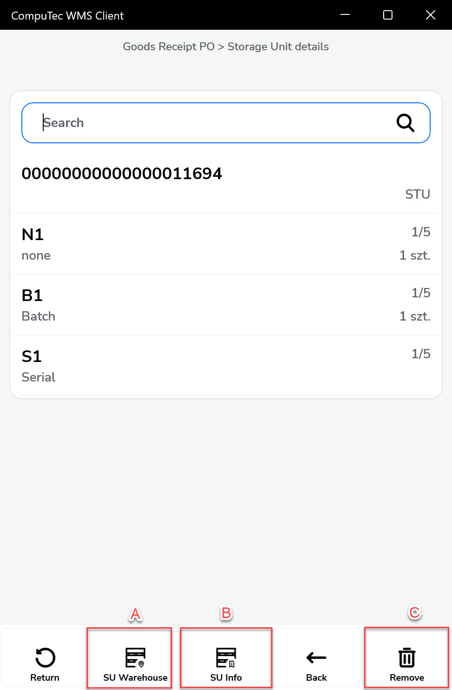 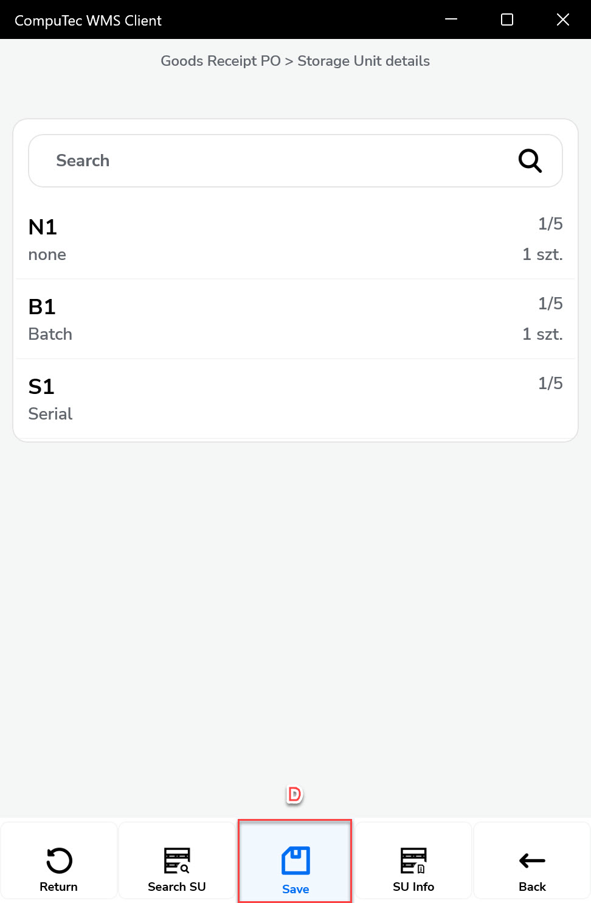

    1. Exit the SU (or enter, when you are not in the SU adding mode).
    2. SUs UDFs.
    3. Delete SU.
    4. Save changes.

8. Nested SUs (SU within SU) are displayed with an indented line.

    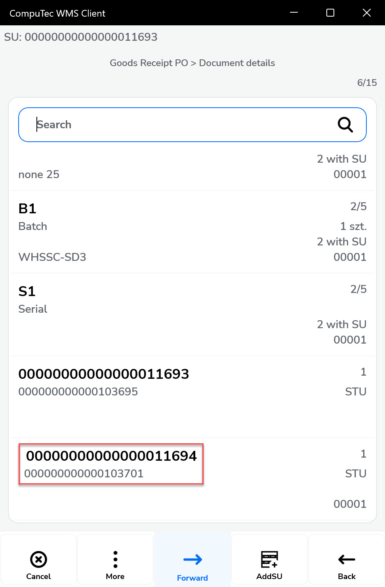

9. Fully added items are automatically moved to the bottom of the list.

    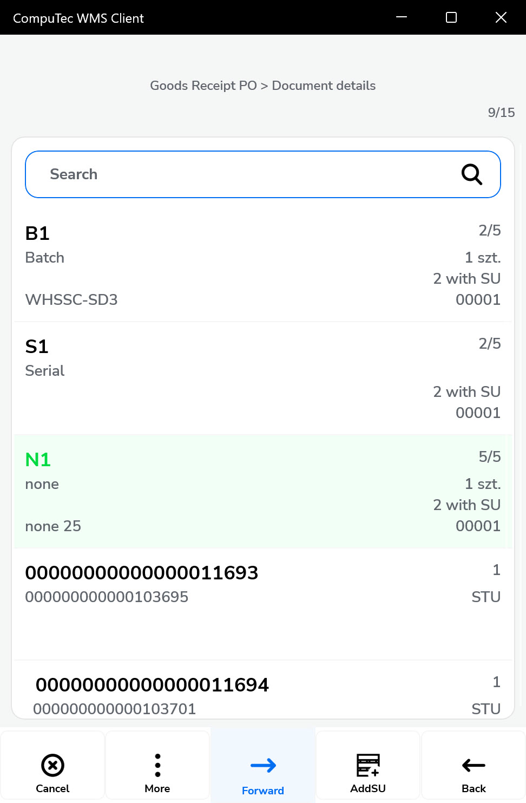

10. You can go to the Remarks when the document is complete.

    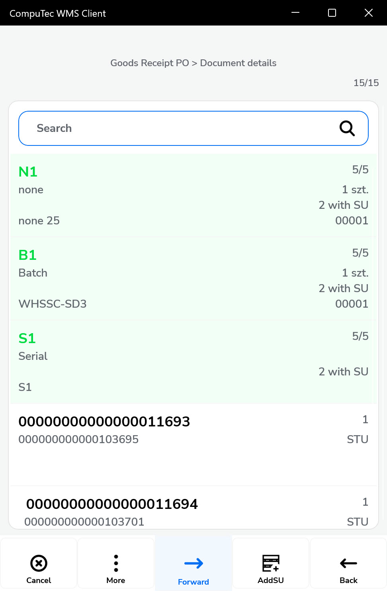 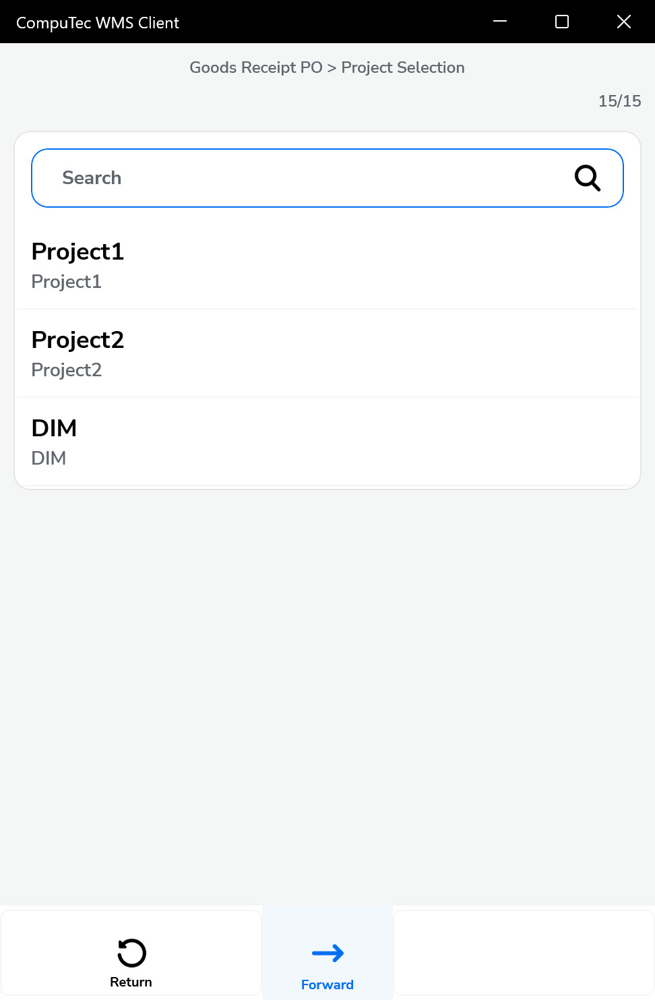

11. Remarks.

    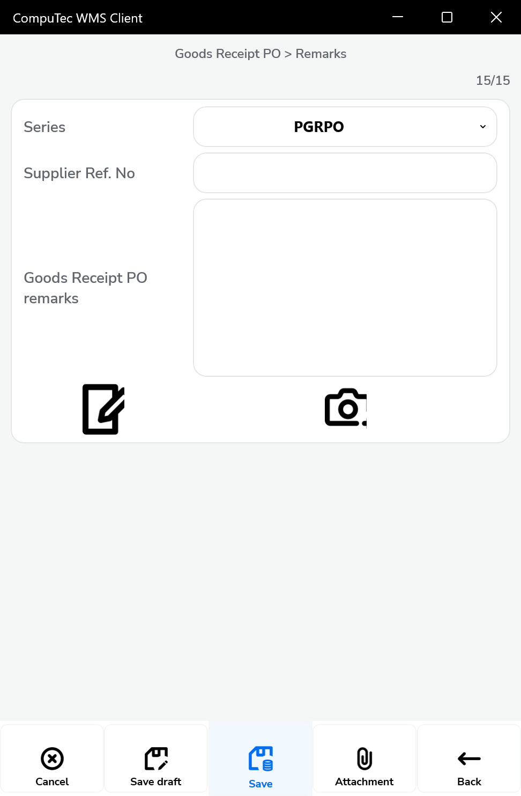

12. Upon saving, a confirmation message will appear indicating successful GRPO creation.

    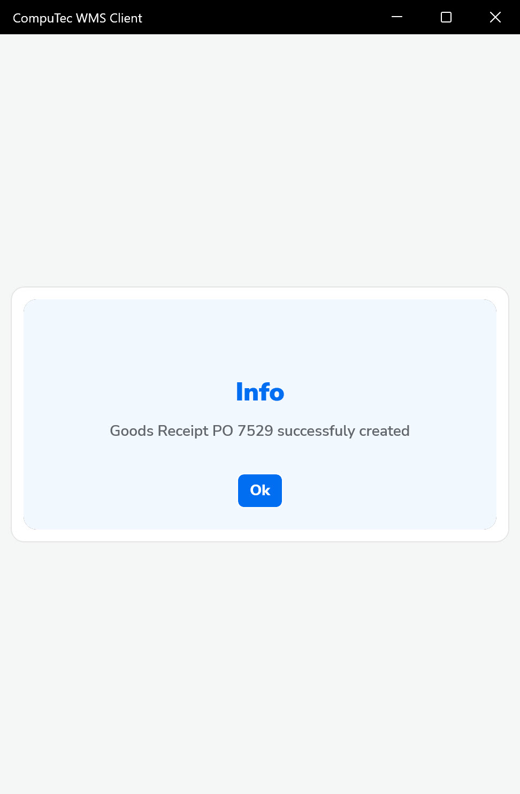

---
