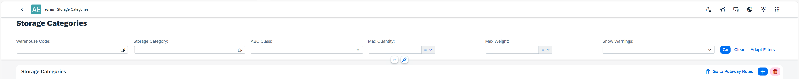
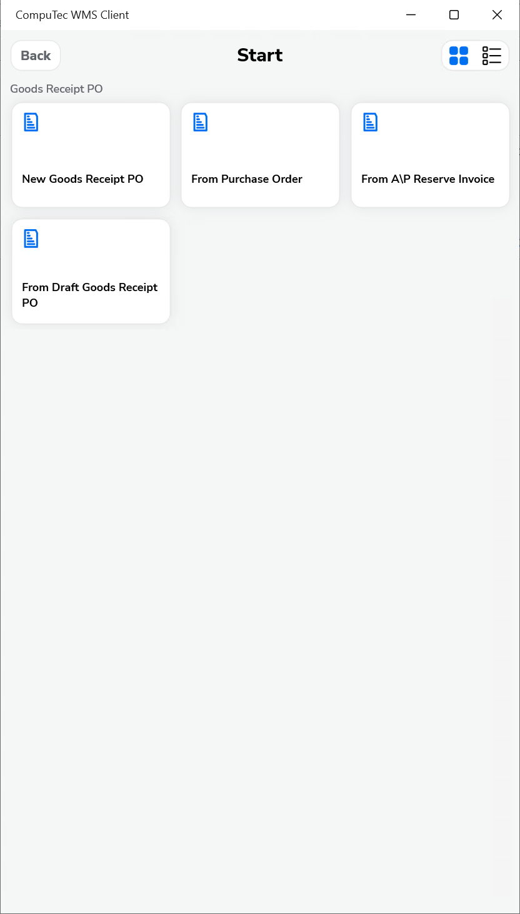

# Put Away

## Introduction

The Put Away functionality in CompuTec WMS is responsible for efficiently moving received goods to appropriate warehouse locations. The goal of this process is to ensure organized and controlled storage of goods, in accordance with predefined logistics rules, while maintaining full traceability of warehouse stock levels.

The Put Away process begins after the physical receipt of goods into the warehouse following a delivery from a supplier. Based on predefined rules such as available space, item characteristics, and storage strategies, the system supports the user in moving the goods from the receiving area to a specific storage location.

**Key features include**:

- identification of goods (e.g., via barcode scanning),
- suggestions of storage locations,
- registration of movement to the selected location,
- verification of correct storage (e.g., compliance with location, item type, quantity, or Storage Unit).

---

## Installation and Configuration

### Prerequisites

Before using the Put Away functionality, ensure the following prerequisites are installed and configured.

- AppEngine 3.0
- WMS 3.0
- AE Plug-ins: WMS and BusinessLogic

### AppEngine and Plug-in Installation and Configuration

- For AppEngine installation, follow the instructions outlined in the [Installation](https://learn.computec.one/docs/appengine/administrators-guide/configuration-and-administration/installation) Guide.
- For configuring the plug-in, refer to the [Configuration and Administration](https://learn.computec.one/docs/appengine/administrators-guide/configuration-and-administration/configuration) Guide.

## Usage

You can access the Put Away module via the AppEngine launchpad.

    
    
    
    

To add a new rule, press the plus icon.

    

You can customize a rule by setting the appropriate values in the fields, which are grouped into four sections:

1. Items, including: Item Code, Item Code Group, Revision, UoM Group Code, UoM Code;
2. Warehouse, including: Warehouse Code, SU Mandatory and ABC Class (that can be set in the UDF on the Item Master Data in SAP);
3. Other, including: Rule name, Status, Remarks;
4. Target, including: Storage Category (more details: ), Sublevels, Bin location.

## Storage Category

The Storage Category defines a set of parameters used to group and qualify bin locations for storage purposes. It determines the storage logic used during the Put Away process by applying constraints such as maximum capacity, classification, and handling requirements.

    

Each Storage Category includes the following fields:

1. **Warehouse**: Specifies the warehouse to which the Storage Category belongs.
2. **Unit of Max Value**: Defines the unit used to calculate the maximum allowed value in a bin:
    1. **Weight**: The bin’s capacity is measured by maximum weight (e.g., in kilograms).
    2. **Quantity**: The bin’s capacity is measured by maximum item count (e.g., pieces).
3. **Max Weight / Max Quantity**: The maximum value allowed for the bin, depending on the selected Unit of Max Value.
    1. If Weight is selected, this field represents the maximum weight a bin can hold.
    2. If Quantity is selected, it represents the maximum number of items.
4. **ABC Class**: An optional classification used for prioritizing or filtering bins. Typically corresponds to the ABC classification defined on the Item Master Data in SAP. Helps optimize storage and retrieval based on turnover or importance.
5. **SU Mandatory**: Defines whether storage units (SUs) are required in bins using this category. If set to Yes, items must be stored within a storage unit (e.g., pallet, box). If No, items may be stored freely in the bin.

    

## WMS

In CompuTec WMS, you can use the Put Away functionality during the GRPO transaction.
To enable it, go to Custom Configuration → GRPO tab and enable the Put Away option:

    

Select the base document and the item:

    

If Put Away rules are enabled, you’ll see that each listed item has its corresponding rule displayed:

    

When you open an item, you can either enter the quantity manually or apply the rule defined for the item. The available storage locations based on the rule will be listed:

You can choose a location and enter the quantity and the batch manually

    

Alternatively, you can press Select all to automatically apply the rule — the system will populate the quantity and assign the appropriate Storage Unit, if required by the rule:

     

You can then save the document.

---
