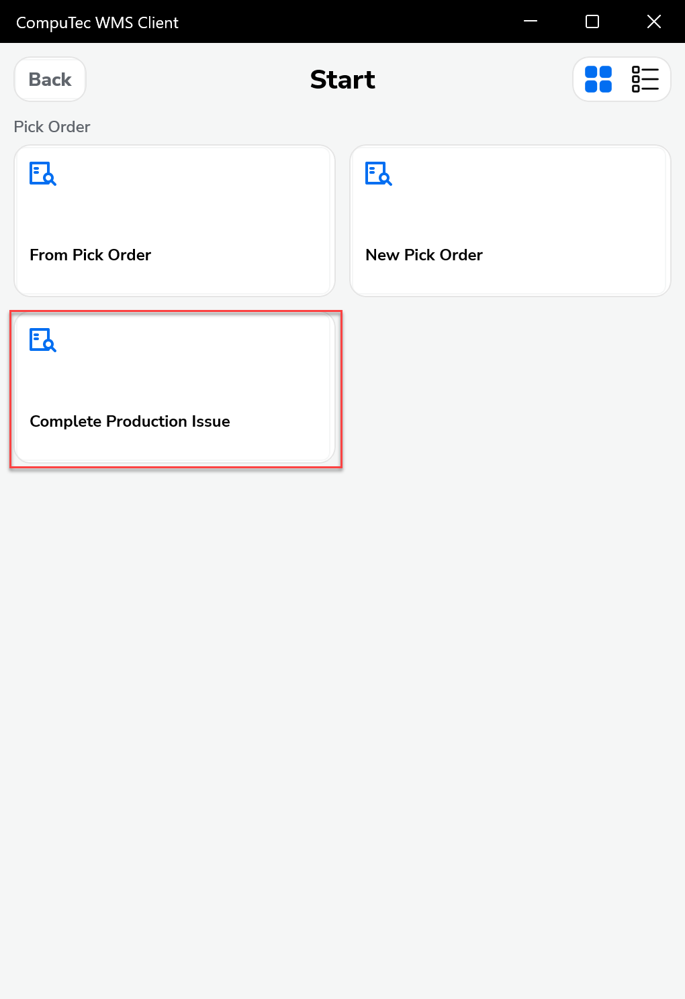
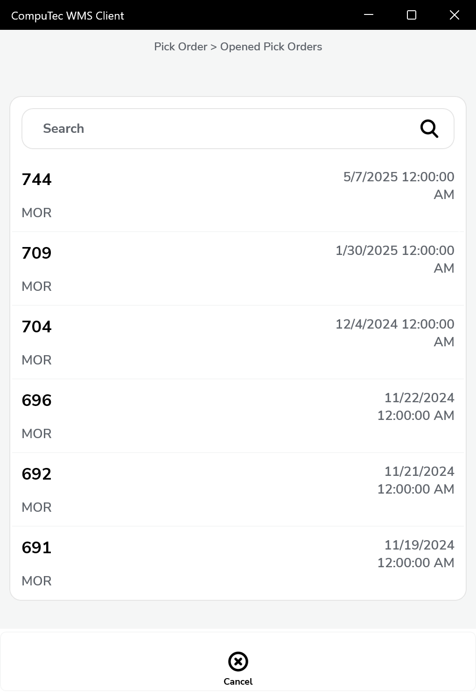
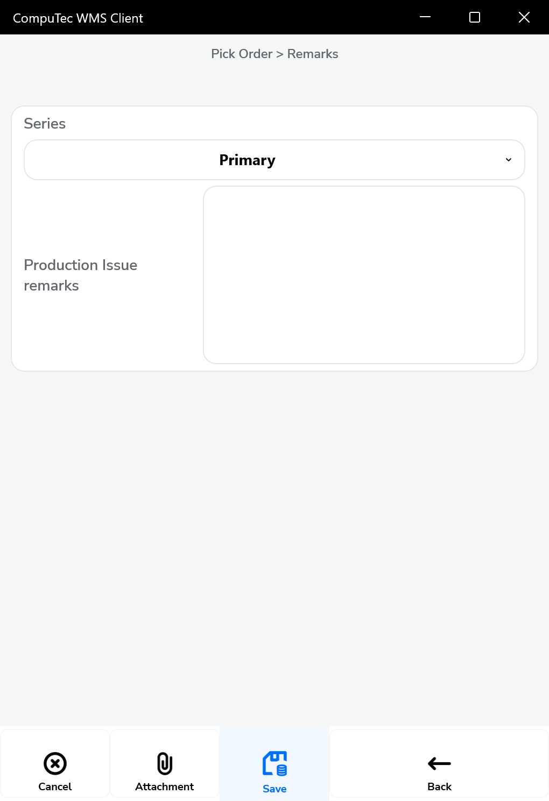
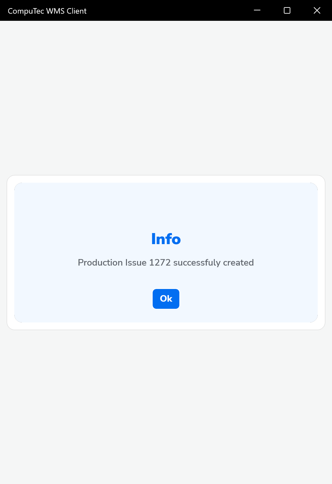

## Complete Production Issue

The Complete Production Issue option enables warehouse users to manually release goods for production directly from CompuTec WMS interface. This is especially useful in scenarios where the Auto Issue setting is not enabled in SAP Business One.

---

**Steps to Complete a Production Issue in CompuTec WMS**

1. Navigate to Pick Order → Complete Production Issue

    

2. Select a Pick Order. You will see a list of open pick orders. Tap on the desired pick order to proceed.
    >Note: Use the Search bar to locate a specific pick order (if needed).

    

3. The remarks screen will appear. Add Production Issue Remarks (Optional). On the Remarks screen, you’ll see:

        - Series (usually set to “Primary” by default).
        - Production Issue remarks: This field is optional and can be used to add any comments or reference information.

            

    Once remarks are added (if any), tap the Save button at the bottom of the screen.

4. After saving, a confirmation message will be displayed on the screen. Tap Ok to complete the process.

   

---
