# Overview

The Pick Order transaction allows generating a ProcessForce Production Issue.

:::info
Some forms' order and availability during a document's creation may vary depending on individual settings. Click [here](../../../administrator-guide/custom-configuration/overview.md) to find out more about custom configuration
:::

1. To create a Production Issue from a Pick Order, click Pick Order in the main menu.

    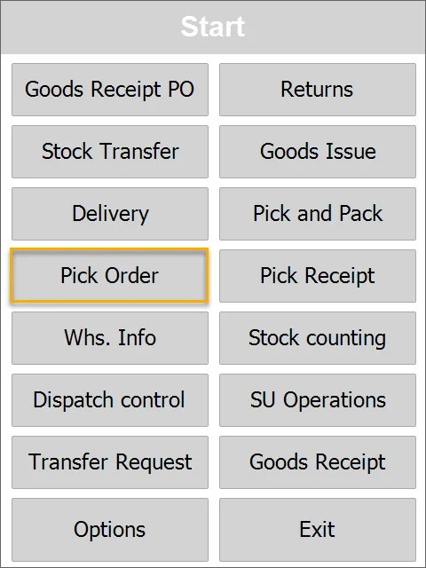
2. You can select From Pick Order or New Production Issue.

    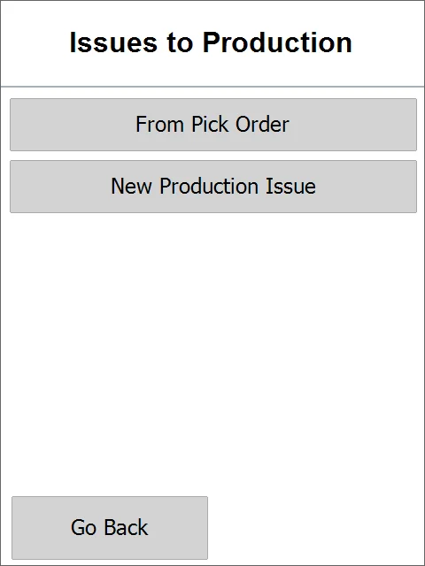
3. Select from Pick Orders or Manufacturing Orders.

    You can use Filter to search for specific orders you want to issue to production.

    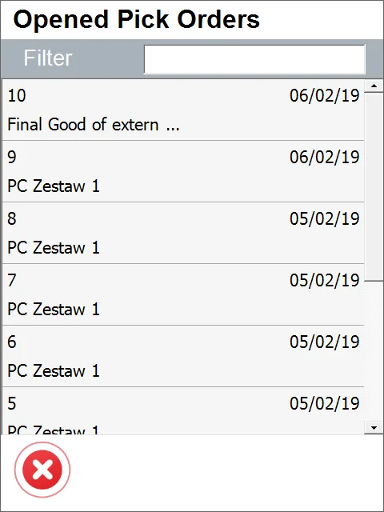

    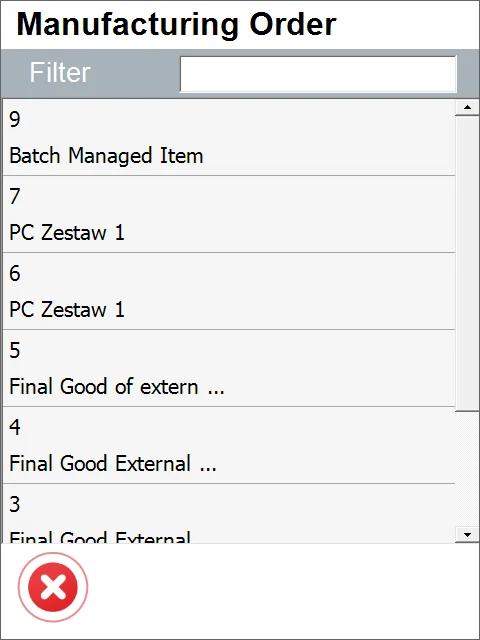
4. The list of Items for Pick Order is opened.

    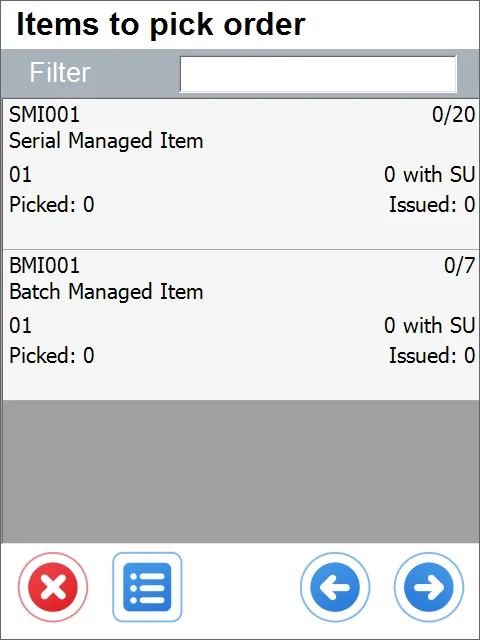
5. Add items from another Pick Order, Manufacturing Order, or Storage Unit.

    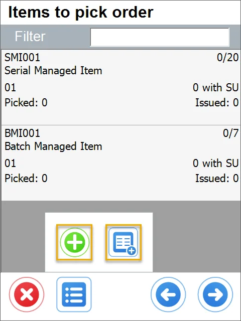
6. After adding the required Items and their quantities, click the 'Right Arrow" icon to go to the Remarks form

    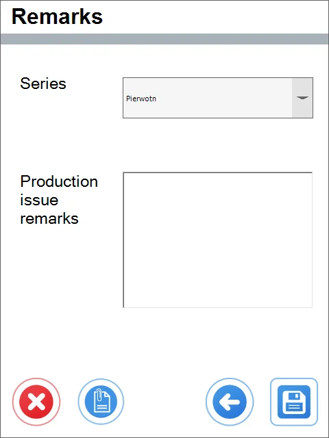
7. You can add some remarks, change the series, add UDFs, or just save and post the document.

    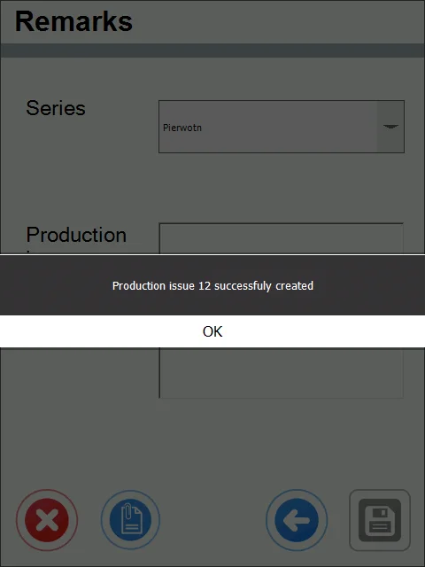
8. The Production Issue is posted in SAP Business One.

    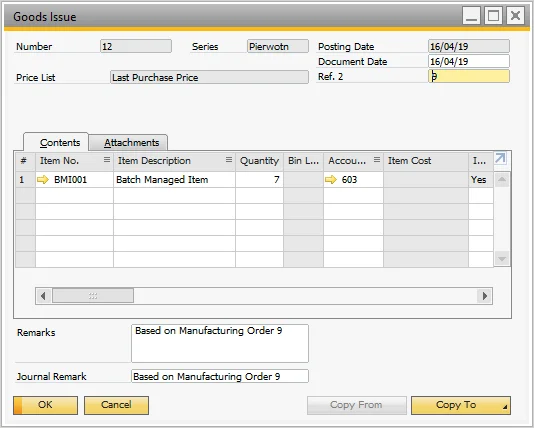

## Pick Order: Complete Production Issue

The Complete Production Issue option enables warehouse users to manually release goods for production directly from CompuTec WMS interface. This is especially useful in scenarios where the Auto Issue setting is not enabled in SAP Business One.

**Steps to Complete a Production Issue in CompuTec WMS**

1. Navigate to Pick Order → Complete Production Issue

    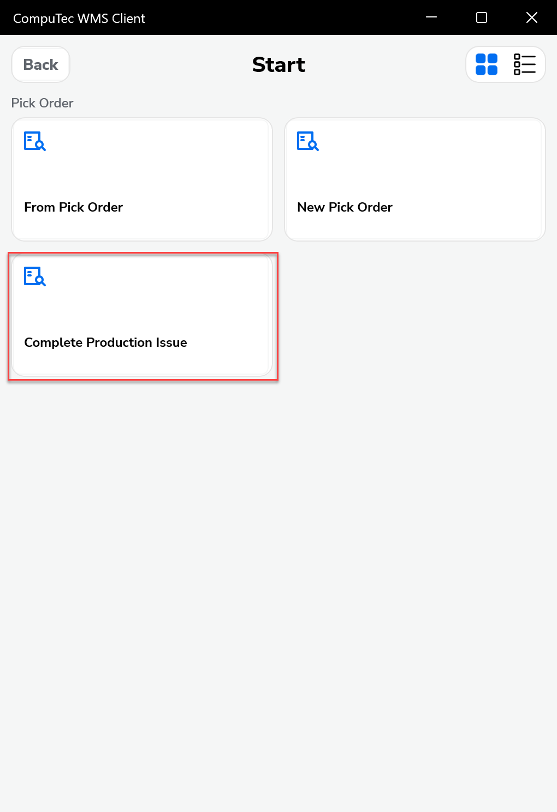

2. Select a Pick Order. You will see a list of open pick orders. Tap on the desired pick order to proceed.
    >Note: Use the Search bar to locate a specific pick order (if needed).

    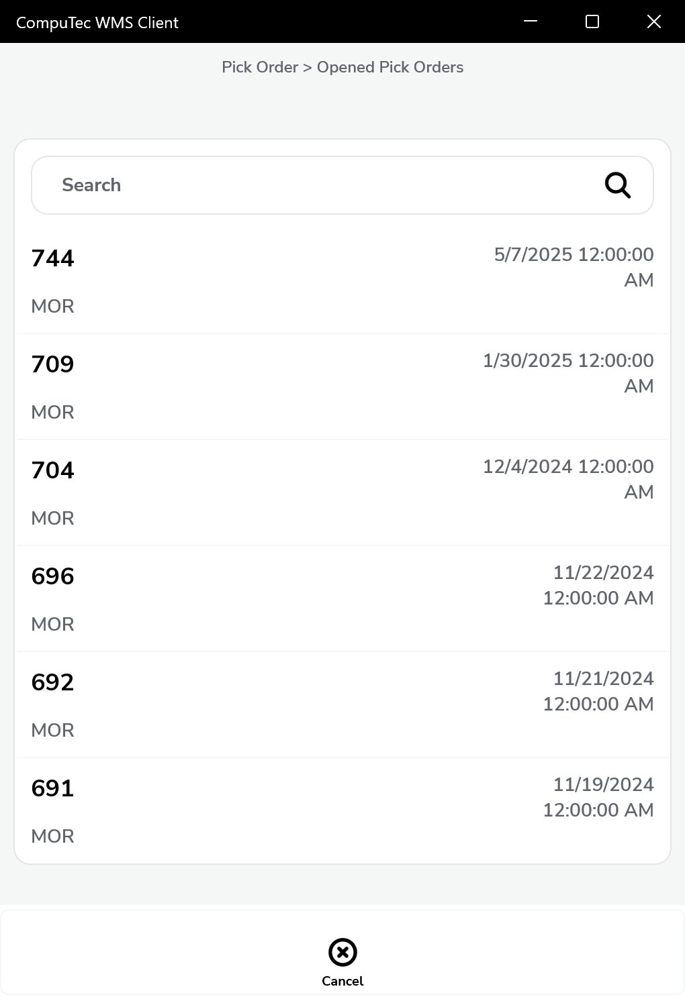

3. The remarks screen will appear. Add Production Issue Remarks (Optional). On the Remarks screen, you’ll see:

        - Series (usually set to “Primary” by default).
        - Production Issue remarks: This field is optional and can be used to add any comments or reference information.

            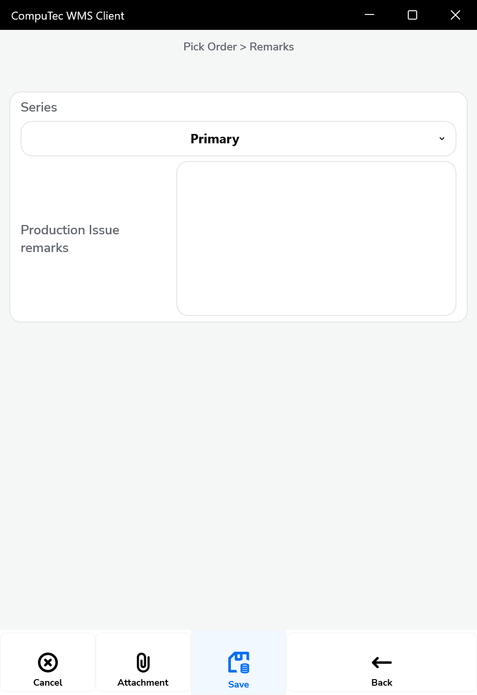

    Once remarks are added (if any), tap the Save button at the bottom of the screen.

4. After saving, a confirmation message will be displayed on the screen. Tap Ok to complete the process.

   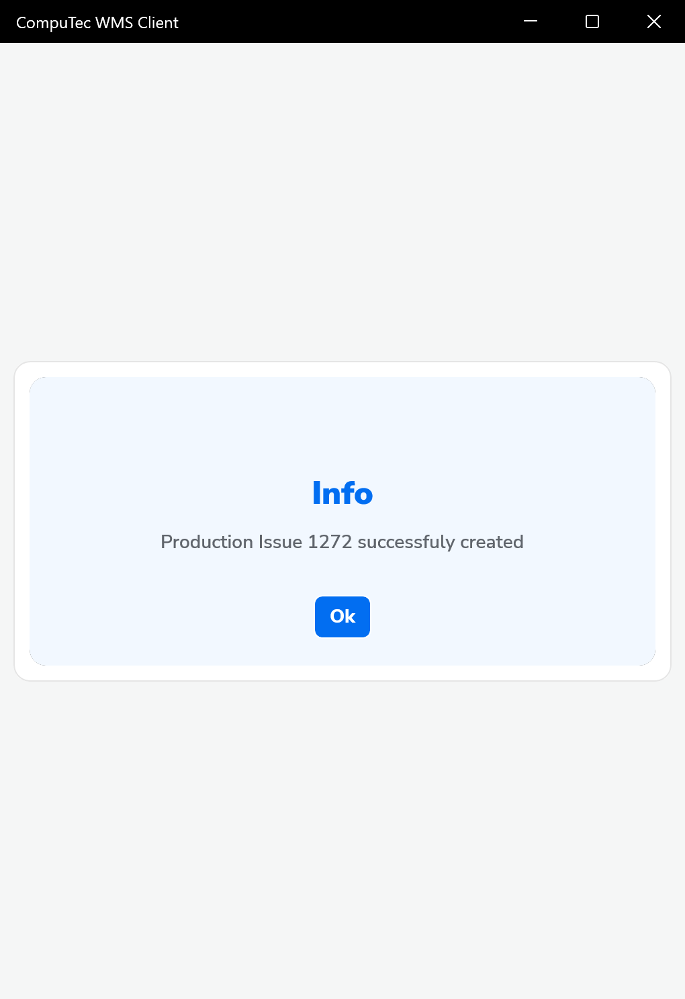

## CompuTec ProcessForce option for Auto Allocation Serial Numbers and Batches (with bin locations)

Since CompuTec ProcessForce PL11, users can choose how to _Auto Allocate Batches on the Pick Order_ option:

This setting is responsible for whether to display or not preselected on Pick Order, Batches/Serial Numbers (there is no unique option for Serial Numbers; the same setting affects both Serial Numbers and Batches).
In WMS, Batches/Serial Numbers preallocated on other documents are always omitted; thus, the "On other documents" option will not affect WMS. Suppose a user wants to consider preselected Batches and Serial Numbers on every document in WMS. In that case, one must select either "Allocated" or "Both" to recalculate quantities properly.

Moreover, the quantities will be recalculated for the same Pick Order - this option **does not** work like pre-allocation on Pick Lists.
This means that if on an original Pick Order document, there were seven serial numbers to be picked and five were already preselected in SAP Business One, then in WMS, there will be only two more serials left to choose and the five previously selected won't be displayed in Serial Selection window.

With the SAP ProcessForce setting enabled, preselecting batches or serials on Pick Order will affect all other transactions in WMS, i.e., if a specific serial, for example, S0001, is preselected on a pick order in SAP Business One, then the same serial S0001 won't be available for example on the Delivery transaction.

The preselected quantities will also be considered when displaying available quantities in bin locations.

---
