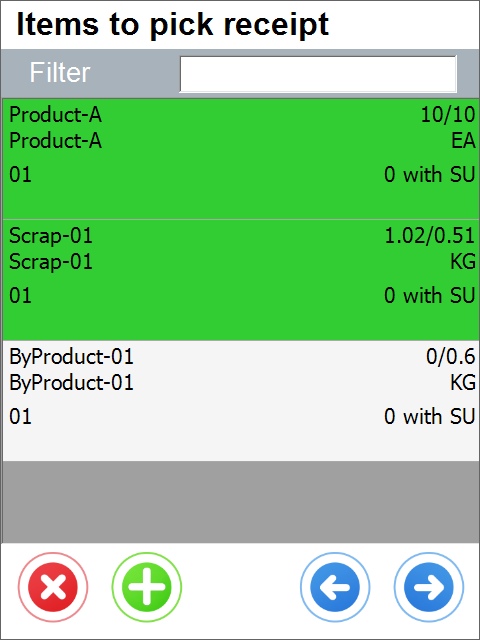

# Overview

Pick Receipt transaction allows to generate a receipt from CompuTec ProcessForce production from a Pick Receipt. (Below an example Pick Receipt in SAP Business One, which can be used in WMS).

This process is available in WMS only when CompuTec ProcessForce is installed.
    

:::info
Some forms' order and availability during a document's creation may vary depending on individual settings. Click [here](../../../administrator-guide/custom-configuration/overview.md) to find out more.
:::

---

## Opening Pick Receipt in CompuTec WMS

To open or create a production receipt from a Pick Receipt, click Pick Receipt in the main menu:

---

## Opened Pick Receipt Documents Window

Click here to learn more about hiding this screen...

This screen is optional and can be turned off by selecting the option in CompuTec WMS Custom Configuration, CompuTec ProcessForce tab - "Show all open pick content".
    

Choose a desired Pick Receipt by clicking its row. Only opened or started Pick Receipts are displayed.
Users can skip this window and create a new Pick Receipt in subsequent workflow steps.
    

:::caution
In every window in which a Filter row is displayed, searching through the records is available by typing in at least a part of a name or a document number.
:::

---

## Picking Items from Production

### Overview of Items List

The Items to pick window appears with Items contained on a base Pick Receipt document.

Click an Item row to set its quantity. You can also do this by scanning a barcode with an Item prefix. From this step, the user can pick the Items in various ways. Below you can find a description of their most common use cases.
    

### Use Case 1: Continuous receipt from the production of Batch/Serial/none managed Item

Click here to expand workflow description...

CompuTec WMS allows a user to receive Items directly on quantity inputting. In this workflow, a user can receive the quantity of an Item to a Warehouse just after inputting the quantity or quantity and distribution number – it is required to check the option for Auto Receipt turned on in CompuTec ProcessForce settings. This solution is suitable for environments where production is a continuous process, and users prefer to pick quantities one after another rather than going to document remarks and then saving.

1. The user starts the process from Items to the pick screen with the Pick Receipt document contents as rows. Item is opened by manual selection or barcode scanning.

**Example of barcode for Product-01...**

All barcodes presented below can be used to open Item Product-01 on the screens below. Learn more from our barcode scanning page for more details.

GS1 Barcode that contains Item code with CompuTec WMS Prefix 91

GS1 Barcode that contains BMI02 Global Trade Item Number with prefix 02 (if GTIN is stored in SAP Item Master Data Barcode field)

GS1 Barcode that contains Product-01 Item code with CompuTec Prefix, Batch number with prefix ten, and quantity with prefix 37. This barcode can also contain GTIN with 02 prefixes instead Item Code with 91 prefixes. Used for solutions when materials are labeled before placing them in a system.

2. After opening the Item user have to choose Storage Unit options or skip this screen. For detailed impact of SU options, see use cases 3 and 4.

3. On the next screen, a user has to enter quantity, bin location if applicable, and details for the receipted Item. Note that when the Auto receipt option is turned on, materials are available to be moved elsewhere around the Warehouse **just after clicking the Save button**. After pressing it in each transaction receipted quantity will increase by the receipted amount, and the screen will be ready for the next receipt. Cleaning Batch, Serial and quantity box can be turned off in Custom Configuration.

**Example of Bin location barcode**

4. On the next screen user has to enter quantity and details for the receipted Item. Note that when Auto receipt option is turned on materials are available to be moved elsewhere around the Warehouse just after clicking save button. After pressing it in each transaction receipted quantity will increase by receipted amount and screen be ready for a next receipt. For Batch managed Items we can turn on in Custom Configuration cleaning Batch and quantity boxes to force user to input right data when screen is used without leaving.

Both for Serial and Batch managed Items, there is a button for automatic Serial Numbers / Batch generation. Each iteration of generating Serial Numbers or Batch, counts as a Pick. That means, by default, generating 3 Batches will causes 3 updates to the Pick Receipt document. Taking into account the possibility of "CompuTec ProcessForce Auto Receipt" option enabled, 3 Goods Receipt documents will be created from those 3 updates.
5. After required quantity is receipted we can push red exit button to go back to the Items list. All Items received during the previous actions are already in the Warehouse.

### Use Case 2: Continuous Picking from production of Batch/Serial/none managed item with optional Pick Receipt

Click here to expand workflow description...

CompuTec WMS user can allocate Items to picked status during pick receipt process and optionally receipt them on document saving – requirement is option for Auto Receipt turned off in CompuTec ProcessForce settings.

1. User is starting process from Items to pick screen with Pick Receipt document contents as rows. Item is opened by manual selection or barcode scanning.

    **Example of barcode for Product-01...**

    All of the barcodes presented below can be used to open Item Product-01 on the screens below. Learn more from our barcodes scanning page for more details.

    GS1 Barcode that contains item code with CompuTec WMS Prefix 91

    

    GS1 Barcode that Contains BMI02 Global Trade Item Number with prefix 02 (if GTIN is stored in SAP Item Master Data Barcode field)

    

    GS1 Barcode that contains Product-01 Item code with CompuTec Prefix, Batch number with prefix 10 and quantity with prefix 37 this barcode can also contain GTIN with 02 prefix instead Item Code with 91 prefix. Used for solutions when materials are labelled before placing them in a system.

    
    

2. After opening Item user have to choose Storage Unit options or skip this screen. For detailed impact of SU options see use cases 3 and 4.

    

3. User have to choose Bin Location where Item would be allocated during the process. Bin location can be scanned or selected manually. On the top of the list there are shown Bin Locations where receipted Item is already present.

    **Example of Bin location barcode**

    

4. On the next screen user have to enter the quantity and details for the picked Item. After pressing the save button on this screen picked quantity will increase by the desired amount, and the screen will be ready for the next pick. For Batch managed Items, we can turn on in Custom Configuration cleaning Batch and quantity boxes to force the user to input the right data when the screen is used without leaving.

    

5. After the required quantity is picked, the user can push the red exit button to return to the Items list.

    

6. All Items received during previous actions are in **picked status** and **are not available for moving them around Warehouse by other employees.**

    

7. Next step is Production Goods Receipt generation in CompuTec WMS or SAP Business One.

    1. **Production Goods Receipt in CompuTec WMS**

    To create a Production Goods Receipt from the WMS level, the user must click the right arrow after turning back from the quantity allocation screen. On the Receipt Remarks screen, users must choose document series (or leave the default one) and can add remarks to the document. Click the save button after that.

    
    2. **Production Goods Receipt in SAP Business One.**
    After Picking Items without receipting in CompuTec WMS, another user can open the Pick Receipt document to finish receipting from the production process in SAP. Example situation is given – when one user is responsible for Batch/quantity allocating and the other for produced materials approval. In this scenario, on fulfilled in WMS Pick Receipt user have to use the "Production Goods Receipt" option in SAP.

    

### Use Case 3: Picking from production Items into Storage Units – Automatic Units Generation

Click here to expand workflow description...

CompuTec WMS users can allocate picked/receipted Items to Storage Units, one unit per receipted quantity.

1. The user starts the process from the Items to the pick screen with Pick Receipt document content as rows. Item is opened by manual selection or barcode scanning.

    **Example of barcode for Product-01...**

    All the barcodes presented below can open Item Product-01 on the screens below. Check our barcode scanning page for more details.

    

    GS1 Barcode that Contains BMI02 Global Trade Item Number with prefix 02 (if GTIN is stored in SAP Item Master Data Barcode field).

    

    GS1 Barcode that contains Product-01 Item code with CompuTec Prefix, Batch number with prefix ten, and quantity with prefix 37. This barcode can also contain GTIN with 02 prefix instead Item Code with 91 prefix. Used for solutions when materials are labeled before placing them in the system.

    
    
2. After opening an Item user have to choose Storage Unit options – **New SU for each quantity** button. This option turns on automatic box/pallet generation in the Pick Receipt process. This screen's default action can also be chosen in [CompuTec WMS Custom Configuration](../../../administrator-guide/custom-configuration/overview.md).

    

3. Users have to choose a Bin location where the Item in units will be allocated during the process. Bin location can be scanned or selected manually. On the top of list there are shown bin locations where receipted Item is already present.

    **Example of Bin location barcode**

    

4. On the next screen user has to enter details for picked Items. After each clicking on save button **quantity in Storage Unit** will be saved in a Warehouse.
    

5. After required quantity is picked user can push red exit button to get back to the Items list. If items were receipted Storage Units which contain them are available for further processes. SSCC number of each pallet is based on number of [SSCC number template in SAP Business One](../../../administrator-guide/installation/sap-business-one-settings/serial-shipping-container-code.md).

6. We can look up recently created Storage Units in Storage Unit Info operation.

### Use Case 4: Picking from production items into a Storage Unit – one Unit

Click here to expand workflow description...

CompuTec WMS user can allocate a few picked items to on Storage Unit.

:::info
Pre-requirement for this workflow is CompuTec ProcessForce Auto Receipt option to be turned off
:::

1. User is starting process from Items to pick screen with Pick Receipt document contents as rows. Item is opened by manual selection or barcode scanning.
    **Example of barcode for Product-01...**
    All of the barcodes presented below can be used to open Item Product-01 on the screens below. Check our barcodes scanning page for more details.

    GS1 Barcode that contains Item code with CompuTec WMS Prefix 91
    

    GS1 Barcode that Contains BMI02 Global Trade Item Number with prefix 02 (if GTIN is stored in SAP Item Master Data Barcode field)
    

    GS1 Barcode that contains Product-01 Item code with CompuTec Prefix, Batch number with prefix 10 and quantity with prefix 37 this barcode can also contain GTIN with 02 prefix instead Item Code with 91 prefix. Used for solutions when materials are labelled before placing them in system

    
    

2. After opening an Item user have to choose Storage Unit options – **New SU / Continue SU option or create new Storage Unit by scanning its SSCC number**. Last option is useful e.g. when we use external labelling.
    

3. User have to choose a Bin location where Item in units will be allocated during the process. Bin location can be scanned or selected manually. On the top of list there are shown Bin locations where receipted Item is already present.
    **Example of Bin location barcode**

    Example of Bin location barcode for Bin 01-A1-S2-L3 with 92 prefix. Barcode in GS1 Format.

    
    
4. On the next screen user have to enter details for picked items. After each clicking on save button quantity in Storage Unit will be saved in a Warehouse. Note that for each save it will be same Storage Unit.
    

5. After required quantity is picked user can click the red exit button to go back to Items list. If Items were receipted, a Storage Unit which is containing them is available for further processes. SSCC number is based on number of [SSCC number template in SAP Business One](../../../administrator-guide/installation/sap-business-one-settings/serial-shipping-container-code.md) or is same as SSCC number scanned on the Storage Unit options screen.
6. We can look up recently created Storage Unit in Storage Unit Info operation:
    

### Use Case 5: Picking / Receipting items managed by batch numbers - focus on batch receipting screen

Click here to expand workflow description...

CompuTec WMS user can receipt from production items managed by batch numbers with custom values for various fields such as Quality Fields, User Defined Fields, additional batch details from Batch Master Data

1. User is starting process from Items to pick screen with Pick Receipt document contents as rows. Item is opened by manual selection or barcode scanning.
    **Example of barcode for Product-01...**

    

2. After opening item user have to choose or skip Handling Unit options
    

3. User have to choose bin location where item in units will be allocated during process. Bin location can be scanned or selected manually. On the top of list there are shown bin locations where receipted item is already present.

    **Example of Bin location barcode**

    Example of Bin location barcode for bin 01-A1-S2-L3 with 92 prefix. Barcode in GS1 Format

    
    

4. On next screen user have to enter details for picked items. Way of working for certain items on the screen may vary depending to Custom Configuration Settings
    **Examples of Custom Configuration impact on batch receipting screen...**
    On this screen user can fulfill/see details as
    1. Quantity input box (scan/select), information about currently receipted quantity and quantity that is left for reception
    2. Batch number and classification - On this screen batch number can be inputted manually, by scanning or generated with button for automatic batch generation which use Batch Template Definition. Classification number Can be also inputted by scanning
        **Barcode example for batch number**
        GS1 barcode with prefix 10 that contains batch number:
        
        GS1 barcode that contains item code with prefix 91 and batch number with prefix 10
        
    3. Batch master data and UDF Fields for created Batch Number
        After pressing (info) button user is moved to section which contains fields fields from Batch Master Data
        
        Fields which have to be showed or required on this screens are selectable In WMS Custom Configuraton UDF Manager.
        
    4. Result of optional query which can contain for example details of receipting method for selected item or manufacturing document.
        WMS displays result from query placed in its Custom Configuration. Note that each value from right column could be use as a variable for query. Then result may vary depending on Item Code or other opened process properties.
        
    5. UDF Fields for Pick Receipt document row.
        
5. After required quantity is picked user can push red exit button to turn back to items list. Data inputted through document creation is now available in Pick Receipt Document as Picked or Receipted. For more details about those settings see Use Case 1 and 2.

### Use Case 6: Picking / Receipting items managed by serials / none - focus on receipting screen

Click here to expand workflow description...

CompuTec WMS user can receipt from production items managed by serial numbers or not managed by distribution number

1. User is starting process from Items to pick screen with Pick Receipt document contents as rows. Item is opened by manual selection or barcode scanning.
    **Example of barcode for Product-01...**
    All of presented below barcodes could be used to open item Product-01 on screens below. Learn more from our barcodes scanning page for more details.

    GS1 Barcode that contains item code with CompuTec WMS Prefix 91

    

    GS1 Barcode that contains item code with CompuTec WMS Prefix 91 and quantity with 95 prefix

    

    GS1 Barcode that Contains Product Global Trade Item Number with prefix 02 (if GTIN is stored in SAP Item Master Data Barcode field)

    

    GS1 Barcode that contains Item Code with prefix 91 and its serial number with prefix 21

    

    

2. After opening item user have to choose or skip Storage Unit options for detailed impact of SU options see use cases 3 and 4

    

3. User have to choose bin location where item in units will be allocated during process. Bin location can be scanned or selected manually. On the top of list there are shown bin locations where receipted item is already present.
    **Example of Bin location barcode**

    Example of Bin location barcode for bin 01-A1-S2-L3 with 92 prefix. Barcode in GS1 Format

    

    
4. On next screen user have to enter details for picked items. It is possible to do also by scanning. Here there can also be added values for pick receipt row User Defined Fields.

    

To show and edit UDF fields assigned to to Table Pick Receipt: Required Items user have to choose to show them in WMS Custom Configuration.

    

After that desired fields will be available in Pick Receipt: Pick Item screen

5. After required quantity is picked user can push red exit button to turn back to items list. Data inputted through document creation is now available in Pick Receipt Document as Picked or Receipted. For more deatils about differences between picking and receipting see Use Case 1 and 2 as well as CompuTec ProcessForce Documentation of Auto Receipt

## Moving forward from items screen - document remarks and UDF Values for Production Goods Receipt Document

After receipting all required items and pressing "Right" arrow user is moved to Production Goods Receipt Remarks screen. This screen is used in workflows where Auto Receipt option is not enabled and Production Goods Receipt is needed to be created from an updated Pick Receipt document.

Click here to learn more about Production Goods Receipt document User Defined Fields...

    After pressing UDF button WMS opens window with UDF fields showed:

    

    Selection of showed/required fields could be done in Custom Configuration → Manager → UDF Manager for **Pick Receipt Document**

    

    

---

## Prompt about a Document Creation Success

After clicking save button information prompt will appear informing user that Goods Receipt with showed Operation Entry was created.

---

## Goods Receipt has been Created and can be Viewed in SAP Business One

## Storage Unit Statuses

SUs can be used in CompuTec ProcessForce Pick Receipt documents after choosing a related option in the Options form.

The **Continue** option chooses a Pick Receipt SU with a **CR – Created** – status in a database/document.

The **New SU** option creates a new SU in the document upon saving a pick (the Save icon in the Quantity form saves a SU to a document and Update Each Pick saves the Pick Receipt to a database. If there already was an SU in this Pick, then the latest SU with the CR status will change its status to **PR – Production**. An SU with this status cannot be edited anymore. Statuses of these Sus can be checked in the @CT_WMS_OSTU table.

The **New SU Each Qty** option creates a new SU upon every new pick in the Quantity form (clicking the Save icon) or as many SUs, as many Serial Numbers / Batches are generated using the Automatic Creation option, e.g. 5 Batches, 5 Items each will generate 5 SUs1. If you create 5 SUs, 4 of them will be with the PR status and the fifth one will be with the CR status (which allows you to pack it with other Items).

Creation of a Goods Receipt at the end of the transaction or with picking using CompuTec ProcessForce Auto Receipt option, changes status of the SU to **O – Open**. SUs with this status are already available in the SU Info transaction are ready to work with.

The Automatic Creation option does not work with the Update each pick option due to the application performance (saving to a database so many entries slow down the performance).

---
