# Return from Delivery

Return from Delivery can be generated from the Delivery document posted in SAP Business One System or CompuTec WMS. (An example Delivery Document used in this guide is published below).

Custom Configuration for Return from [Delivery](../../../administrator-guide/custom-configuration/custom-configuration-functions/delivery.md).

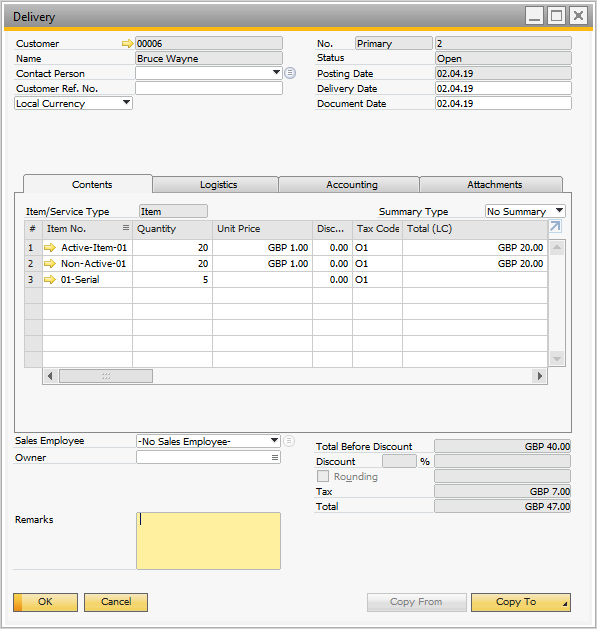

---

## Opening Return From Delivery in the Application

To start creating SAP Business One Return Document, click the Return from Delivery in the Returns sub-menu.

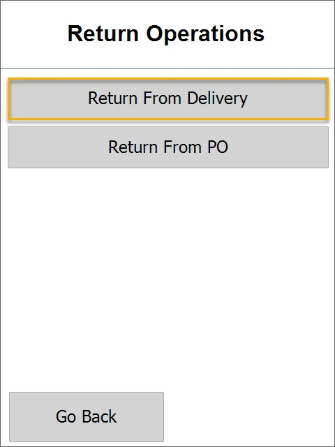

## Delivery Selection Screen

On the next screen, a list of opened Deliveries is displayed. A document selection can be done manually or by scanning a barcode that contains a prefix and selected Delivery DocEntry number. This step can be skipped to [create a Delivery without a base document](#use-case-3-creating-a-goods-return-without-a-base-document).

## Document Details Screen

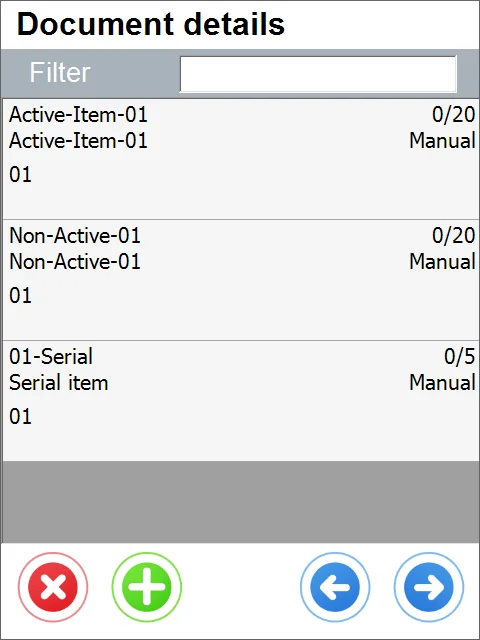

## Delivery Selection

On the next screen, a list of opened Deliveries is displayed. A document selection can be done manually or by scanning a barcode that contains a prefix and selected Delivery DocEntry number. This step can be skipped to create a Delivery without a base document.

Here you can check an example barcode for Delivery

In this case, a barcode for Delivery 180006 is (253)33 – GS1 prefix with DocEntry.

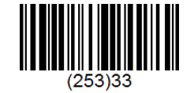

If a related option in WMS Custom Configuration is chosen, then Barcode with Prefix + DocNum can be scanned too.

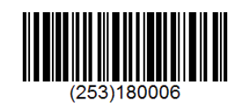

This step contains barcode validation – scanning an incorrect barcode causes an error display.

## Workflows in CompuTec WMS Items list

### Use Case 1: Return of whole delivery

On a Delivery document selection, the user sees materials copied from a base document as rows in the application. The next step is to select Items and set up their details. Item selection can be done by scanning or by manual selection. In the example below, a document contains three types of Items – managed by Batches, by Serial Numbers, and those not managed by distribution numbers.

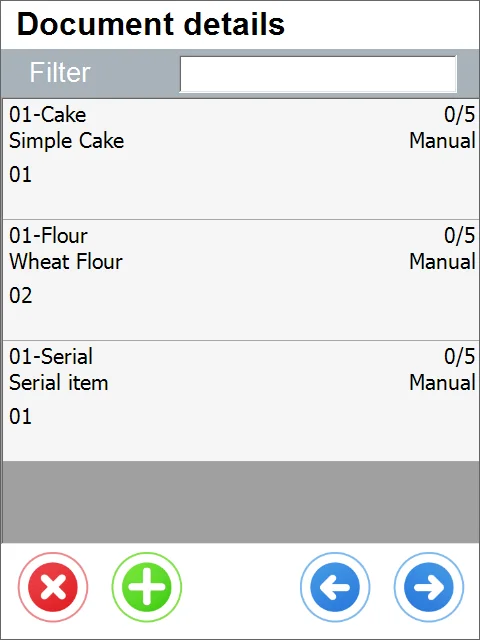

After choosing **01-Flour** – a Batch-managed Item (manually or by scanning), a screen with Batches delivered appears. In this screen, the user can select a Batch to be returned. If returned Batches differ from those in Delivery, they can be added using the plus button. In this case, a returned Batch is the same as previously delivered so that the user can process with a Batch selection from the list.

The next step is to choose a Bin Location (if the Warehouse has Bin Locations). The Bin Location screen can be skipped if the option "Returning Always to default bin" is enabled.

In the following screen, the user must input the quantity returned. Quantity can be put manually or scanned.

Fulfilling the rest of the items is similar; after all Items from the base document are fulfilled, all rows are colored green. To move forward, click the right arrow.

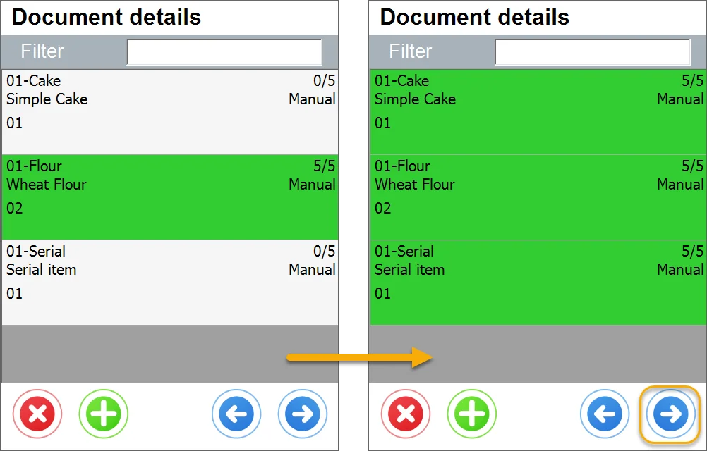

### Use Case 2: Receiving partial return – using the delete Item button

It is possible to create a partial Return: a document based on which we will receive only some Items from a base document/documents.

After choosing **01-Serial** – a Serial Number managed Item (manually or by scanning), a screen with Serial Numbers delivered appears. In this screen, the user can select Serial Numbers to be returned. If returned Serial Numbers differ from the Serials in Delivery, they can be added using the plus button. In this case, a returned Serial number is the same as previously delivered so that the user can process with a Serial Number selection from the list.

Repeat this step until you get the required quantity of Items to return.

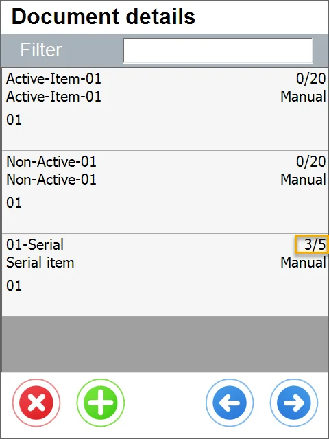

You can click the right arrow button to go to Remarks.

### Use Case 3: Creating a Goods Return without a base document

It is possible to create a Goods Return that is not based on any Delivery document.

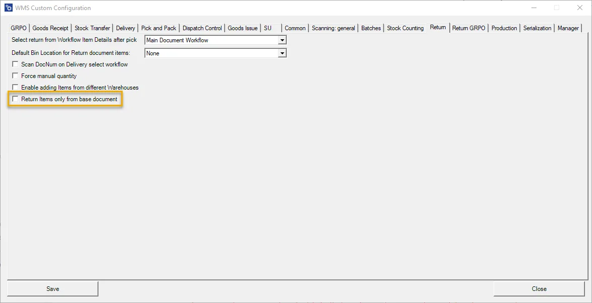

In this case, a Goods Return will be based on a list of Items chosen in the application. To be able to create this kind of document, it is required to uncheck the Return Item only from the Base Document Custom Configuration option. On doing this, another option appears on the Delivery Selection form:

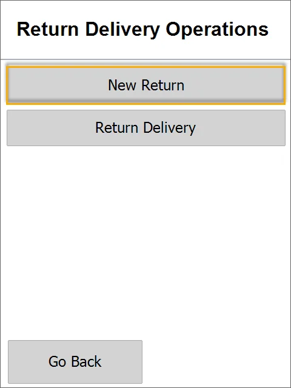

Then the Warehouse selection screen opens, and selecting one of the Warehouses is possible.

All the Warehouses are available for a logged user branch in the SAP Business One system displayed.

A row of a specific Warehouse contains its name and code.

Choosing a Warehouse is required to move to the next step; choosing it leads to the Customer Selection form:

On the Customer selection screen, the user must choose Business Partner, which returns goods to a company. Business Partner selection can be done manually or by scanning the Business Partner code with a prefix.

Here you can check an example barcode for Business Partner in GS1 UCC\EAN barcode standard

A barcode for Business Partner 00002 - Hanks Deliveries

This step contains barcode validation – scanning an incorrect barcode causes an error message display.

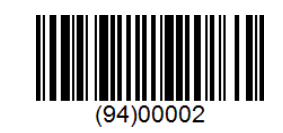
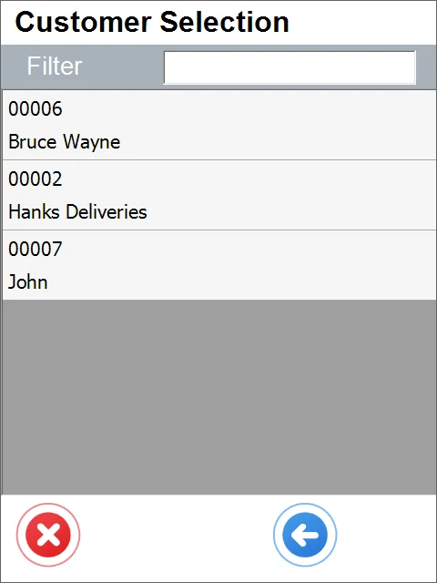

Choosing a customer is required to move to the next step; choosing it leads to the Document details form:

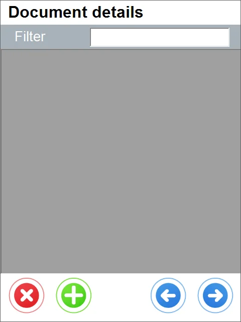

Click the + icon to add new Items to the document (you can also abort the document creation by using the 'x' icon or move back to the Warehouse selection form by using the left arrow icon):

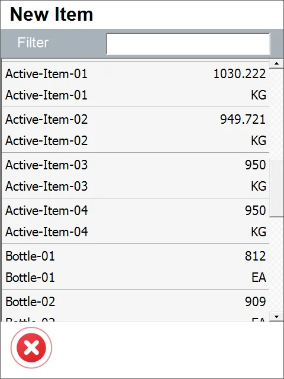

After choosing **Active-Item-01** – a Batch-managed Item (manually or by scanning), the Storage info form appears. In this screen, the user can add Batches using the 'plus' button:

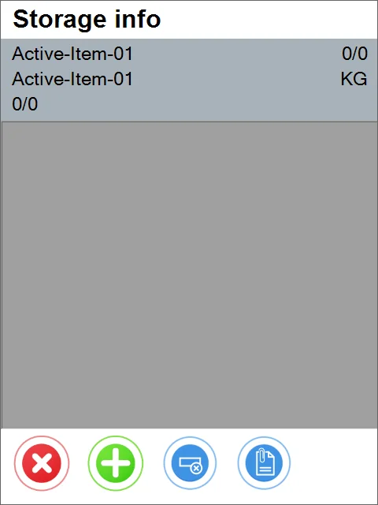

The next step is the Bin Location selection (if the Warehouse has Bin Locations). The Bin Location screen can be skipped if the option "Returning Always to default bin" is enabled.

Choosing a Bin (C-SYSTEM-BIN-LOCATION in this case) leads to the Batch selection:

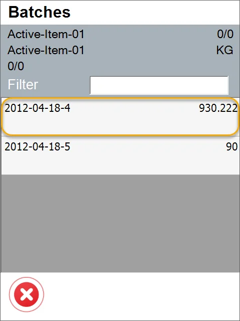

Choosing a Batch (2012-04-18-4 in this case) leads to Quantity form. Here, the user has to input the quantity that is returned. The amount can be put manually or by scanning. Note that The pick quantity is 0 as this Item is not based on a Delivery document but was chosen without a base document.

Click the right arrow to accept the quantity and return to a current Item details form or a current document details form.

In this example, Main Document Workflow is chosen in Custom Configuration:

A line with the picked quantity is colored green (as there is no planned quantity due to the lack of the base document).

Click the Active-Item-01 row to modify its details (Batches, quantity), plus the icon to add another Item to the left arrow icon to choose another Warehouse. Clicking the right arrow icon leads to the document remarks form.

### Remarks and Saving

Moving forward leads to the Remarks screen; here, the user can choose Document Series and Add Remarks, which will be visible in SAP Business One after the document posting.

CompuTec WMS will also receive information about the document creation status.

---

## Posted document in SAP Business One

Return document is available in SAP Business One after saving it in CompuTec WMS. The remarks field also contains standard information about the base document for return.

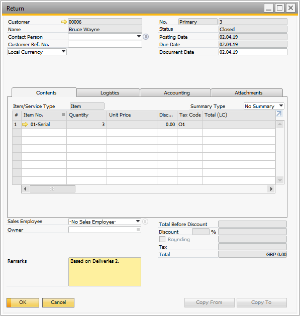

---
