# Return from GRPO

Goods Return Document can be generated from Goods Receipt PO document posted in SAP Business One System or CompuTec WMS, and user can generate new Goods Return without base document. (An example Goods Receipt PO Document in this guide is posted below).

Custom Configuration for Return GRPO: [Return GRPO](../../../administrator-guide/custom-configuration/custom-configuration-functions/return-grpo.md)

## Opening Return From Delivery in the application

To start the creation of the SAP Business One Goods Return Document, press the Return from PO in the Returns sub-menu or other menu container.

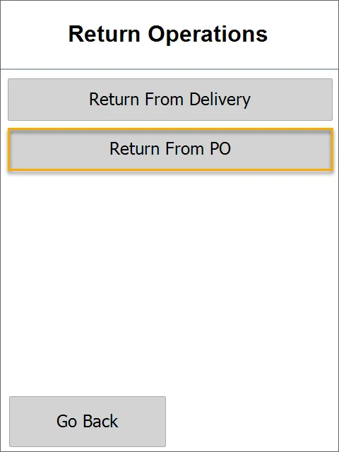

## Optional: Base Document Selection

The user can use the already posted Goods Receipt PO as a base document or create Goods Return from scratch. To copy positions from existing documents, the User must select "GRPO Based Return"; to create a blank Goods Return Document, the user must choose the "New Goods Return" button.

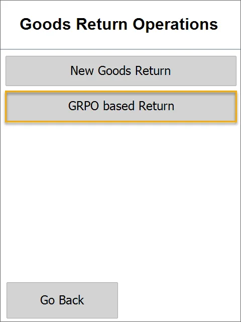

Choose **the Goods Receipt PO** document from the list of already posted ones. After selection, the application copies the indexes from the base document and moves to the items list.

## Workflows in CompuTec WMS Items list

### Overview

Goods Return Items list example.

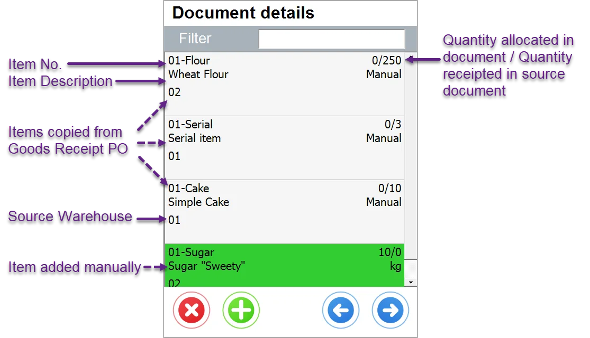

## Use Case 1: Returning to Vendor all items from the Good Receipt PO

All items from selected GRPO documents are loaded after document selection in CompuTec WMS:

After choosing Flour (batch-managed Item), the user is moved to the storage info screen. Batch numbers are imported from the Good Receipt PO Document.

On the next screen, users must choose Batch, which will be returned and confirm the quantity.

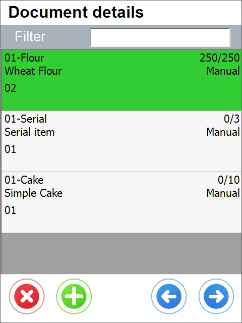

When we select Item managed by Serial Numbers, the Storage Info screen opens, and we see Serial Numbers imported from the Good Receipt PO Document.

Users must choose Serial Numbers, which will be returned, and confirm quantity.

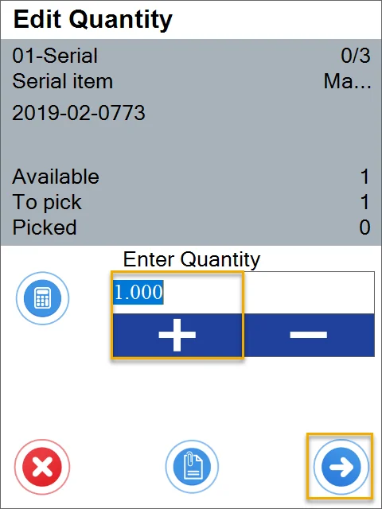

Now we see on the list that one of 3 Items managed by Serial Numbers is selected. We have to repeat the same step with the other items Serial Numbers manages.

You can also add an Item not listed on the Document Details screen. To do that, click the '+' button that leads you to the Item Selection screen.

Select a Warehouse.

The Item list with quantities appropriate for that Warehouse will appear.

After selecting an Item, its Batch/Serial, and quantity, the new Item is added to the list and can be returned.

After selecting an Item managed by none, only the quantity screen appears, where we must enter all quantities. Now we see that all Items and their quantities are selected, and we can click the right arrow to go to remarks.

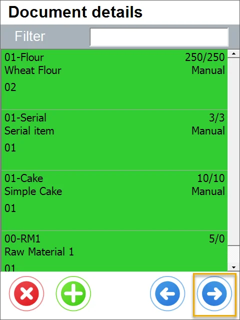

Here, we can enter Remarks, change the document series, or set UDFs. Then, we press the Save icon to save this Return from GRPO.

## Use Case 2: Returning to Vendor only one Item from Goods Receipt PO

In this scenario, the user will return all Items copied from the Good Receipt PO shown below.

All Items from selected GRPO documents are loaded after document selection in CompuTec WMS.

After choosing Flour (batch-managed Item), the user is moved to the Storage Info window. Batch numbers are imported from the Good Receipt PO Document.

On the following screen, the user has to choose Batch, which will be returned, and confirm the quantity.

After adding a selected Batch and quantity, the first row became green. You can also add an Item not listed on the document.

The Item list with quantities from this Warehouse will appear.

After selecting the Item, its batch/Serial Numbers, and quantity, the new Item is added to the list and can be returned.

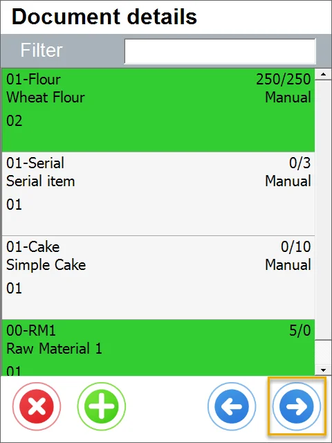

Only the first Item is selected with the whole quantity, and one is added additionally, so only these two Items are marked green on the list, and only these quantities will be returned.

## Use Case 3: Returning Items without Goods Receipt PO as a source document

It is possible to return Items without a base GRPO document. To do this, choose the New Goods Return option from the menu.

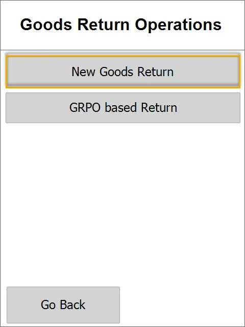

Next, choose the Warehouse from which the return will be performed.

Next, choose the Supplier to whom the Items will be returned.

This leads to the Document details form. Click '+' to add Items.

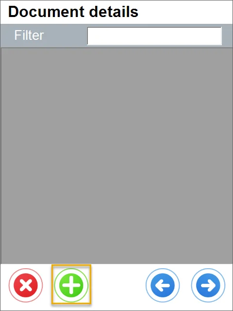

The item selection window is then opened. On each row, there is a quantity of a specific Item in the Warehouse and a unit of Measurement.

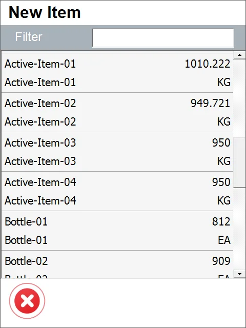

Choose the Item you want to return. Quantity and Batch / Serial Numbers form opens then.

Non-managed Item:

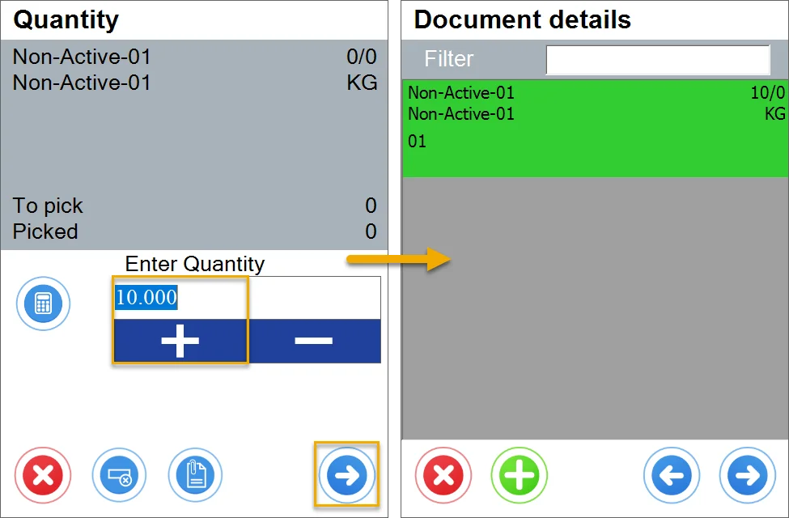

Batch-managed Item:

Serial Numbers managed Item:

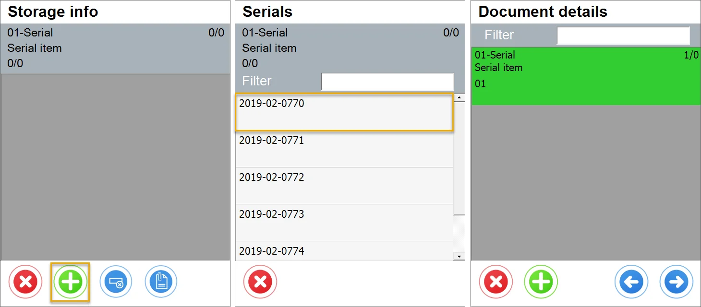

This leads to Document details. Items and quantities. Click the right arrow to move to the Remarks window.

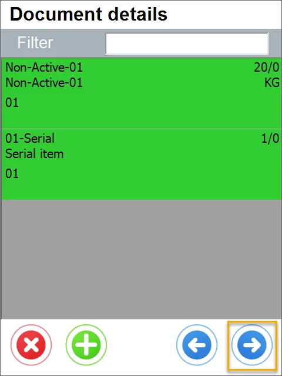

You can put remarks, add UDFs, move to the previous screen, or save the document.

