# SAP Production Issue

In SAP Business One integrated with CompuTec WMS, a Production Issue is generated to record the issue of raw materials or components to a production order. This step is essential for maintaining accurate inventory and ensuring a smooth manufacturing process. The production issue can be triggered directly from posted Production Orders in SAP Business One.

This guide walks you through the step-by-step process of creating an SAP Production Issue using CompuTec WMS, with visual aids and important notes to assist you at every stage..

:::info
    The order and availability of some windows or forms may vary depending on system configurations and individual settings.
:::

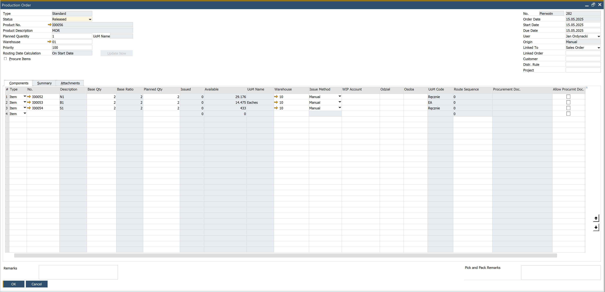

## Step-by-Step Guide to Creating a Production Issue

1. From the main menu in CompuTec WMS, select SAP Production Issue.

    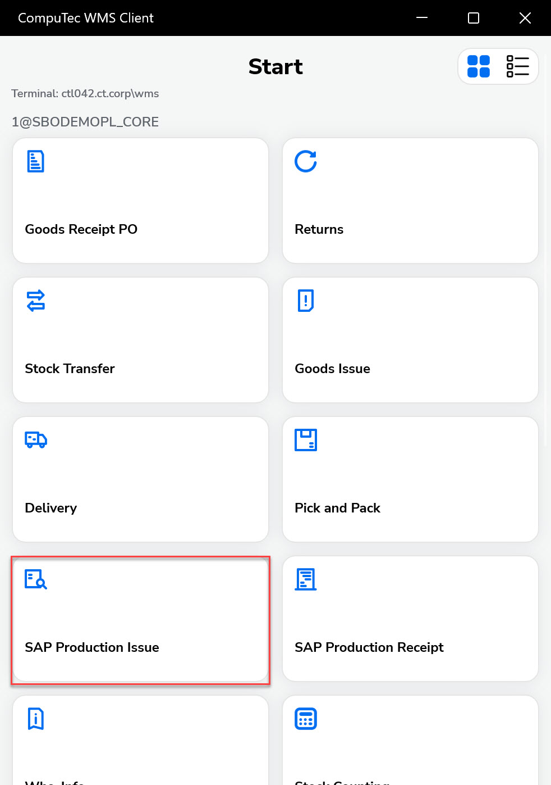

2. The Source Warehouse selection window will appear. Click on the desired Warehouse to select it.

    :::info
    Searching through the records is available in every window in which a Filter row is displayed by typing in at least a part of a name, e.g., a part of a warehouse name, in the Warehouse Selection window.
    :::

    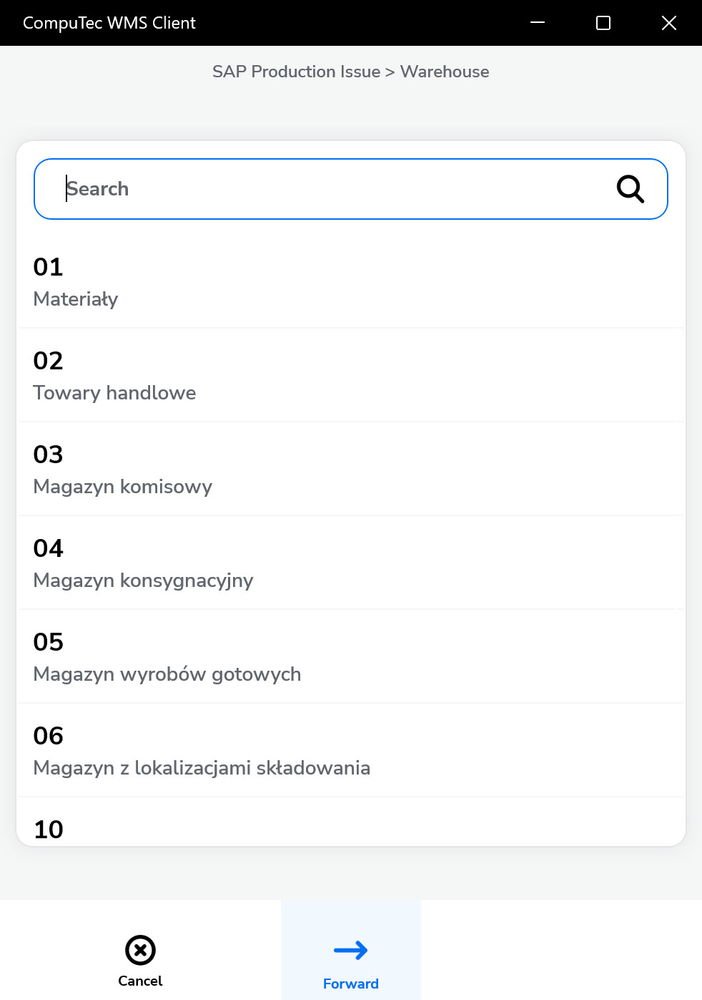

    :::caution
    You can skip this step by clicking the right arrow icon. In this case, the Source Warehouse selection will appear later after clicking an item row in the Document Details window.
    :::

3. The Production Orders window shows a list of available orders. If a warehouse was selected earlier, only relevant production orders will be shown.

    Select at least one order. Then click the right arrow to proceed.

    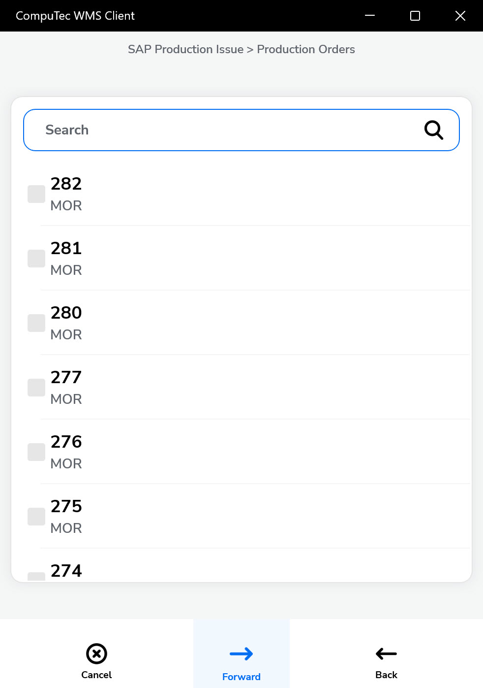

4. The Document Details window displays only items with a manual issue method. Click on an item to set its details.

    >Note: A red-colored row indicates that the item is not available in the selected warehouse.

    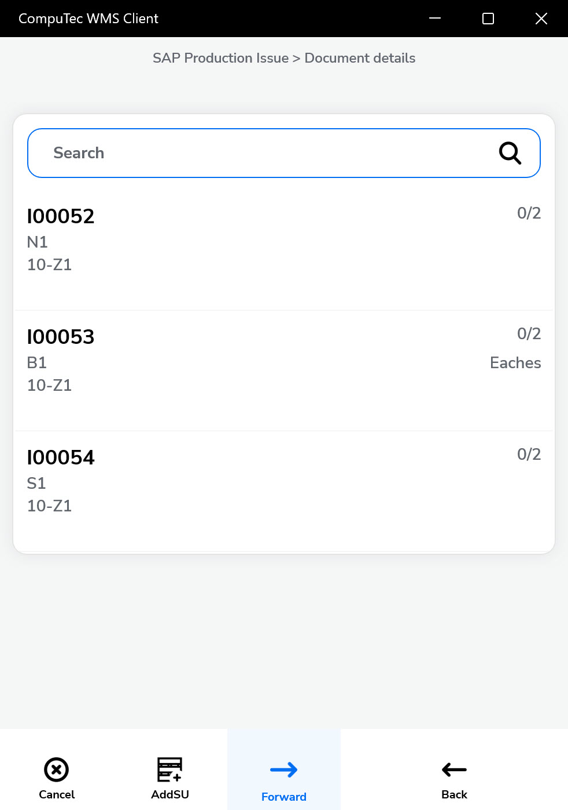

5. If the chosen Warehouse has Bin Locations, the Bin selection window will appear while determining the document details.

    Click a Bin row to choose the desired Bin location.

    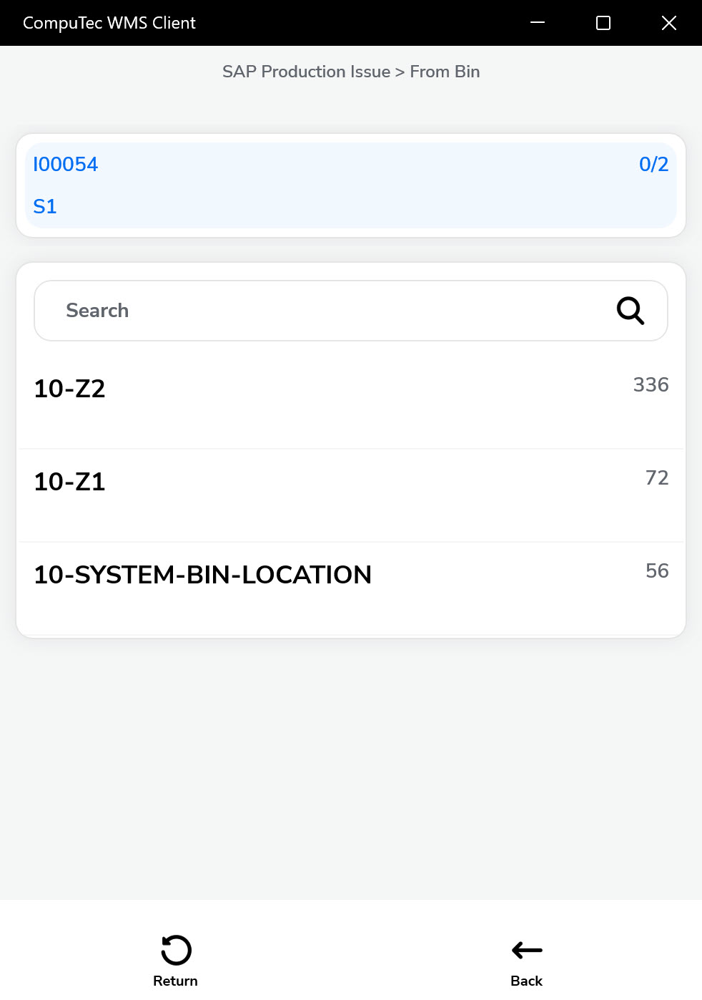

6. The Quantity Window will appear.

    You can change the quantity by typing it in or using the '+' and '-' icon buttons. Click save,

    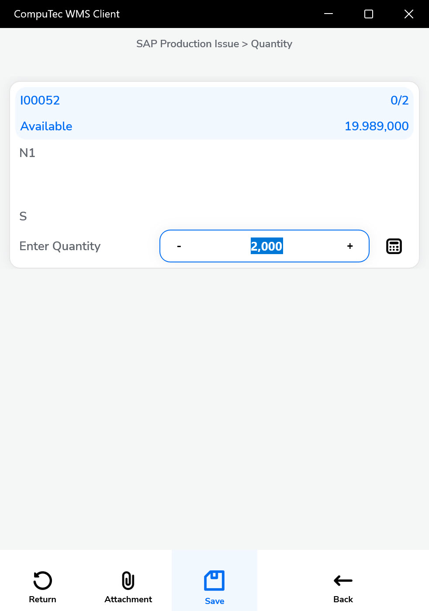

7. If Serial Numbers manage the Item, the Serial Number window appears after step 5 of this guide.

    Clicking a Serial Number row picks it and adds it to the Document Details window. This step should be repeated until obtaining the desired quantity.

    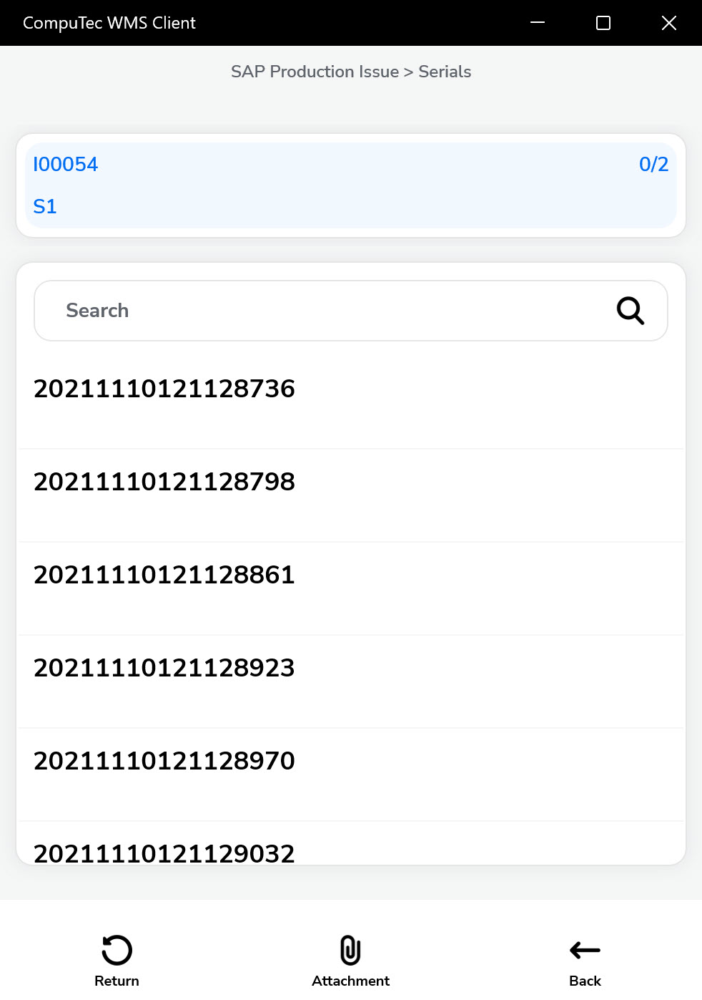

8. If Batches manages the Item, the Batch window will appear after clicking the Item in the Document Details window.

    The Quantity window appears after clicking the desired batch (see no. 6 of this guide).

    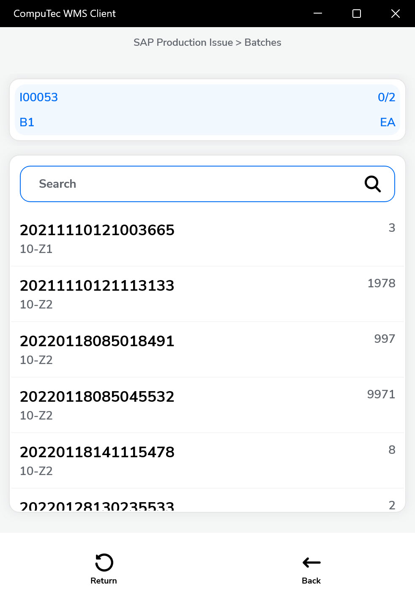

9. Click the right arrow icon after setting document details.

    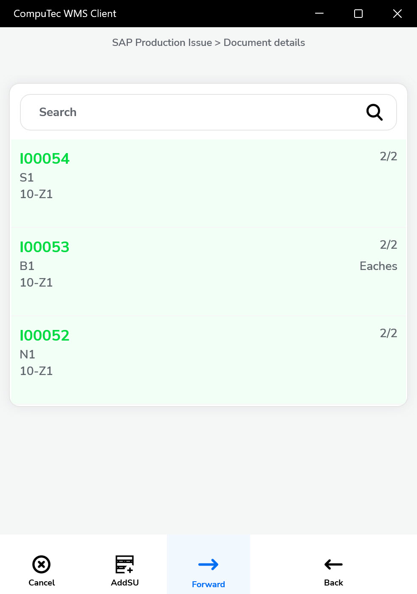

10. The Remarks window will appear. Filling in a reference number field and a Production issue remarks field is optional.

    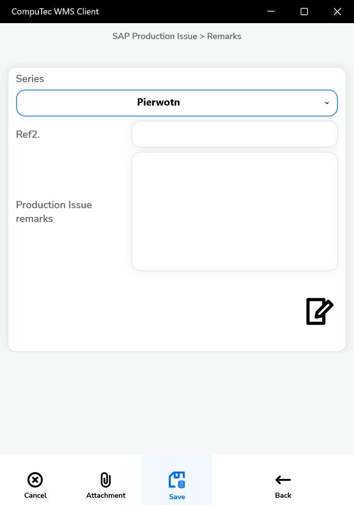

11. Click the save icon to post the SAP Production Issue document.

    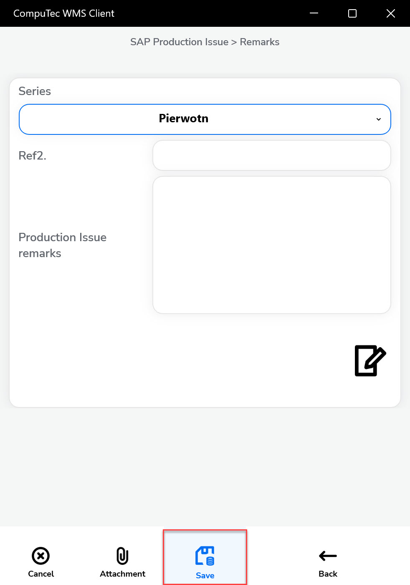

12. A confirmation note appears indicating the successful creation of the document. Click "Ok" to finish the transaction.

    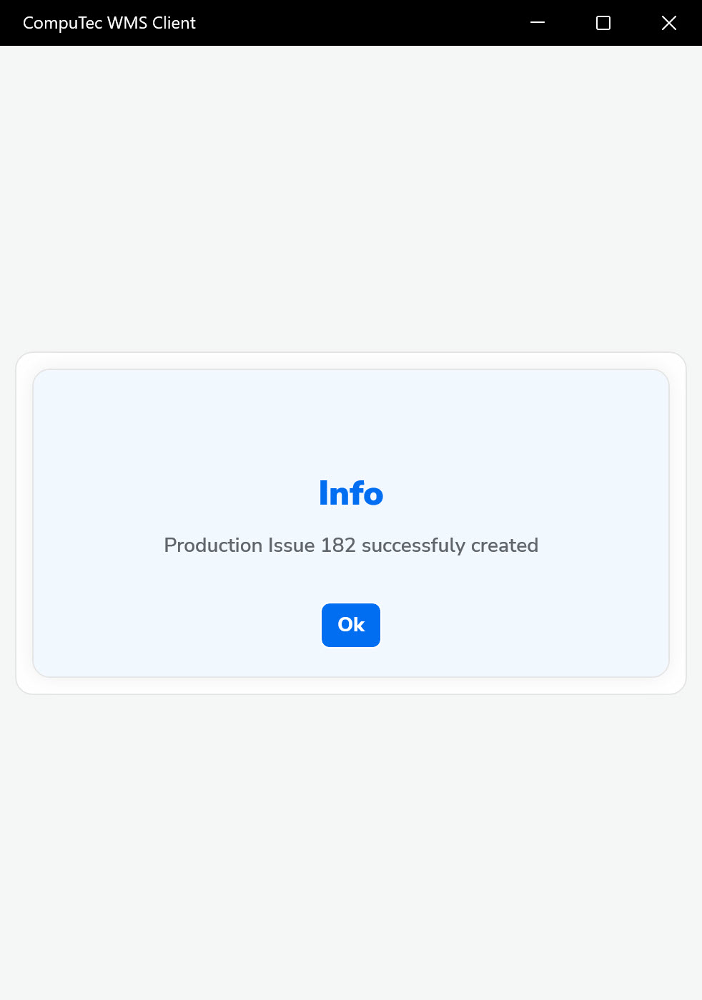

13. The Production Issue is now successfully posted and can be viewed in SAP Business One.

    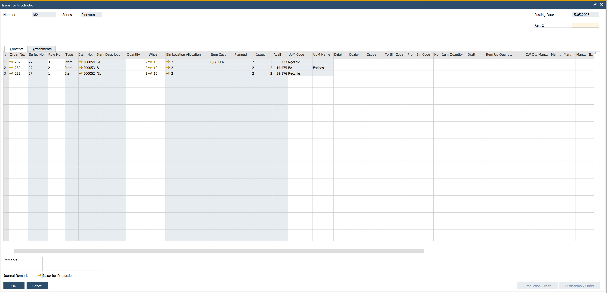

---
