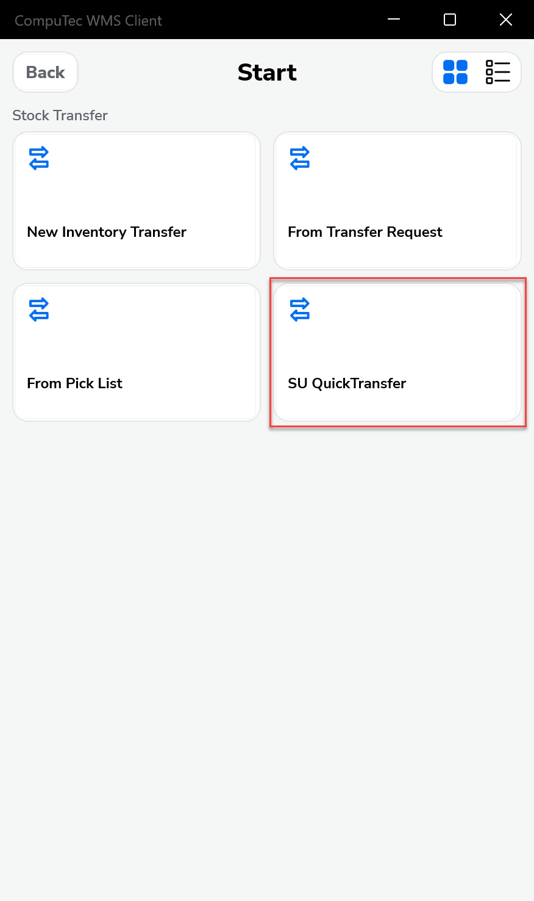
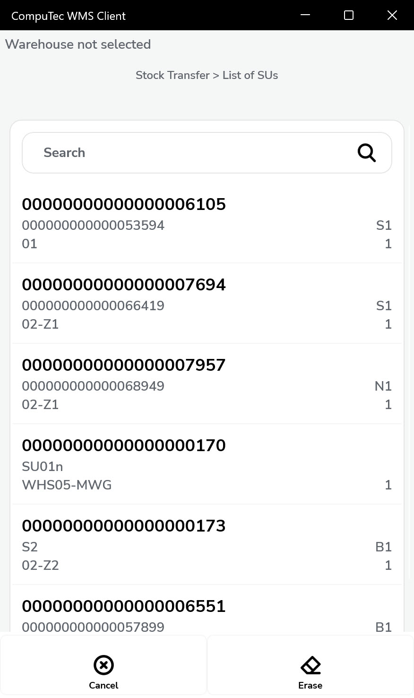
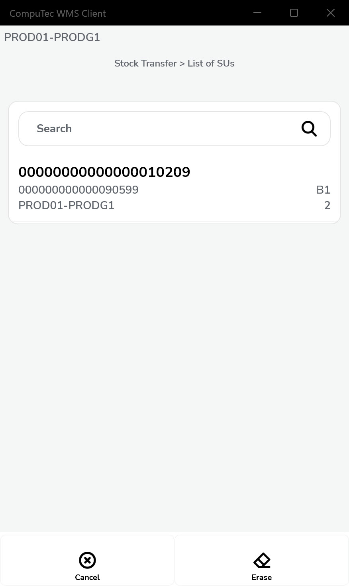
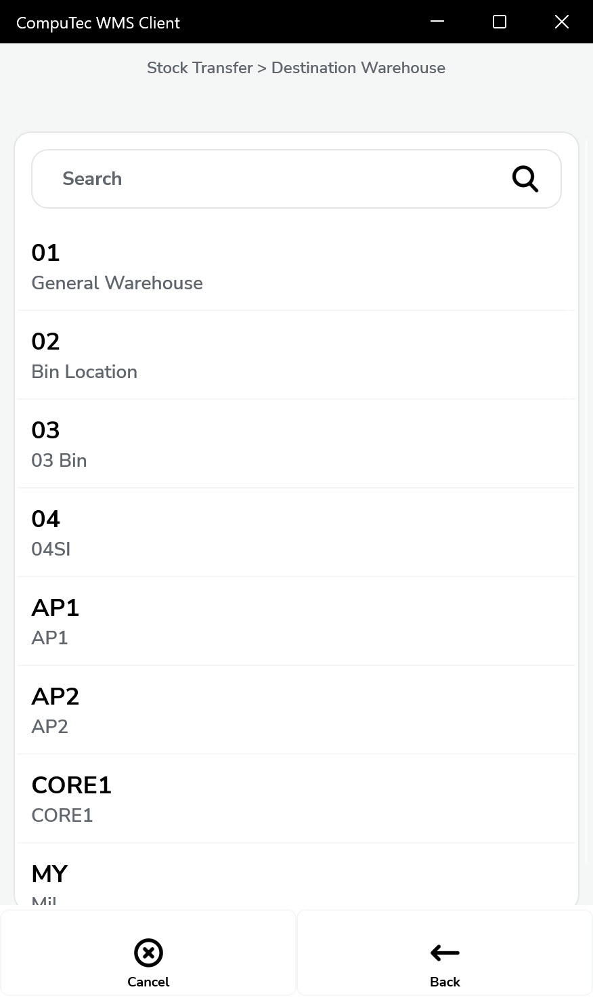
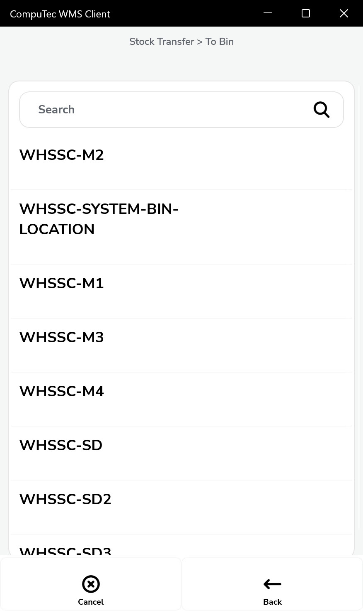
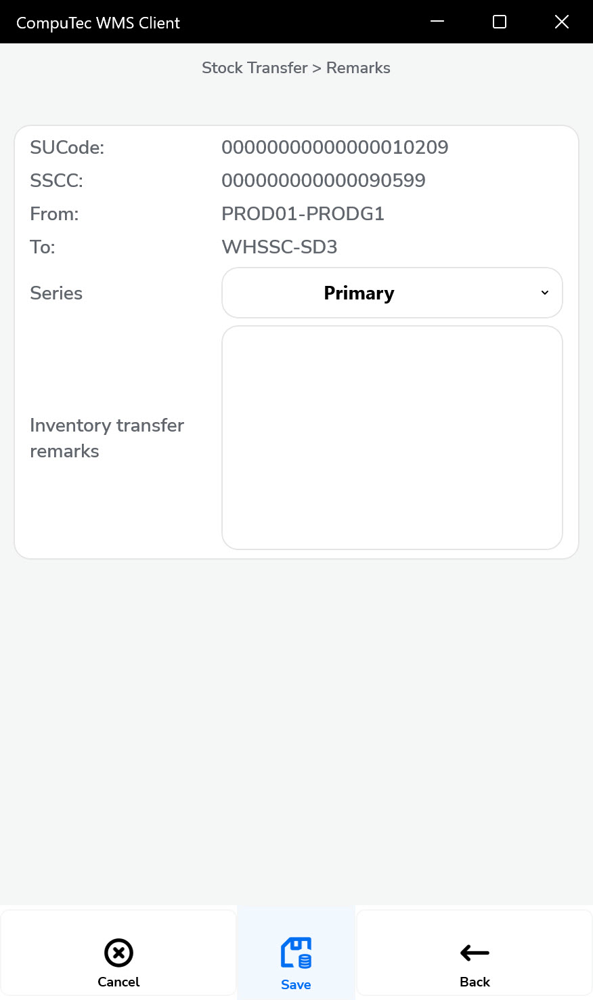

# Storage Unit Quick Transfer

Efficient warehouse operations require tools that simplify complex tasks. SU Quick Transfer, available in the **CompuTec WMS 2.10.23_R1 release** is designed to make stock transfers of Storage Units (SUs) fast and seamless. This tool allows you to complete the entire process in just a few seconds, enhancing productivity and accuracy in your warehouse. Here’s a step-by-step guide on how to use it:

---

## Steps for Using SU Quick Transfer

1. **Select the Transaction**: Begin by choosing the transaction “SU Quick Transfer” from the menu.

        

2. **Scan an SU or SSCC Code**: Use the barcode scanner to scan the SU or SSCC Code. Alternatively, you can use the filter bar at the top of the screen to narrow the SU search by warehouse and location.

         

3. **Choose the Destination**: Based on the scanned code, you’ll be directed to either the Destination Warehouse or the Bin Location window. Select the appropriate destination for the transfer.

         

4. **Save the Transaction**: Confirm and save the transaction in the remarks window to finalize the process.

        

The video demonstration showcases the SU Quick Transfer process using a barcode scanner simulator. You can watch it here: [SU Quick Transfer Video](https://www.youtube.com/watch?v=XWdkcGahZqc).

---
