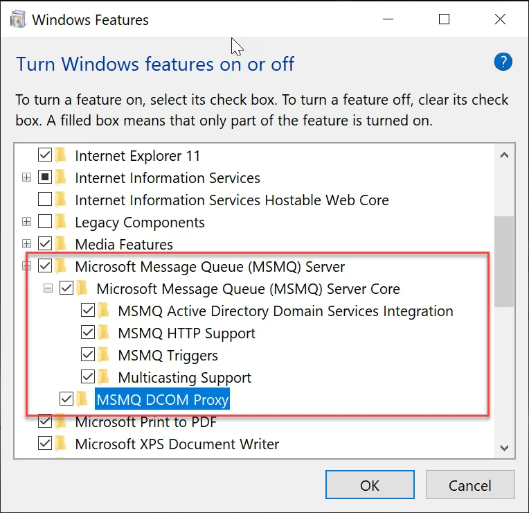

# Configuration of Scales for WMS Client for Handheld Devices

This guide provides step-by-step instructions for configuring scales for the WMS (Warehouse Management System) client on handheld devices. Following these instructions ensures a smooth setup and proper integration of the scales with the WMS system, enabling accurate data capture and streamlined warehouse operations.

---

## Steps for Configuration

1. Turn on Microsoft Message Queue Server (MSMQ) in the same environment as Gateway Manager, To ensure seamless communication between the handheld devices and the Gateway Manager.

    1. Open "Windows Features".

        
2. Install the [MSMQ package](https://download.computec.one/software/wms/tools/msmq.arm.cab) on the handheld devices with WMS:

    1. Connect the handheld scanner to the PC.
    2. Copy the MSMQ package to the application location along with the CompuTec WMS application.
    3. Install the package on the handheld device.
3. For detailed guidance on integrating Weight Scales with the handheld devices, refer to the relevant [documentation](/docs/pdc/administrator-guide/weight-scales-integration/overview).
4. For detailed guidance on integrating WMS with the handheld devices, refer to the relevant [documentation](../../administrator-guide/computec-gateway-service/computec-gateway-service-installation.md).

---
Following the steps outlined in this guide ensures reliable operation and efficient warehouse management. For additional resources or technical support, check the WMS integration documentation.

