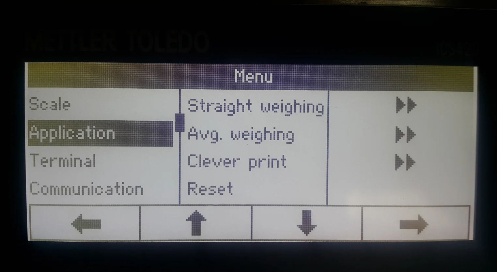
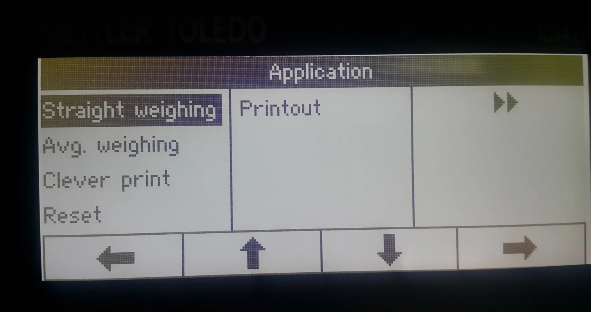

# Mettler Toledo Weight Scale Configuration

This guide outlines the steps to correctly configure a Mettler Toledo weight scale for seamless integration with CompuTec Gateway and CompuTec WMS 2.0. The process involves creating a template, selecting a work mode, and assigning the template to the scale. By following these instructions, you can ensure your weight scale operates efficiently within your system.

---

## Defining a Template

- Go to the "Communication" option in the menu.
- Select "Define Template".
- Choose "Template 1" and configure the data points to be sent by the weight scale. Set up the following details:

  - Line 1: Date
  - Line 2: Time
  - Line 3: Gross
  - Line 4: Net
  - Line 5: Tare
  - Line 6: SNo. Terminal.

  

  

  

  

  

  

## Choosing a Mode for Weight Scales

- Go to the "Communication" option in the menu.
- Select "COM2".
- choose "Mode".
- Set the mode to "Continuous print".

## Assigning the Defined Template to the Weight Scales

- Choose the "Application" option from the menu.
- Select "Straight weighing".
- Choose "Printout".
- Select "COM2".
- Select "COM2" again.
- Choose a Template name that was defined in the [first step](#defining-a-template) ('Template 1' in this example)
- Click "OK" to save the changes.

---
