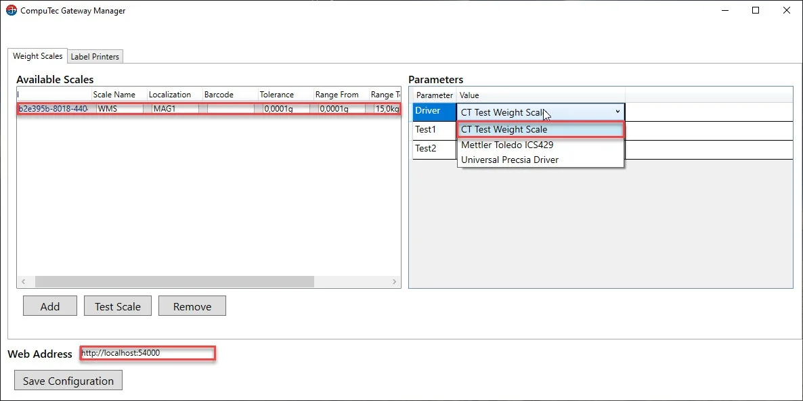
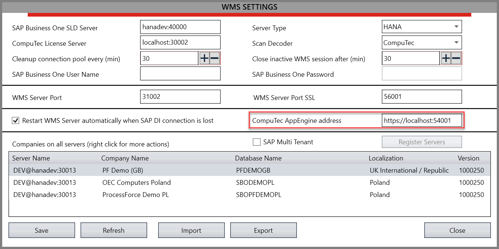
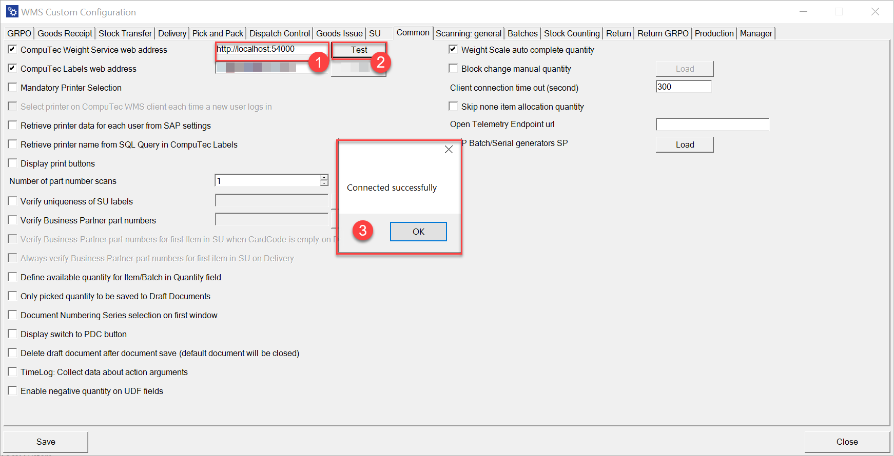
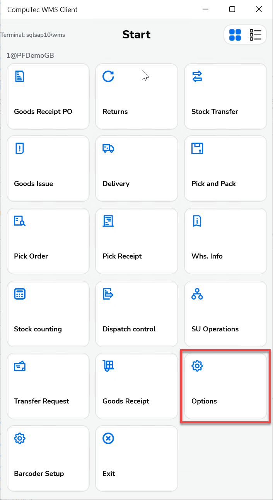
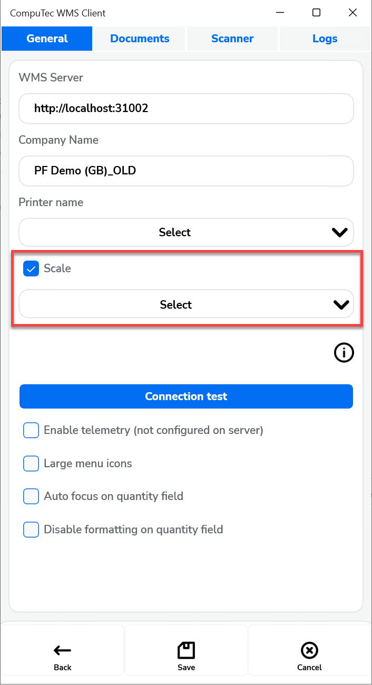
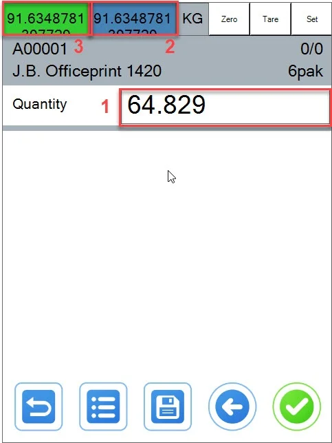
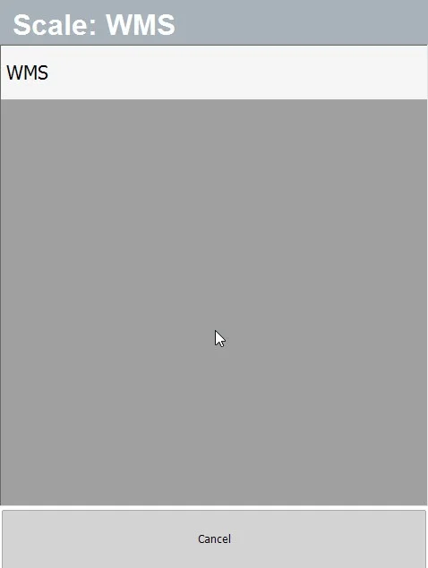

# Overview

This guide provides detailed instructions for configuring and using weight scales with CompuTec WMS to ensure accurate and efficient weight management in your operations. By following these steps, you can seamlessly integrate weight scales into your system and optimize your workflows.

---

## Configuration Steps

1. Configure CompuTec AppEngine and Plugin Gateway Manager from: [Weight scales integration](/docs/pdc/administrator-guide/weight-scales-integration/overview).
2. Ensure the application address is correct, such as `http://localhost:54000` or a designated IP address like `http://10.0.0.10:54000`.
3. Open the "CompuTec Gateway Manager" (Weight Manager).
4. Configure your specific CompuTec WMS weight scale. For example, in this guide, the CompuTec WMS Test Weight Scale is used as a reference, but you should select the scale relevant to your setup.
5. Assign a barcode to your weight scale if needed.

    
6. Open "Custom Configuration" and navigate to the "Common" tab.
7. Set your CompuTec AppEngine address:

    
8. Ensure the CT Weight Service web address option is selected.
9. Test the connection and confirm by clicking OK.

    
10. Save the custom configuration and close the settings.
11. Open the CompuTec WMS Client.
12. Select "Options":

    
13. Check the Scale checkbox and select your CompuTec WMS printer.

    
14. Alternatively, if you prefer to use the barcode scanning functionality of your weight scale, you can leave this option unselected.
15. Save configuration.
16. Open any transaction.
17. Select Quantity window (1).
18. Select (2) or (3) if you want to use your scale(2 Gross, 3 Net).
19. To add another weight to an existing value, press and hold the respective button (2 or 3) for 3 seconds.

    
20. You can choose your weight with a Barcode.
21. In the transaction window, click the "Set" button located in the right corner.
22. Scan the barcode associated with your weight scale via the WeightScanManager.

    

---
