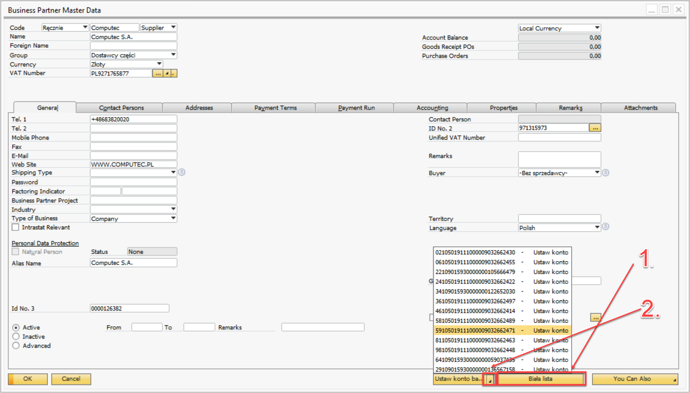
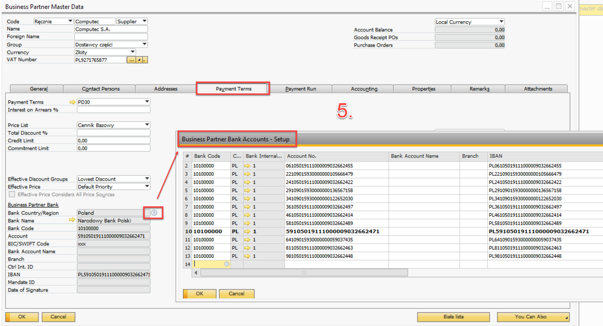

# Pobieranie rachunków z białej listy do kartoteki PH

W SAP Business One, gdy Partner Biznesowy (BP) nie posiada predefiniowanego domyślnego rachunku bankowego, użytkownicy mogą wygodnie pobrać wszystkie dostępne rachunki bankowe z oficjalnej białej listy i ustawić je jako domyślne. Ta funkcjonalność zapewnia zgodność i dokładność transakcji finansowych poprzez pobieranie zweryfikowanych danych bezpośrednio z rejestru białej listy.

---

## Przegląd procesu

- **Dostęp do danych podstawowych partnera biznesowego**: Po dodaniu nowego partnera biznesowego przejdź z powrotem do ekranu danych podstawowych partnera biznesowego.
- **Uruchom pole „Biała lista”**: Kliknij na pole „Biała lista” (1). Akcja ta spowoduje pojawienie się pola „Ustaw konto bankowe”.
- **Wybierz domyślne konto bankowe**: Rozwiń listę (2), aby wyświetlić wszystkie dostępne rachunki bankowe pobrane z białej listy. Wybierz odpowiednie konto, aby ustawić je jako domyślne.

    

- **Komunikat potwierdzający**: Po wybraniu rachunku bankowego system wyświetli komunikat „Konto bankowe dodane pomyślnie” (3), potwierdzający pomyślne dodanie rachunku.
- **Aktualizacja danych podstawowych Partnera Biznesowego**: Po potwierdzeniu należy odpowiednio zaktualizować dane podstawowe Partnera Biznesowego (4).

    

## Wyniki tej funkcjonalności (5)

- **Kod banku**: Pole obowiązkowe w systemie, ale nie wykorzystywane bezpośrednio. Zawsze stosowany jest stały kod 10100000.
- **Numer konta**: Pobrany bezpośrednio z rejestru białej listy.
- **IBAN**: Również pobrany z białej listy, z przedrostkiem PL, aby zachować zgodność z polskimi standardami bankowymi.

    

---
