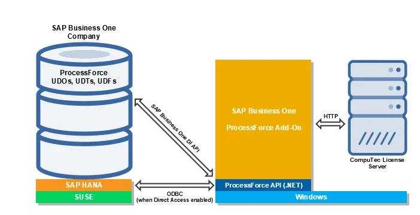

# CompuTec ProcessForce Architecture

CompuTec ProcessForce is a 64-bit .NET-based add-on built to extend the core functionalities of SAP Business One, with a specific focus on the needs of manufacturing and process industries. Its architecture is designed for deep integration, performance efficiency, and adaptability across both Microsoft SQL Server and SAP HANA environments.

## Architectural Overview

At its core, CompuTec ProcessForce functions as a **Windows-based .NET application** that launches from within SAP Business One. It operates via an executable process (`ProcessForce.exe`) and integrates seamlessly with the SAP Business One environment through its APIs and extension points.

---

## Key Architectural Components

### 1. CompuTec ProcessForce API

The business logic and data handling layer is encapsulated in a dynamic-link library (DLL) deployed with the add-on.

- Written in **C#** and part of the installation directory.
- Interfaces with SAP Business One using the **Data Interface (DI) API**.
- Offers **Direct Access Mode**, which uses **ADO.NET** for efficient database communication.

This separation of concerns ensures robust handling of both SAP-compliant data structures and custom logic.

---

### 2. User Interface (UI) Layer

The user interface is built using a combination of SAP-standard and modern web-based technologies:

- **SAP Business One UI API** is used for most standard forms and interactions.
- Select features leverage **SAPUI5** (HTML-based interface) for richer and more responsive UIs. Examples include:
  - Serialization
  - MRP 2.5
  - Batch Traceability 360
  - Mass BOM Change Tool

This hybrid approach supports both consistent user experience and enhanced usability for complex operations.

---

### 3. Data Management

CompuTec ProcessForce relies on SAP Business One’s extensibility features to store and manage its data:

- User-Defined Objects (UDOs)
- User-Defined Tables (UDTs)
- User-Defined Fields (UDFs)

This ensures tight integration with the SAP data model while allowing CompuTec ProcessForce to manage industry-specific logic and traceability data.

---

### 4. Reporting and Analytics

Reporting capabilities are database-aware and provide flexibility depending on the platform:

- **SAP HANA**:
  - Uses **Calculation Views** and the **CompuTec Semantic Model** for performance-optimized analytics.
- **Microsoft SQL Server**:
  - Utilizes **Stored Procedures**, **Functions**, and **Views** for report generation.

Across both platforms, data retrieval is also supported via **User Queries**, and reports are rendered using **Crystal Reports**.

---

## SAP HANA vs. Microsoft SQL Server Compatibility

CompuTec ProcessForce delivers feature parity across both database platforms. However, the **Semantic Model**, which leverages SAP HANA’s native calculation views, is **exclusive to SAP HANA**.

This architectural distinction provides enhanced analytical capabilities and performance for HANA users, while still offering comprehensive functionality for SQL Server environments.

---

## Summary

CompuTec ProcessForce’s architecture is designed to:

- Extend SAP Business One with advanced manufacturing logic.
- Provide flexible UI and reporting layers tailored to user needs.
- Maintain performance across database platforms.
- Enable deep traceability and real-time analytics.

Its modular, API-driven design ensures scalability, maintainability, and compatibility with evolving SAP Business One standards.

---
