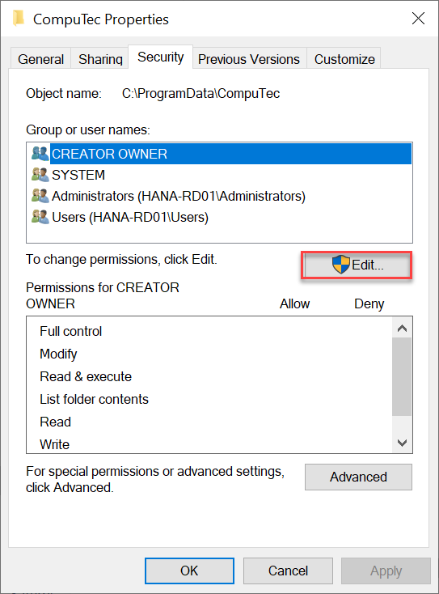
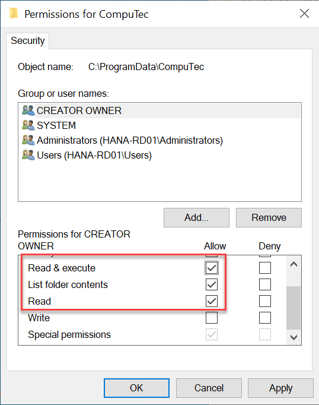

# Security Settings

When installing ProcessForce on machines with custom security configurations, certain security settings need to be adjusted to ensure smooth operation. These changes are not required for systems using default security settings.

---

Follow the steps below to configure the necessary permissions:

1. Open file explorer, navigate to the below location (Note: the ProgramData folder is hidden by default): `C:\ProgramData\`

2. Locate the CompuTec Folder, right-click on it, select Properties. Switch to Security tab, and click Edit... button:

    

3. In the Permissions for CompuTec window, ensure all SAP Business One users with  ProcessForce installed have the **Read & execute**, **List folder contents** and **Read** permissions for the folder and **all descendant folders and files** of it:

   

---
