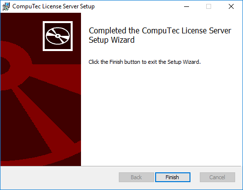

# CompuTec License Server Installation

The CompuTec License Server is a crucial component for managing licenses in CompuTec solutions. This guide provides step-by-step instructions for installing and configuring the CompuTec License Server in a Windows environment. It also covers setting up necessary firewall rules to ensure proper functionality.

:::info
    You can check the available **CompuTec ProcessForce user license types** [here](../license-comparison-chart.md).
:::

---

## Installing CompuTec License Server

:::danger
  Before installing a new version, uninstall any previous versions of CompuTec ProcessForce License Server and SAP COM License Bridge if you have used them with CompuTec ProcessForce 8.81, 8.82, or 9.0 PL05 - PL08 HotFix.
:::

:::caution
    CompuTec License Server can be installed in a **Windows environment** only.
:::

1. Download the latest version of CompuTec License Server from [here](../../../releases/download.md)

2. Extract the ZIP file.

3. Run the `CompuTec.LicenseServer.Setup.msi` file and click "Next":

    

4. Specify the installation folder (default path is recommended) and click "Next":

    

5. Confirm installation – click the "Install" button:

    
    

6. Once the installation is completed successfully, click "Finish".

    

## Setting Windows Firewall rule

1. Navigate to `Windows Settings → Network & Internet → Windows Firewall`:

    

2. Click on Advanced settings option:

    

3. In the Windows Firewall with Advanced Security window, select Inbound Rules and click New Rule... to open the New Inbound Rule Wizard.

    

4. Choose "Port" as the rule type:

    

5. Choose TCP protocol and specify 30002 as the local port:

    

6. Choose "Allow the connection" action:

    

7. Choose all profiles:

    

8. Specify the rule name and click Finish:

    

## Using CompuTec Service Manager and Configuring Direct Data Access mode

For instructions on using CompuTec Service Manager and configuring Direct Data Access mode, refer to the detailed guide [here](./configure-computec-service-manager.md).

---
