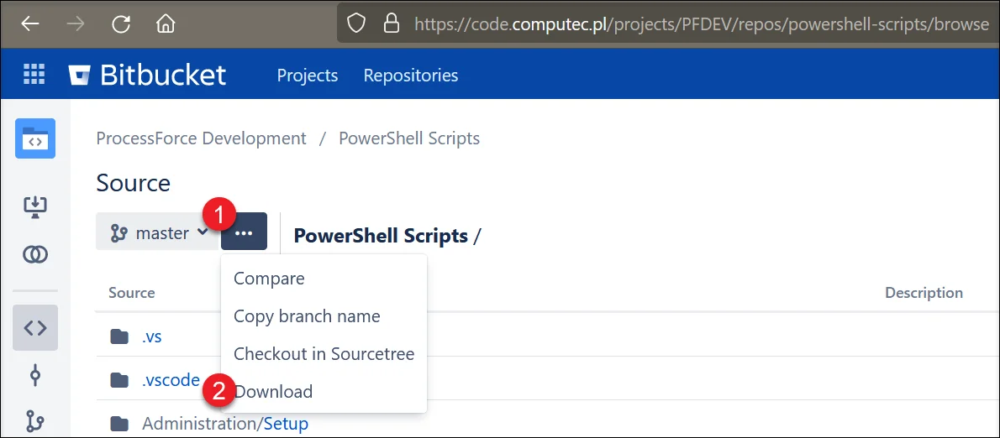
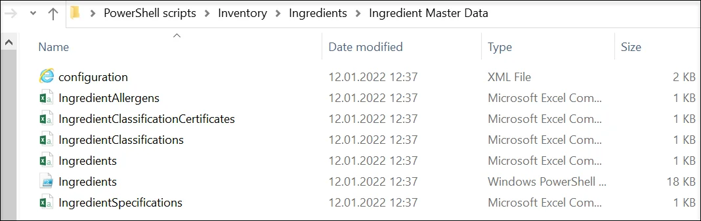

# Overview

Managing and updating data in databases efficiently is crucial for ensuring smooth business operations. This guide provides a detailed overview of using PowerShell scripts to import and update data within CompuTec ProcessForce. With predefined scripts, you can streamline data handling, enhance flexibility, and reduce manual efforts. On related pages, you can find all the necessary information on PowerShell configuration, predefined scripts, and how to modify them.

:::info
    On the 4th of March 2022, [PFI (CompuTec ProcessForce Import) plugin for CompuTec AppEngine](/docs/appengine/plugins-user-guide/pfi) was released. PFI facilitates the import and updating of data to CompuTec ProcessForce objects, providing a streamlined, faster, and more flexible alternative to PowerShell updates.
:::

:::caution
   If you modify our scripts and require our team’s assistance to resolve any resulting issues, charges will apply at an hourly rate of 150 EUR/USD, plus applicable expenses. Before any work begins, mutual confirmation via email is required to acknowledge and accept these charges.
:::

:::info
    Please note that updated and standardized scripts were released on October 22, 2018. Additionally, as part of this update, connection parameters have been relocated to a separate file named "configuration.xml (which can be found in a zip file of a specific script).
:::

---

## Required Files

The latest PowerShell script versions are available in our [public git repository](https://github.com/CompuTec/processforce-powershell). The repository contains predefined scripts and necessary configuration files.



In the following example, Ingredient Master Data scripts are used. To access Ingredient Master Data folder:

1. Go to the downloaded folder
2. Navigate to:
    :::info Path
    Inventory → Ingredients → Ingredients Master Data
    :::

    

Each folder contains three types of files:

- **Configuration file**: a file that holds information on a database access
- **PowerShell script**: for executing import or update of the data
- **Comma-Separated Values (CSV) files**: files to be filled in with data to be imported or updated

## Procedure

### Configuration File

1. Open the configuration.xml file using any XML editor.

    ```xml

    <?xml version="1.0" encoding="UTF-8" standalone="yes"?>
    <configuration>
      <connection
        Database="PFDEMOGB"
        SQLServer="NDB@hanaserver:30013"
        LicenseServer="hanaserver:40000"
        DbServerType="dst_HANADB"
        UserName="manager"
        Password="1234"
      />
      <!-- Database       = Database/schema name (check in SAP Company select form/window, or in Microsoft SQL Server Management Studio or in SAP HANA Studio) -->
      <!-- SQLServer      = Database server name or IP address with port number; Should be the same as in the System Landscape Directory (check https://<Server>:<Port>/ControlCenter); Sometimes the best is to use an IP address to resolve connection problems -->
      <!-- LicenseServer  = SAP Business One Licence Server name or IP address with a port number (check in SAP Business One client -> Administration -> License -> License Administration -> License Server) -->
      <!-- DbServerType   =
                            [SAPbobsCOM.BoDataServerTypes]::"dst_HANADB"      # For SAP HANA
                            [SAPbobsCOM.BoDataServerTypes]::"dst_MSSQL2019"   # For Microsoft SQL Server 2019
                            [SAPbobsCOM.BoDataServerTypes]::"dst_MSSQL2016"   # For Microsoft SQL Server 2016
                            [SAPbobsCOM.BoDataServerTypes]::"dst_MSSQL2014"   # For Microsoft SQL Server 2014
                            [SAPbobsCOM.BoDataServerTypes]::"dst_MSSQL2012"   # For Microsoft SQL Server 2012
      -->
      <!-- UserName       = SAP Business One username, e.g., manager -->
      <!-- Password       = SAP Business One user password -->
    </configuration>

    ```

2. Edit the parameters in the connection element based on the comment in the file and save the file.

The completed file can now be used with any predefined PowerShell script to update or import data into the specified database. Simply copy it to any script folder and replace the existing configuration file.

### CSV Files

Use an appropriate application (e.g., Microsoft Excel) to enter the necessary values in the CSV file. In this example, the Ingredient Classification Certificates file is being prepared. The first line contains field names and is provided in the CSV file. Data is entered in subsequent lines, as shown below:

| IngredientCode | ClassificationCode | BusinessPartnerCode | CertificateNumber | CertificateDate | Status | StatusDate | Attachment  | Remarks |
| -------------- | ------------------ | ------------------- | ----------------- | --------------- | ------ | ---------- | ----------- | ------- |
| 2              | 2                  | 2                   | 1                 | 02.07.2015      | A      | 02.07.2015 | C:\test.pdf | remarks |
| 2              | 2                  | 2                   | 2                 | 02.07.2015      | P      | 02.07.2015 |             | remarks |

After saving the changes, open the file in a text editor (e.g., Notepad) to verify that values are separated by semicolons (;) (like in the screenshot below). Sometimes, semicolons are automatically changed for a comma or other signs. This change can influence the data import/update process.

```IngredientCode;ClassificationCode;BusinessPartnerCode;CertificateNumber;CertificateDate;Status;StatusDate;Attachment;Remarks

2;2;2;1;02.07.2015;A;02.07.2015;C:\test.pdf;remarks

2;2;2;2;02.07.2015;P;02.07.2015;;remarks

```

### Executing Script

To process the CSV file, open the required script in a compatible application, such as PowerShell ISE. Ensure that all related files, including the configuration file, CSV files, and script, are stored in the same folder for seamless execution.


---
