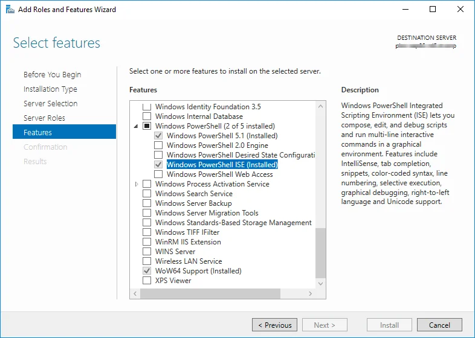

# PowerShell Application Configuration

PowerShell is a powerful scripting tool that can be used to automate data imports and updates in your SAP Business One and CompuTec ProcessForce environment. This guide provides a step-by-step approach to configuring PowerShell for seamless integration, ensuring compatibility, and setting the correct execution policies.

On this page, you can find a step-by-step manual for configuring PowerShell to import or update data.

:::caution
    If you modify our scripts and encounter issues requiring our team’s intervention, any time spent reviewing and resolving these issues will be charged on a time and material basis at an hourly rate of 150 EUR/USD, plus any applicable expenses. Work will only commence after mutual email confirmation agreeing to these charges.
:::

---

## Installation

To ensure a smooth PowerShell setup, make sure that the machine where the scripts are executed has the same version of the CompuTec ProcessForce API as the version used in your company database.

For easier script editing and debugging, install one of the following:

- Windows PowerShell ISE
- Visual Studio Code with the PowerShell extension

Additionally, ensure that you are using the correct bit version (64-bit) of PowerShell to match your SAP Business One and CompuTec ProcessForce environment.

If you are using Windows Server, you can add Windows PowerShell ISE through Server Manager by following these steps:

## Execution Policy

Set execution policy to RemoteSigned. To check which execution policy is selected, choose the `Get-ExecutionPolicy` command.

If the result/output is Restricted (as in the screenshot above), perform the `Set-ExecutionPolicy RemoteSigned` command and type Y on the dialog window to complete it.

After rechecking the policy, you should see RemoteSigned communication.

Now that PowerShell is configured, you can begin using scripts to import and update data. Follow the [data import guide](../data-import/overview.md) to proceed with the next steps.

---
