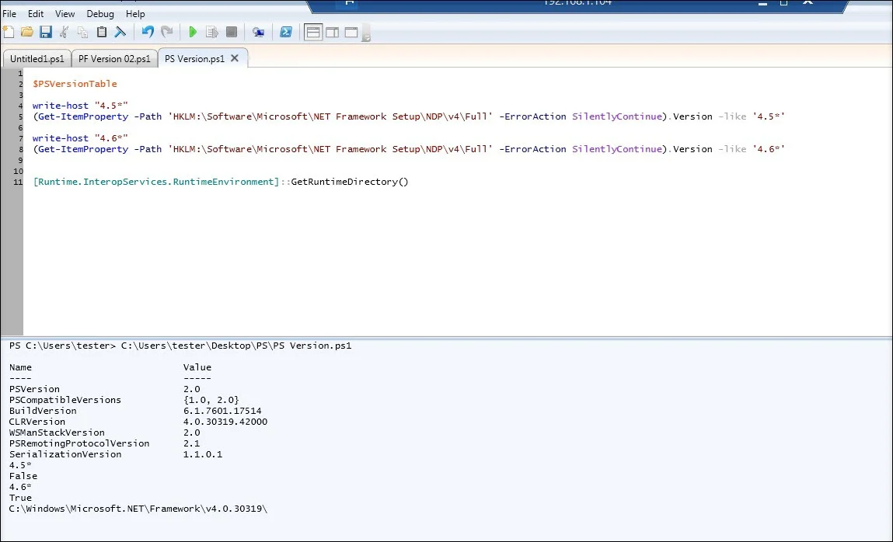
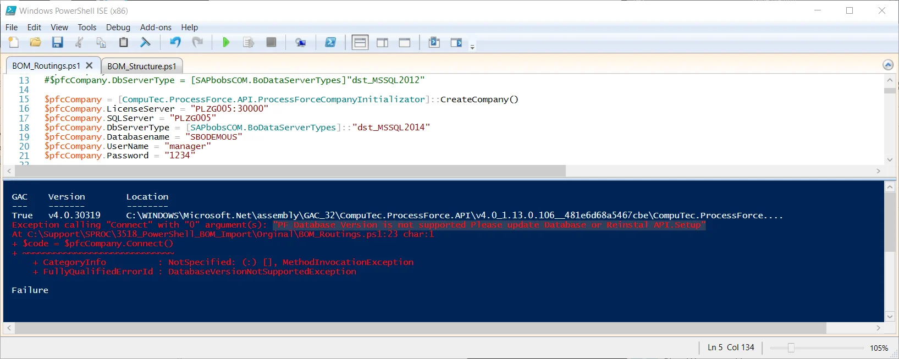
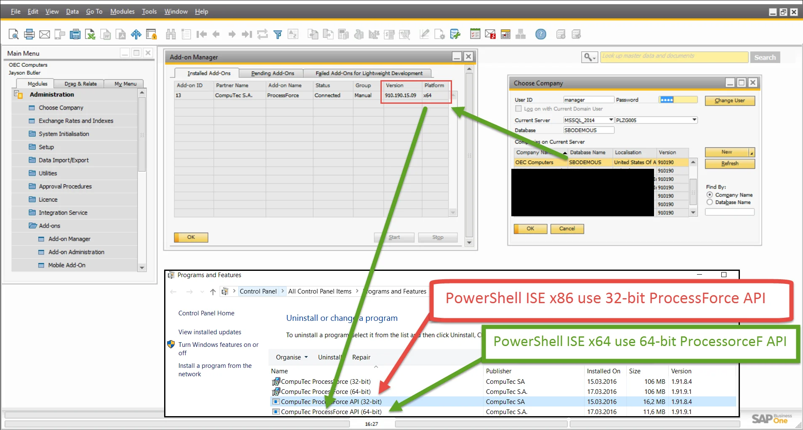
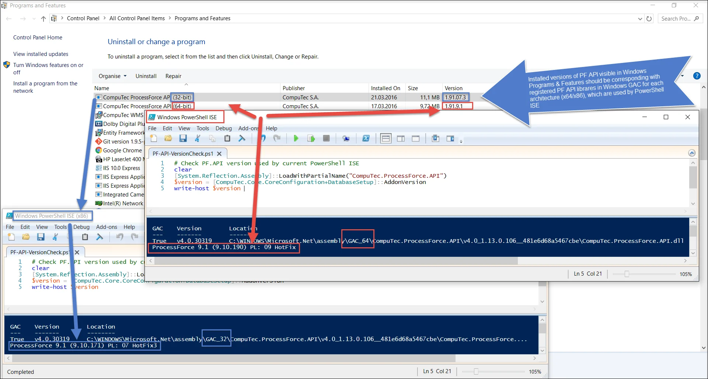
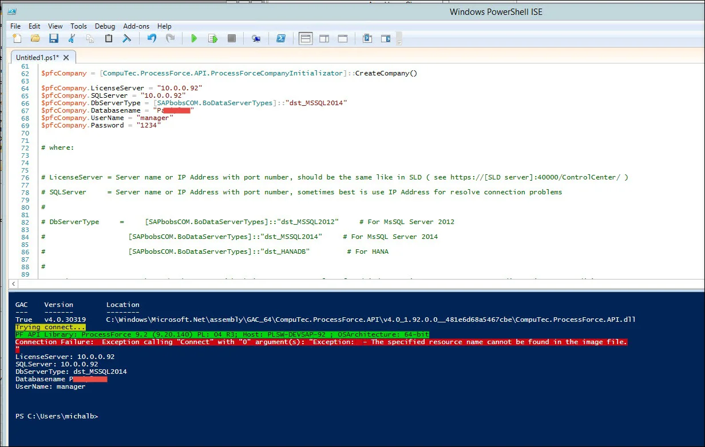

# General Issues

When working with PowerShell scripts for SAP Business One and ProcessForce API, you may encounter various issues related to connectivity, API compatibility, and database access. This guide outlines the most common problems and provides troubleshooting steps to help resolve them.

---

## Connection Issues

Verify the login credentials on the machine where you attempted the PowerShell connection using SAP's DITool to ensure they are correct. You can find this tool in the SAP Note:

- [2057143 - DI API_How to Prepare and Debug an XML Payload](https://launchpad.support.sap.com/#/notes/2057143)

Additionally, refer to this SAP Note to troubleshoot and diagnose connection issues:

- [2029714 - Troubleshooting Integration Framework SLD DI Connection](https://launchpad.support.sap.com/#/notes/2029714)

:::note
    Despite this SAP Note relating to Integration Framework, many DI connection issues are similar across different applications that use the DI API.
:::

## Exception: Unable to find type

`CompuTec.ProcessForce.API.ProcessForceCompanyInitializator`: make sure that the assembly that contains this type is loaded

**Reason**

You are probably using PowerShell 2.0 with CLRVersion 2.0.

**Diagnose Actions**

Check if the CLR Version is 2.0 or lower.

```powershell title="PowerShell 2.0 script"
$PSVersionTable
```


**Solution steps - 01 (Example for PowerShell ISE x86)**

1. Upgrade CLRVersion to 4.0 (Requires .NET Framework 4.5/4.6 Full).
2. Add a configuration file to PowerShell ISE.
3. Refer to the Configuration Files section in [the PowerShell application configuration](../../data-import/ps-app-configuration.md).

    
4. Restart PowerShell ISE and verify the updated CLRVersion.

    

**Solution steps - 02 - ProcessForce 10.0 & newer**

- Use PowerShell 5.1

- [Refer to the installation part of the documentation](../ps-app-configuration.md#installation)

## Exception: ProcessForce Database Version is not supported

Please update the Database or Reinstall API.Setup



**Reason**

ProcessForce, PowerShell ISE, and PF.API versions vary.

**Diagnose Actions**



- Verify the ProcessForce version and platform in SAP Client. To do this, navigate to: SAP Client → Administration → Add-On Manager (see a screenshot above).

- Check the PowerShell ISE architecture: if running in 32-bit mode (x86), ensure if this platform is the same as ProcessForce one.

- Check In Windows → Programs & Features and match the installed  ProcessForce API version with the ProcessForce version and platform in SAP Add-On Manager.

    

- Confirm the correct ProcessForce API library version is being used in PowerShell ISE:

    ```powershell
    # Check PF.API version used by current PowerShell ISE
    clear
    [System.Reflection.Assembly]::LoadWithPartialName("CompuTec.ProcessForce.API")
    [System.Reflection.Assembly]::LoadWithPartialName("CompuTec.Core")
    $version = [CompuTec.Core.CoreConfiguration+DatabaseSetup]::AddonVersion
    write-host $version
    ```

**Solution**

- Use PowerShell ISE 64-bit if ProcessForce add-on x64 is installed on your database.
- Use PowerShell ISE 32-bit if ProcessForce add-on x86 is installed on your database.

## Exception: Unable to Access SBO-Common Database


**Reason**

Mismatch of DBServerType.

## Exception: Database Server Type not Supported


Mismatch of DBServerType.

## Exception: The specified Resource Name Cannot be Found in the Image File

**Diagnose Steps**

1. 
2. 

**Solution**

- Check SQL/HANA server name in the credentials configuration. Sometimes, a database server can be visible only by its name or IP address.
- It should be the same as in the SAP Client Choose Company form/window.

## Exception: Login SLD Failed

Make sure the server, company, and user credentials are correct


**Solution**

- Check SQLServer & LicenceServer IP address or name.
- Check SQLServer & LicenceServer port numbers (they should be used only for HANA connection).
- Be sure about lower & upper cases in login or password.
- Check if SLD is working - try to log in using SAP Business One Client to the target database.

---
