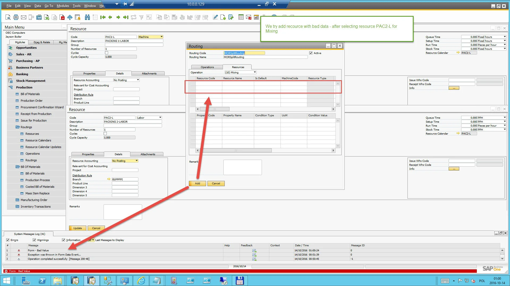

# Resource Issues

This section addresses common resource-related issues encountered during PowerShell data imports. It will be regularly updated based on reports from the support portal and insights from CompuTec consultants.

---

**How to troubleshoot a case of incorrect data import for resources that triggers a "Form - Bad Value" error**

Even if a PowerShell script executes without errors, it does not guarantee that the imported data is valid. The API does not perform validation for all scenarios, which can lead to incorrect data imports.

The following description shows an example reproduction of an incorrect data upload issue and how to diagnose what is wrong with imported data.

Please follow the instructions on the following screenshots:

- **Step 1**:

    

- **Step 2**:

    

- **Step 3**:

    

- **Step 4**:

    

## Summary

- If selecting a resource triggers the "Form - Bad Value" error, manually navigate to the resource definition, reselect all field values, and update the resource.
- In most cases, an error will be displayed during the update, helping to pinpoint the incorrect data.
- Once all data is correctly reselected and the resource is successfully updated, the issue should be resolved.
- When importing multiple resources, ensure that all resources undergo this validation process to prevent similar issues.

---
