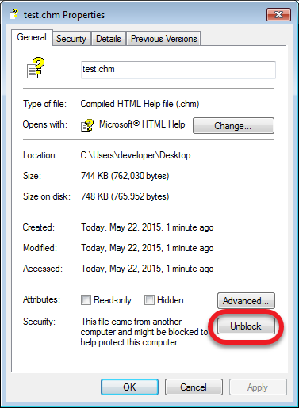
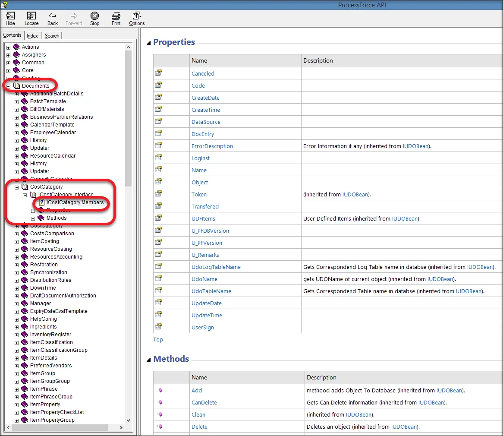
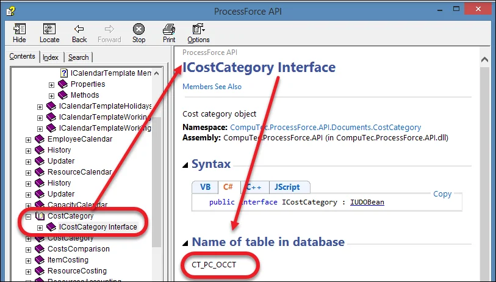
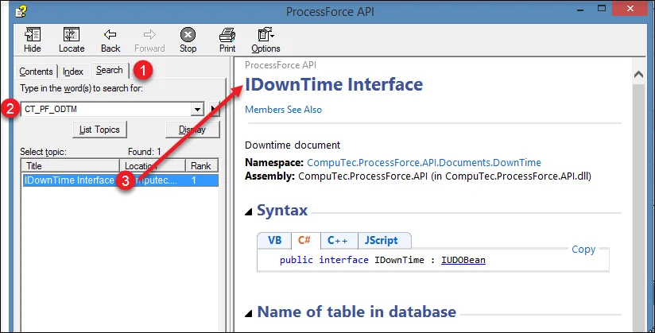

# ProcessForce API Documentation

The ProcessForce API enables seamless integration with external software such as PowerShell scripts and third-party add-ons. This documentation provides essential details on available objects, their properties, and methods to facilitate smooth API usage.

:::info
    Download the ProcessForce API documentation file here: [Download](https://download.computec.one/media/processforce/CompuTec_ProcessForce_API.chm)
:::

---

>Note: If the file appears blank when opened, please choose Properties from the file context menu and click the Unblock option on the General tab.

    

## Documents

The Documents section contains a comprehensive list of all objects available through the ProcessForce API, including their properties and methods. Descriptions will be added progressively. The example below illustrates the path to a list of Cost Category properties and methods, with similar paths generated for other objects:

## Table Name

The documentation file contains table names specified for objects:

Additionally, you can verify what type of data is stored in a specific table:

---
