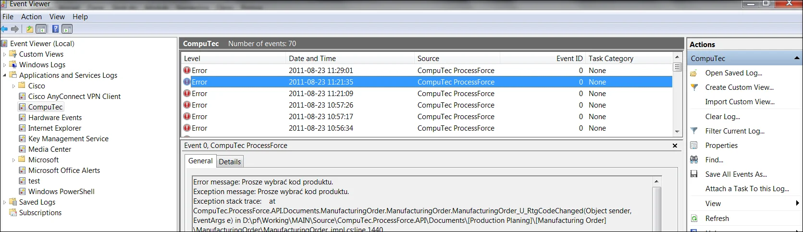

# General

CompuTec ProcessForce provides a powerful API for managing manufacturing operations within SAP Business One. This guide outlines key best practices and techniques for working with  CompuTec ProcessForce objects using LINQ, handling data efficiently, managing exceptions, and optimizing manufacturing processes. Whether you are dealing with Bill of Materials (BOM), Manufacturing Orders (MOR), routing operations, or backflushing, these best practices will help ensure accuracy and performance in your implementations.

---

1. **CompuTec ProcessForce Objects & LINQ**: all child objects in CompuTec ProcessForce are fully compatible with LINQ syntax, making it easy to find specific data. For example, to retrieve all resources from a Bill of Materials used in a specific operation and routing:

    ```csharp
    IBillOfMaterial bom = company.CreatePFObject(CompuTec.ProcessForce.API.Core.ObjectTypes.BillOfMaterial);
    com.GetByItemCodeAndRevision("Chair01", "") == 0
    var resources = bom.RoutingOperationResources.Where(p => p.U_OprCode == "Cutting" && p.U_RtgOprCode == 1 && p.U_RtgCode == "DIRtg1");
    ```

2. **Automatic Updating Relative Resources**: when objects such as BOM, MOR, Routing, or Operation are used and properly set, certain data is automatically copied. For example, setting the U_RtgCode field on MOR will copy all routing data from BOM to MOR:

    ```csharp
    IBillOfMaterial bom = company.CreatePFObject(CompuTec.ProcessForce.API.Core.ObjectTypes.BillOfMaterial);
    if (bom.GetByItemCodeAndRevision("Chair01", "") == 0)
    {
        bom.Routings.SetCurrentLine(bom.Routings.Count - 1);
        if (!string.IsNullOrEmpty(bom.Routings.U_RtgCode))
            bom.Routings.Add();
        bom.Routings.U_RtgCode = "DIRtg1";
        bom.Routings.U_IsDefault = "Y";
        bom.Update();
    }
    ```

3. **Preventing Unexpected Row Changes**: a best practice is to use SetCurrentLine(Count-1) after updating a field to prevent unexpected row changes:

    ```csharp
    rtg.OperationResources.SetCurrentLine(rtg.OperationResources.Count - 1);
    if (!string.IsNullOrEmpty(rtg.OperationResources.U_RscCode)) //Check if the last line in udoobject is empty. If not, add a new line.
        rtg.OperationResources.Add();
    ```

4. **Ensuring Item Details Exist**: every item must have a corresponding Item Details object. When importing items using DTW or other SAP DI API tools, use the following PowerShell script to ensure all items have a corresponding Item Details object:

    ```csharp
    clear
    #### Path to dlls ####
    add-type -Path "d:\pf\Working\MAIN\Binaries\8.8\881PL05\Interop.SAPbobsCOM.dll"
    Add-Type -Path "d:\pf\Working\MAIN\Source\CompuTec.ProcessForce\bin\Debug\CompuTec.ProcessForce.API.dll"

    #Creating PF company
    $pfcCompany = [CompuTec.ProcessForce.API.ProcessForceCompanyInitializator]::CreateCompany()
    $pfcCompany.UserName = "manager"
    $pfcCompany.Password = "enigma"
    $pfcCompany.SQLPassword = "1q2w3e"
    $pfcCompany.SQLServer = "PCNBPO02"
    $pfcCompany.SQLUserName = "sa"
    $pfcCompany.Databasename = "PFDemo"
    $pfcCompany.DbServerType = [SAPbobsCOM.BoDataServerTypes]"dst_MSSQL2008"
    try
    {
        $code = $pfcCompany.Connect()
        if($code -ne 1)
        {
            write-host –backgroundcolor green –foregroundcolor white "ProcessForce is Conneced"

            $rs = $pfcCompany.CreateSapObject([SAPbobsCOM.BoObjectTypes]"BoRecordset")
        
            $rs.DoQuery("SELECT T0.ItemCode FROM OITM T0
                LEFT OUTER JOIN [@CT_PF_OIDT] T1 ON T0.ItemCode = T1.U_ItemCode
                WHERE
                T1.U_ItemCode IS NULL")
            
            if($rs.RecordCount -gt 0)
            {
                Write-Host "Number of Items To Add: "$rs.RecordCount
                Write-Host "Starting Transaction..."
                $pfcCompany.SapCompany.StartTransaction()
            
                while (!$rs.EoF)
                {
                    $itemCode = $rs.Fields.Item(0).Value.ToString()
                    Write-Host "Adding Item Details For Items: "$itemCode
                
                    $itemDetails = $pfcCompany.CreatePFObject([CompuTec.ProcessForce.API.Core.ObjectTypes]"ItemDetails")
                    $itemDetails.U_ItemCode = $itemCode;
                    Write-Host "Result (0 - succces): "$itemDetails.Add()        
                    $rs.MoveNext()
                }
                Write-Host "Commiting Transaction..."
                $pfcCompany.SapCompany.EndTransaction([SAPbobsCOM.BoWfTransOpt]"wf_Commit")
            }
            else
            {
                Write-Host "Operation finished. All items have a correspondent ItemDetails object!"
            } 
        }
    }
    catch [Exception]
    {
        Write-Host "Error occured while Adding Item Details Transaction is Rollbacking"
        $pfcCompany.SapCompany.EndTransaction([SAPbobsCOM.BoWfTransOpt]"wf_Rollback")
        Write-Host $_.Exception.InnerException.ToString()
    }
    ```

5. **Exception Handling**: every exception from CompuTec ProcessForce is saved in Event Viewer under CompuTec log as CompuTec ProcessForce source:

    

6. **Caution when Using Backflushing**: be very careful when using backflushing. Backflushing should only be used when necessary. Below is the equation for calculating the issue quantity for the backflush item.

    ```csharp
    ((item.U_Result / moruo.U_Quantity) * (moruo.U_ActualQty + finalgoodRow.U_PickedQty) - (item.U_ActualQty+item.U_ResidualQty))
    where:
    item.U_Result- Result of formula calculation in Backflush Item Rowmoruo.U_Quantity- Planedd Quantity of final good
    moruo.U_ActualQty- Final Good quantity that is already receipted
    finalgoodRow.U_PickedQty - quantity of final Good that is currently receipted
    item.U_ActualQty- Actual Quantity of backflush Itemitem.U_ResidualQty-Residual Quantity of backflush Item
    ```

7. **Using Try-Catch Blocks**: CompuTec ProcessForce creates exceptions when something is wrong. It is strongly recommended to use a try-catch block to handle these exceptions.

8. **Replacing Items in Routing Operations**: when replacing an item with child items (e.g., routing operations), there is no need to manually remove all children; this is handled automatically when replacing the item code or removing the chosen line.

9. **Optimizing Manufacturing Orders from BOM**: when creating a manufacturing order from a Bill of Materials that has filed a Revision to improve performance, use `ItemUtils` class:

    ```csharp
    IManufacturingOrder mor = company.CreatePFObject(CompuTec.ProcessForce.API.Core.ObjectTypes.ManufacturingOrder);
    SAPbobsCOM.Recordset rec = company.SapCompany.GetBusinessObject(SAPbobsCOM.BoObjectTypes.BoRecordset);
    rec.DoQuery(string.Format("Select Code from [@CT_PF_OBOM] where U_ItemCode=N'{0} and U_Revision=N'{1}'", "Table01", "Rev01"));
    mor.U_BOMCode = rec.Fields.Item(0).Value;
    ```

10. **Working with Formulas**: when working with formulas on IBillOfMaterial Or IManufacturingOrder, use RecalcFormulas() method. If there is an error in the formula, it will throw an exception. Every time you Add or Update an object, this method is automatically executed.

11. **User-Defined Fields in Production Transactions**: to include extra information in Goods Receipt or Goods Issues from production, add a User-Defined Field (UDF) to PickOrderRequiredItems or PickReceiptRequiredItems with the same code, name, and type as the SAP document lines. This ensures the data is automatically copied.

12. **Custom Batch or Serial Selection in Backflushing**:  implementing FIFO, LIFO, or Other Selection Methods

    To customize material selection in backflushing transactions, you need to manually modify the SQL functions CT_PF_GetFreeSerials and/or CT_PF_GetFreeBatches by adjusting the ORDER BY clause in the SQL code.

        :::caution
            Keep in mind that after every CompuTec ProcessForce upgrade, these functions will be automatically overwritten by the installer, requiring you to reapply your changes.
        :::

---
