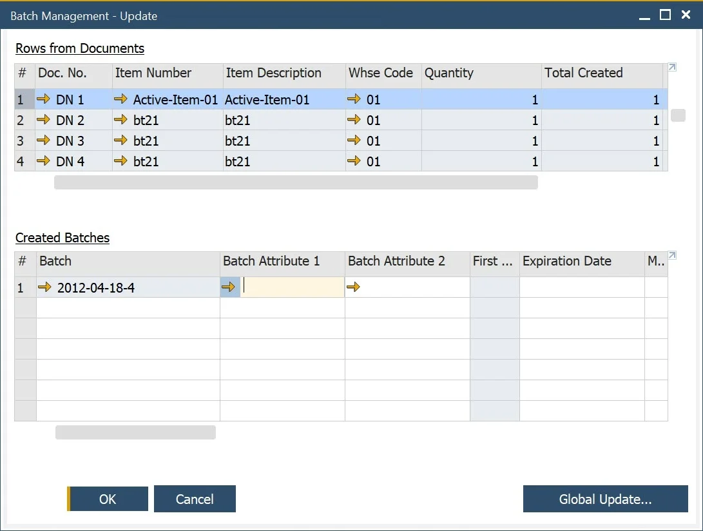

# Introduction to CompuTec ProcessForce

This guide walks you through the essential first steps to install, activate, and begin using **CompuTec ProcessForce**, an advanced manufacturing add-on for SAP Business One. You'll also get a quick orientation to key modules and navigation paths within the system.

---

## Prerequisites

Before you begin, ensure:

- Your system meets the minimum [system requirements](./administrator-guide/system-requirements.md).
- You have access to installation files for both the CompuTec License Server and CompuTec ProcessForce add-on. [Download them here](./releases/download.md).

---

## Step-by-Step Installation

1. Follow the [installation guide](./administrator-guide/installation/first-installation/license-server.md) to set up the CompuTec License Server.
2. Use the standard SAP Business One Add-on Manager to install CompuTec ProcessForce.
3. After installation, the add-on runs in **trial mode for 14 days**.
4. Before the trial expires, request a valid license from your CompuTec ProcessForce provider. [Learn how here](./administrator-guide/licensing/license-request.md).
5. Use SAP Business One’s standard navigation to manage the add-on:  
   `Main Menu → Administration → Add-ons`

## Navigation Overview

Once installed, CompuTec ProcessForce modules are available through the SAP Business One **Main Menu**:

---

## Key Functional Modules

Here’s a quick summary of commonly used features and their purposes:

### General Settings

:::info Path
Administration → System Initialization → General Settings → ProcessForce
:::

Here you can define general CompuTec ProcessForce settings, e.g. set default values or time constraints for many of the add-on features.

[→ Learn more](./user-guide/system-initialization/general-settings/overview.md)

---

### Item Details

:::info Path
Inventory → Item Details
:::

Extended Item definition allows assigning much more information to an item. In the menu you can assign revision, classifications, phrases, groups, texts, and attachments to a specific item.

[→ Learn more](./user-guide/item-details/overview.md)

---

### Ingredient Declarations

:::info Path
Inventory → Ingredients
:::

CompuTec ProcessForce provides an extension to product master data. Nutrient and ingredient information can be used to create complex ingredient listings and declaration statements, thus are useful in the creation of product labels.

[→ Learn more](./user-guide/ingredient-declarations/overview.md)

---

### Batch Control

:::info Path
Inventory → Item Management → Batches
:::

Batches are groups of the same products. Batch Master Data functionality allows to define of many values for a whole group of the same products.

[→ Learn more](./user-guide/inventory/batch-control/overview.md)

---

### Batch Traceability

:::info Path
Inventory → Item Management → Batches → Batch Traceability
:::

Batches are a base for traceability – a function that allows to track down a certain raw material on every level of production and a product in later distribution, which can be used e. g. in a fast and easy recall process. Batch Trace functionality allows tracing a whole track that a certain product passed.

[→ Learn more](./user-guide/inventory/batch-control/batch-traceability.md)

---

### Bill of Materials (BOM)

:::info Path
Production → Bill of Materials
:::

Bill of Materials (BOM) represents a product structure that is a list of raw materials or sub-components that together creates a specific product. BOM is the main concept of process manufacturing. It allows defined values like co-products, scrap, yield, and many more things crucial for production.

[→ Learn more](./user-guide/formulations-and-bill-of-materials/bill-of-materials/overview.md)

---

### Production Routings

:::info Path
Production → Routings
:::

Routing determines the steps that are performed in the manufacturing process for a specific product. Resources required for production and Operations performed on it can be defined within Routing. CompuTec ProcessForce solution allows defining of many settings for Routing, Operation, and Resource.

[→ Learn more](./user-guide/routings/overview.md)

---

### Manufacturing Order

:::info Path
Production → Manufacturing Order
:::

CompuTec ProcessForce Manufacturing Orders are used to plan, execute and record production activities.

[→ Learn more](./user-guide/manufacturing/manufacturing-order/overview.md)

---

### Production Scheduling

:::info Path
Manufacturing Order → Scheduling
:::

Based upon many resources and time constraints, CompuTec ProcessForce provides a simple but powerful scheduling solution to manage the Manufacturing Orders within the plant and to manually re-schedule via "drag and drop" means.

[→ Learn more](./user-guide/scheduling/overview.md)

---

### Item Costing

:::info Path
Main Menu → Costing
:::

CompuTec ProcessForce Product Costing has been built to take advantage of all the costing methods provided by SAP Business One. Thus providing a solution that supports the costing, analysis, and finance controlling operations.

[→ Learn more](./user-guide/costing-material-and-resources/item-costing/overview.md)

---

### Quality Control

:::info Path
Main Menu → Quality Control
:::

A Quality Control Test can be generated using predefined test protocols, from Goods Receipt PO, Complaint, Manufacturing Order. A request for it can also be set up by an SAP Business One Business Alert. QC functionality allows to set a wide range of details for a quality test, e.g. test protocol templates, Resources and Items used to conduct a test, assigned Inspector, frequency of a test, defects, reasons along with additional instructions and attachments, and more.

[→ Learn more](./user-guide/quality-control/overview.md)

---

### Complaint Management

:::info Path
Main Menu → Complaints
:::

You can create and manage complaints from customers, suppliers, or internal departments. Functionality allows recording, analyzing and starting action upon complaints, among other things.

[→ Learn more](./user-guide/complaint-management/complaint.md)

---

## Next Steps

- Explore individual module documentation for task-specific usage.
- Learn how to configure initial settings in the Administrator Guide.
- Need support? Write to [https://support.computec.pl](https://support.computec.pl)

---
