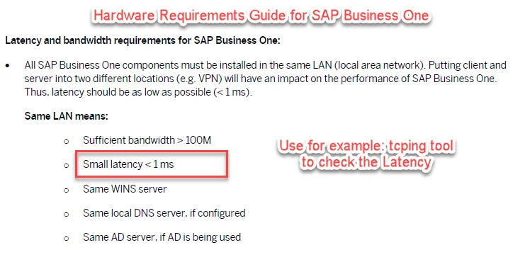
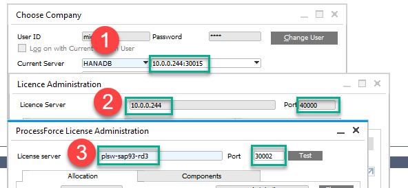
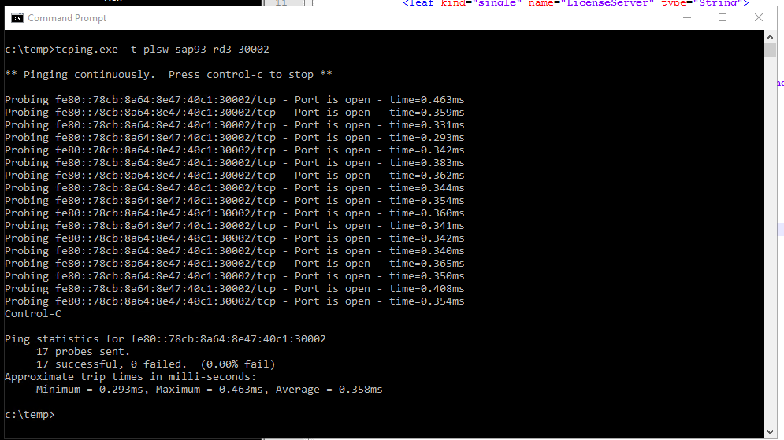
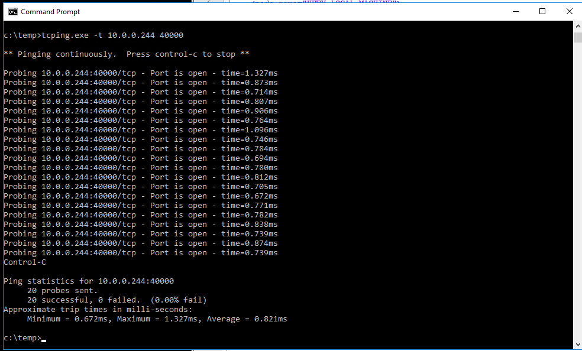
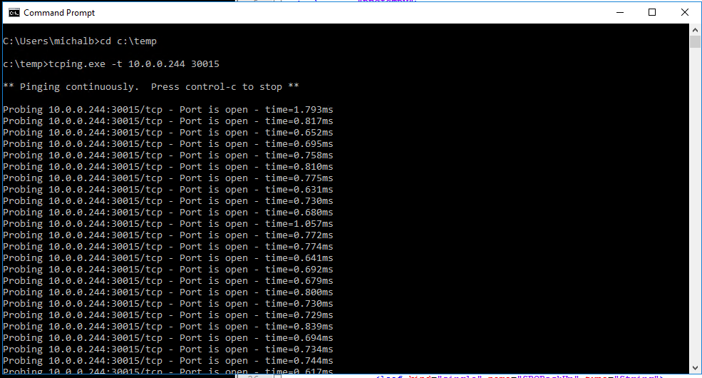
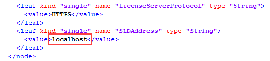

# Performance Issues

On this page, you can check the most common performance problems while working with CompuTec ProcessForce and ways of resolving these issues.

---

## Long delay in opening and browsing CompuTec ProcessForce forms on SAP Business One for SAP HANA

In some cases, users can experience a long delay in opening some documents or switching to another one when operating CompuTec ProcessForce on SAP Business One, a version of SAP HANA. Usually, the issue affects the Bill of Materials, Manufacturing Order, Item, or Business Partner Master Data, among others.

If you experience the described issue, please collect the following data, and raise a support ticket on support.computec.pl with the collected data.

### Network bandwidth and Latency



Download: [tcping](https://www.elifulkerson.com/projects/tcping.php)

Command: `tcping -t IP port`

- Do network latency tests using the `tcping -t` command and take a screenshot with the results.
- Obligatory do a complete set of tests and do separate tests for the cases:

  - from the workstations/server to the SAP HANA database (default port: 30015),
  - from the workstations/server to SAP License Server (default port: 40000),
  - from the workstations/server to CompuTec License Server (default port: 30002),
  - use proper settings IP / Server name, which is currently configured in SAP Business One Client.

- use proper settings IP / Server name, which is currently configured in SAP Business One Client

  

- Example

  Save TCPing in location **C:\Temp\Tcping\**
  Run Windows CMD
  In the CMD window, paste the command:
  *C:\Temp\Tcping\tcping64.exe -t 10.0.0.202 40000*
  *or*
  *C:\Temp\Tcping\tcping64.exe -t 10.0.0.202 30002*

  *CTRL+C will terminate the testing process*

- **Results**

  - correct results corresponding to SAP Hardware requirements should be similar to or better than those below on the screens

    

    

    

  - TCPing results should be on a stable level.
  - We observed problems with performance and unexpected errors in CompuTec ProcessForce when responses were above 1 ms.

1. Go to SAP HANA Studio and take a screenshot of the NDB > Overview form.
2. Check if CompuTec License Server is configured correctly. If you have an older version, please update it (you can check the latest version here).
3. Check Linux Kernel. If you have an older version, please update it.
4. Run the following query:

  ```sql
  select C.* from CDPM C, OCMN O, RDOC R where C."Hidden" = 'Y' and O."Type" = 'C' and C."Name" = O."Name" and R."DocName" = O."Name" and R."Status" = 'I'
  ```

  Search for the report with the name that is returned by the query. Change the report to active and save, Then change back to inactive and save again, Run the query again, there should be no result returned now.
5. Please check the following SAP NOTE: 2113913 - DI API Log Files Slow Down the Connection Time - [https://launchpad.support.sap.com/#/notes/2113913](https://launchpad.support.sap.com/#/notes/2113913).

## Long delay in opening CompuTec ProcessForce forms, but browsing is fast

Symptoms:

- Around 20-30 seconds delay on opening CompuTec ProcessForce add-on forms/windows – each time
- SAP Business One forms/windows open fast
- CompuTec ProcessForce add-on starts normally
- After opening the CompuTec ProcessForce add-on form/window browsing data / moving to the next record takes an average time (2-3s)
- Updating CompuTec ProcessForce license for users takes much more time.

Reason:

- It might be caused by incorrect configuration in b1-local-machine.xml files located in:

  :::info Path
  C:\Program Files\SAP\SAP Business One DI API\Conf\b1-local-machine.xml

  C:\Program Files\SAP\SAP Business One\Conf\b1-local-machine.xmll
  :::

Solution:

- correct files
- or reinstall the SAP Business One client and SAP Business One DI API (you can check how to do this here)
- common mistake is using localhost in SLDAddress, especially on workstations and terminals for CompuTec PDC
  

- bear in mind that both files should be the same:
  :::info Path
  SAP Business One\Conf\b1-local-machine.xmll

  SAP\SAP Business One DI API\Conf\b1-local-machine.xml
  :::
