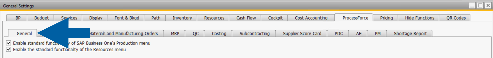
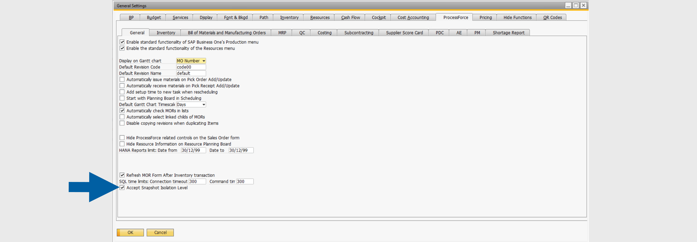
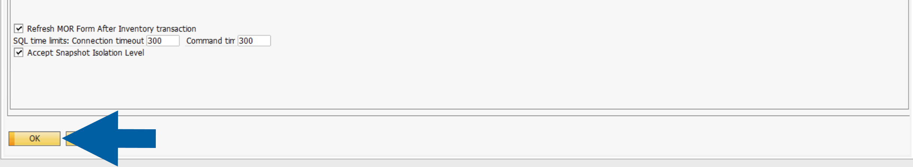
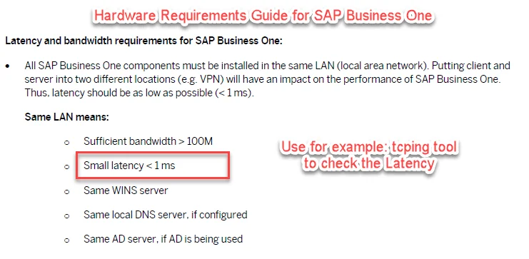
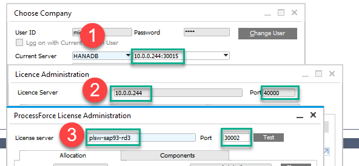
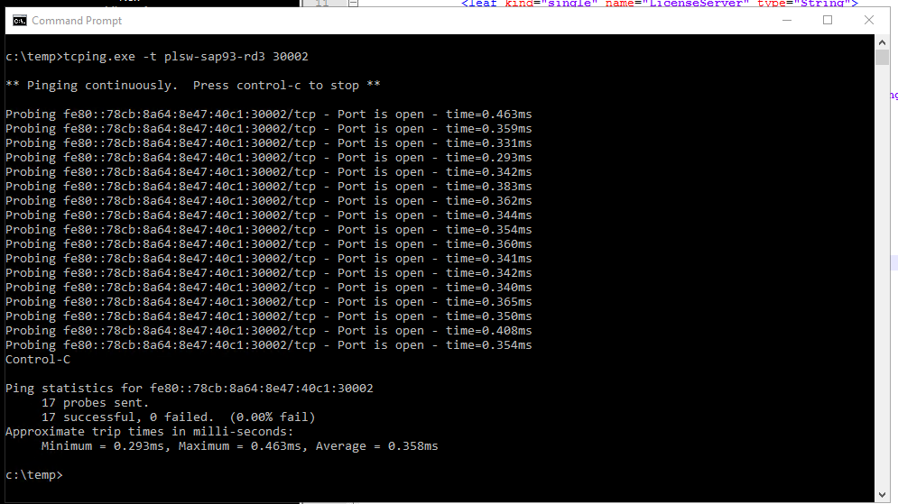
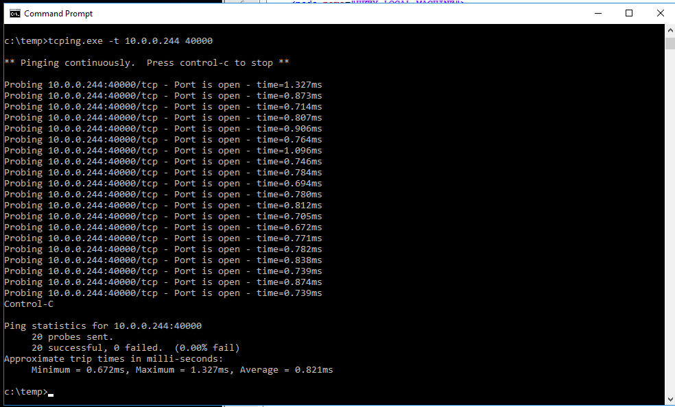
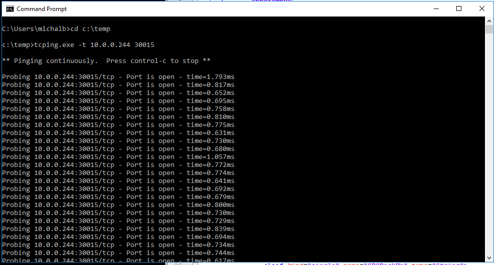
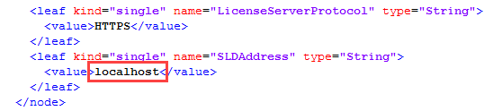

# Performance Issues

On this page, you can check the most common performance problems while working with **CompuTec ProcessForce** and ways of resolving these issues.

## Snapshot Isolation in SAP Business One (SQL Server)

:::info[note]
**Applies to**: **SAP Business One** on **Microsoft SQL Server** only. Not applicable to SAP Business One, version for SAP HANA.  
**Available from**: ProcessForce version **10.0 RL39 HF2**.
:::

**Snapshot Isolation** is a **Microsoft SQL Server** isolation level that prevents read and write operations from blocking each other. Instead of waiting for locks to be released, SQL Server reads a consistent snapshot of the data stored in ``tempdb``.

When **Snapshot Isolation** is enabled at the database level, core database **ADO** connections automatically use **Snapshot** scope. No additional connection string changes are required.

The main consideration is a moderate increase in ``tempdb`` usage, because **MS SQL Server** stores row versions there. After enabling **Snapshot Isolation**, monitor ``tempdb`` size and growth regularly.

:::note[info]

You can read more about **Snapshot Isolation**, in the [SAP Knowledge Base Article](https://userapps.support.sap.com/sap/support/knowledge/en/3663007).

:::

### Symptoms

Consider enabling **Snapshot Isolation** if users report any of the following issues:

- Frequent blocking between users
- Slow document posting during busy periods
- Deadlocks during high transaction volume
- Reports or queries hanging while documents are being added or updated
- Reduced system performance when many users are connected at the same time

### Benefits

Enabling **Snapshot Isolation** can provide the following benefits:

- Read operations no longer wait for write locks
- Users running reports or browsing data are less likely to be blocked by users posting transactions
- Deadlock frequency is significantly reduced
- Concurrent user capacity improves on busy systems
- ADO database connections automatically use Snapshot scope
- No per-connection configuration changes are required

### Activate Snaphot Isolation

To enable **Snapshot Isolation**, follow these steps:

1. Run the following SQL statements for each **SAP Business One** company database:

    ```sql
    ALTER DATABASE YourCompanyDB SET ALLOW_SNAPSHOT_ISOLATION ON;

    -- One-time setup for tempdb and model to stay persistent across restarts
    ALTER DATABASE model  SET ALLOW_SNAPSHOT_ISOLATION ON;
    ALTER DATABASE tempdb SET ALLOW_SNAPSHOT_ISOLATION ON;
    ```

    :::note[Database Descriptions]

    - ``YourCompanyDB`` - The SAP Business One company database where **Snapshot Isolation** will be enabled
    - ``tempdb`` - SQL Server stores row versions here while *Snapshot Isolation* is active
    - ``model`` - SQL Server recreates ``tempdb`` from the model database every time the **SQL Server** service restarts

    Replace the ``YourCompanyDB`` placeholder value in the script with your actual **SAP Business One** database name.

    Enabling **Snapshot Isolation** on ``model`` ensures that ``tempdb`` automatically inherits the setting after every SQL Server restart. This prevents administrators from having to manually reapply the setting after a reboot.
    :::

2. In **SAP Business One**, go to: **Administration** > **System Initialization** > **General Settings** > **ProcessForce** > **General**.

    

3. Enable the following checkbox: **Accept Snapshot Isolation Level**.

    

4. Click **OK** to save the changes.

    

5. Restart the **SAP Business One Client** to ensure the new database session settings are applied.
6. Done! The **Snapshot Isolation Level** is enabled.

## Long delay in opening and browsing CompuTec ProcessForce forms on SAP Business One for SAP HANA

In some cases, users can experience a long delay in opening some documents or switching to another one when operating CompuTec ProcessForce on SAP Business One, a version of SAP HANA. Usually, the issue affects the Bill of Materials, Manufacturing Order, Item, or Business Partner Master Data, among others.

If you experience the described issue, please collect the following data, and raise a support ticket on support.computec.pl with the collected data.

### Network bandwidth and Latency



Download: [tcping](https://www.elifulkerson.com/projects/tcping.php)

Command: `tcping -t IP port`

- Do network latency tests using the `tcping -t` command and take a screenshot with the results.
- Obligatory do a complete set of tests and do separate tests for the cases:

  - from the workstations/server to the SAP HANA database (default port: 30015),
  - from the workstations/server to SAP License Server (default port: 40000),
  - from the workstations/server to CompuTec License Server (default port: 30002),
  - use proper settings IP / Server name, which is currently configured in SAP Business One Client.

- use proper settings IP / Server name, which is currently configured in SAP Business One Client

  

- Example

  Save TCPing in location **C:\Temp\Tcping\**
  Run Windows CMD
  In the CMD window, paste the command:
  *C:\Temp\Tcping\tcping64.exe -t 10.0.0.202 40000*
  *or*
  *C:\Temp\Tcping\tcping64.exe -t 10.0.0.202 30002*

  *CTRL+C will terminate the testing process*

- **Results**

  - correct results corresponding to SAP Hardware requirements should be similar to or better than those below on the screens

    

    

    

  - TCPing results should be on a stable level.
  - We observed problems with performance and unexpected errors in CompuTec ProcessForce when responses were above 1 ms.

1. Go to SAP HANA Studio and take a screenshot of the NDB > Overview form.
2. Check if CompuTec License Server is configured correctly. If you have an older version, please update it (you can check the latest version here).
3. Check Linux Kernel. If you have an older version, please update it.
4. Run the following query:

  ```sql
  select C.* from CDPM C, OCMN O, RDOC R where C."Hidden" = 'Y' and O."Type" = 'C' and C."Name" = O."Name" and R."DocName" = O."Name" and R."Status" = 'I'
  ```

  Search for the report with the name that is returned by the query. Change the report to active and save, Then change back to inactive and save again, Run the query again, there should be no result returned now.
5. Please check the following SAP NOTE: 2113913 - DI API Log Files Slow Down the Connection Time - [https://launchpad.support.sap.com/#/notes/2113913](https://launchpad.support.sap.com/#/notes/2113913).

## Long delay in opening CompuTec ProcessForce forms, but browsing is fast

Symptoms:

- Around 20-30 seconds delay on opening CompuTec ProcessForce add-on forms/windows – each time
- SAP Business One forms/windows open fast
- CompuTec ProcessForce add-on starts normally
- After opening the CompuTec ProcessForce add-on form/window browsing data / moving to the next record takes an average time (2-3s)
- Updating CompuTec ProcessForce license for users takes much more time.

Reason:

- It might be caused by incorrect configuration in b1-local-machine.xml files located in:

  :::info Path
  C:\Program Files\SAP\SAP Business One DI API\Conf\b1-local-machine.xml

  C:\Program Files\SAP\SAP Business One\Conf\b1-local-machine.xmll
  :::

Solution:

- correct files
- or reinstall the SAP Business One client and SAP Business One DI API (you can check how to do this here)
- common mistake is using localhost in SLDAddress, especially on workstations and terminals for CompuTec PDC
  

- bear in mind that both files should be the same:
  :::info Path
  SAP Business One\Conf\b1-local-machine.xmll

  SAP\SAP Business One DI API\Conf\b1-local-machine.xml
  :::
