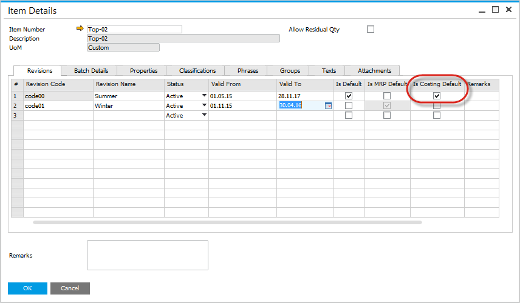
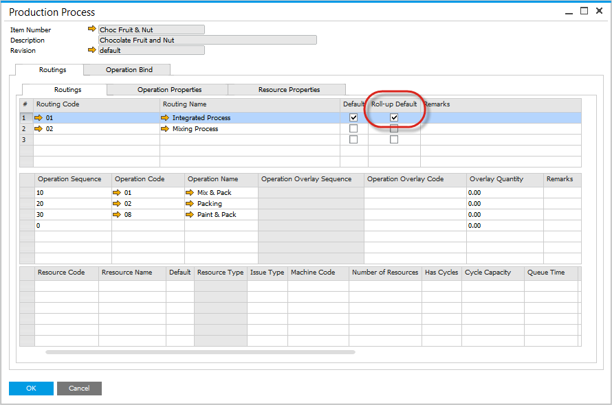

# Revision and Routing Costing Defaults

Setting costing defaults for specific Revisions and Routings ensures accurate cost calculations tailored to the unique configurations of each product. This guide explains how to define costing defaults at both the revision and routing levels.

## Revisions

CompuTec ProcessForce can cost a product at a revision level.

Within the Item Details form:

1. Select the desired Revision for cost calculation.
2. Check the field "Is Costing Default" to designate it as the default for costing.

Click [here](../item-details/overview.md) to find out more about Item Details.

## Production Process

- Multiple routes can be defined for a product.
- To include resource costs within a route, select the routing and check it as the default for cost calculation.
- Even for a single route, it is still required to check the field.

Click [here](../formulations-and-bill-of-materials/production-process/overview.md) to find out more about Production Process.

---
