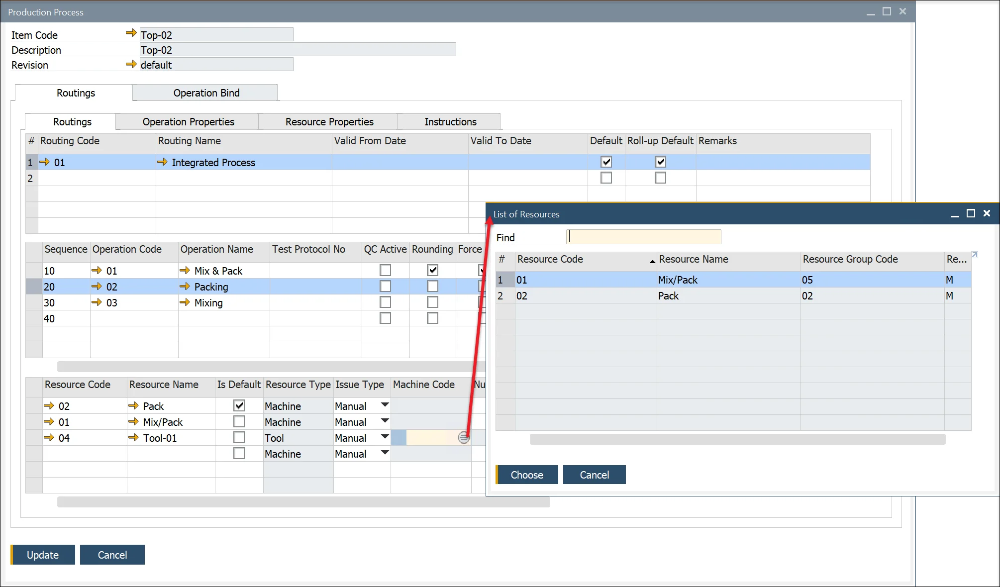

# Overview

The production process in manufacturing involves assigning a specific [Routing](../../routings/overview.md) to a production item and linking specific items to operations within that routing. This ensures a structured workflow, allowing for efficient management of resources, tooling, and operation bindings.

---

## Adding a Routing

To access Production Process, navigate to:

:::info Path
    Production → Bill of Materials → Production Process
:::

To reach the Routing form:

- Navigate through the main menu: Production → Bill of Materials → Production Process.
- From the Bill of Materials form, right-click on the header and select Production Process from the context menu.
- From the Item Details form, right-click on any revision line in the Revisions tab and select Production Process from the context menu.

## Default Routing and Alternatives

Enter a Routing Code in the second column to define a primary or alternative Routing.

- To set a Routing as the default for Manufacturing Orders, check the box in the "Default" column.
- To designate a Routing as the default for Product Costing, check the corresponding box.

## Operation Overlay

If the production process supports overlapping operations, enter an Operation Overlay Code (Operation Code) and a Quantity to define when the next operation begins.

## Resources

Clicking on the Operation Code column displays the Resources within the Operation within the third section.

For a specific combination of Item Code, Revision, Routing, Operation, and Resource, users can:

- Adjust Time and Rate values.
- Add or remove Resources as needed.
- Assign a Default Resource if multiple alternatives exist.

## Tooling

To add a Tool, select the corresponding Machine Code.

This setup indicates which machine the tool is associated with for manufacturing a specific product.

## Operation Bind

Operation Bind enables users to link Items from the related Bill of Materials (BOM) to specific Operations in the production process.

The window is divided into four sections:

1. Items that can be linked as inputs for the selected operation.
2. Items that are already selected as input for operation.
3. Items that can be linked as outputs for the selected operation.
4. Items that have already been assigned as outputs.

To bind an Item to an Operation, first select a Routing and then choose the corresponding Operation:

In Operation Binding, users can modify the quantity used to calculate operation time. In ProcessForce, operation time is determined based on the planned quantity of the final product. The resulting quantity of the selected item is considered in this calculation.

- To change the item used for time calculation, select the Time Calc checkbox.

To bind Items to a specific Operation, click on the Item row and use the arrow to transfer it from the upper to the lower section of the form:

### Operation Bind Ratio

When binding an Item to multiple Operations, its quantity must be distributed among them. You can define this distribution using either:

- **Binding Quantity**: Specifies the exact amount allocated to each operation.
- **Ratio**: Represents the proportion of the total quantity assigned to each operation. The sum of all ratios must equal 1 to proceed.

To automate ratio and quantity distribution:

- Enable Automatically Calculate Ratio on Operations under General Settings > ProcessForce > Bill of Materials & Manufacturing Orders.
- When an item is assigned to two operations, the system automatically sets the ratio to 0.5 and calculates the Binding Quantity accordingly.

If the Automatically Calculate Ratio on Operations setting is disabled:

- You must manually set either Quantity or Ratio so that the total ratio sums to 1.

To review and adjust all Operations linked to a Component:

- Right-click on the Ratio field.
- Select Show all operations for component.

### Manufacturing Order Operation Bind

Operation Bind can be modified for a specific Manufacturing Order by selecting Operation Binding from the context menu on the order header. Items and operations can be linked using arrows.

Click an Operation row and Item row and use arrows to bind both elements:

## Instructions tab

The Instructions tab is available from the Production Process form under the Routing tab. This editable text area can store any related documentation.

## Validity Period

A validity period can be set for a routing within the production process. This allows for flexible manufacturing processes based on seasonal changes, environmental factors, or evolving production requirements.

### Example usage

A food industry company may define a single Bill of Materials but apply different Routings based on seasonal variations such as temperature and humidity, ensuring optimal production efficiency year-round.

---
