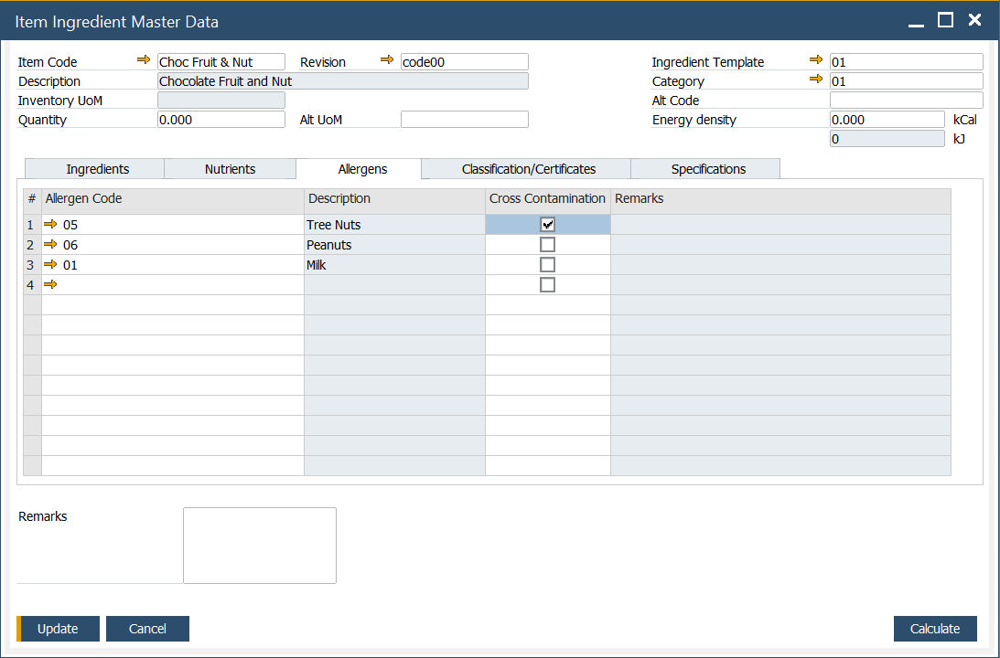

# Item Ingredient Master Data

The Item Ingredient Master Data form enables users to define the ingredient and nutrient details for a specific item. This form is crucial for managing product compositions, ensuring compliance with labeling requirements, and tracking ingredients and nutrients within products.

---

:::info Path
        Inventory → Ingredients → Item Ingredient Master Data
:::

## Form Header

In the form Header, the following information can be defined:

- **Item Code**: an alphanumeric code assigned to a specific item.
- **Description**: a description of an item.
- **Inventory UoM**: Unit of Measure, e.g., kilogram
- **Alt UoM**: an alternative Unit of Measure
- **Quantity**: quantity of the item.
- **Ingredient Template**: a predefined list of ingredients. To get more information, click [here](ingredient-and-nutrient-template.md)
- **Category**: category of the ingredient. To get more information, click [here](./ingredient-settings/ingredients-category.md)
- **Alt Code**: an alternative code that can be used as standard, scientific codes governed by law, e.,g. E number - codes assigned to substances that can be used as additives to food products within the European Union and Switzerland
- **Energy density**: measured in kCal (kilocalories) - a fixed value is automatically recalculated into kJ (kilojoules) units.

## Tabs

### Ingredients

In this tab, predefined ingredients can be chosen. To get more information on defining ingredient details, click [here](../ingredient-declarations/ingredient-master-data.md).

### Nutrients

In this tab, predefined nutrients can be defined. To get more information on defining nutrients, click [here](../ingredient-declarations/nutrient-master-data.md).

Daily Intake template can be added by choosing a desired Daily Intake Code. To get more information on defining Recommended Daily Intake, click [here](../ingredient-declarations/recommended-daily-intake.md).

### Allergens

In this tab, you can set a list of allergens assigned to a specific item. To get more information on defining allergens, click [here](../ingredient-declarations/ingredient-settings/allergen.md).

If cross-contamination is possible for a specific allergen, it can be checked in a Cross Contamination column.

### Classification/Certificates

In this tab, information on related certificates can be set. Certificates can be assigned to a specific classification. The certificate is a document confirming compliance with specific requirements for products of a company that holds the document. The following information can be set for a specific certificate:

- **BP Code**: Business Partner Code.
- **BP Name**: Name of the Business Partner.
- **Certificate Number**: the ID number of the certificate.
- **Certificate Date**: the date the certificate was issued.
- **Status**: one of three options may be set for a specification: Not Approved, Pending, or Approved.
- **Status Date**: date when the status was updated.
- **Attachment**: a file attached to a specific certificate, e.g., scanned document.
- **Remarks**: additional notes or comments.

### Specifications

This feature allows you to create and modify vendor or industry specifications for an ingredient. The following details can be defined:

- **BP Code**: a code assigned to the specific business partner.
- **BP Name**: name of the business partner.
- **Specification Number**: a unique number assigned to a specific specification.
- **Specification Date**: date of the specification
- **Status**: one of the three options may be set for a specification: Not Approved, Pending, or Approved.
- **Status Date**:  a date when the specification status was last updated.
- **Attachment**: attach relevant documents.
- **Remarks**: additional notes related to the specification.

---
